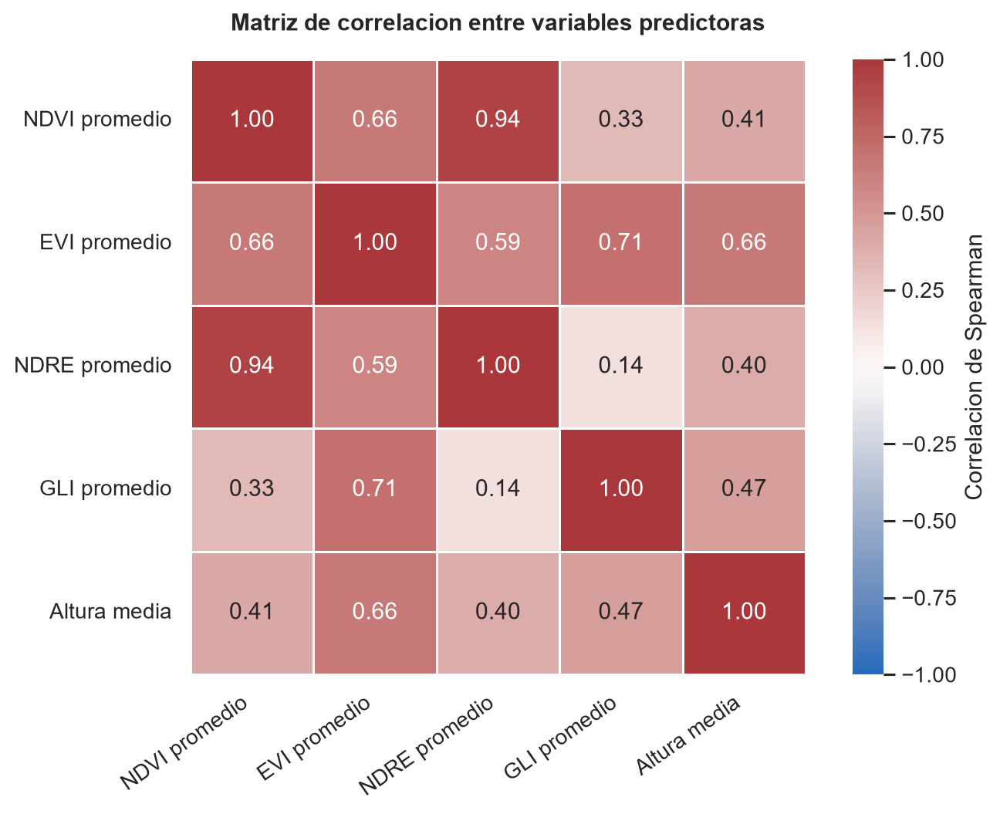
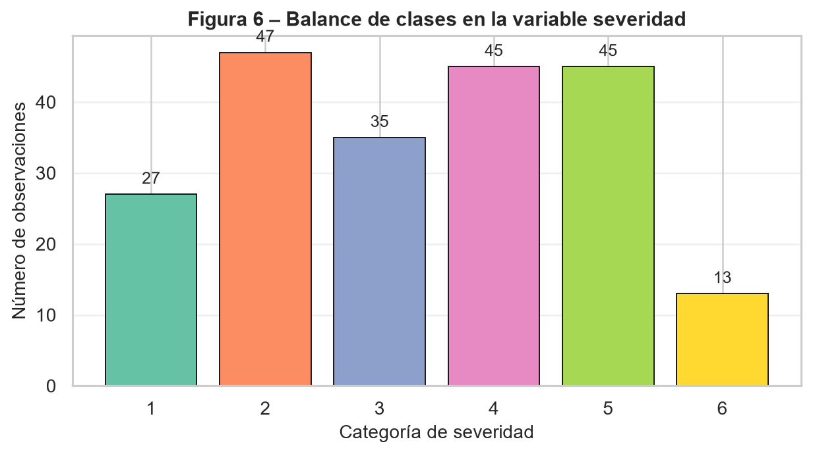
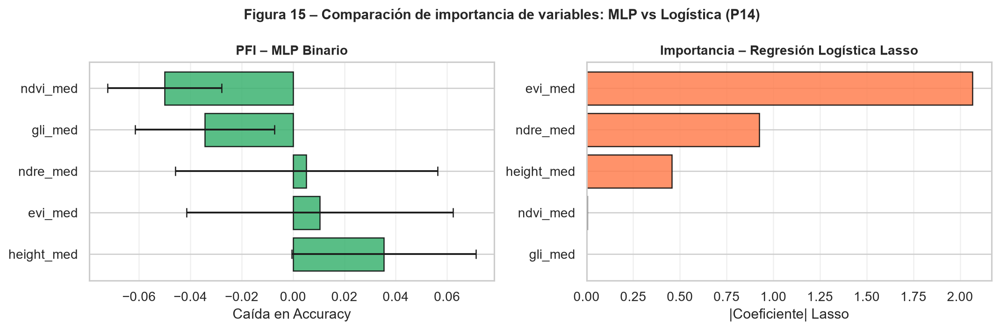
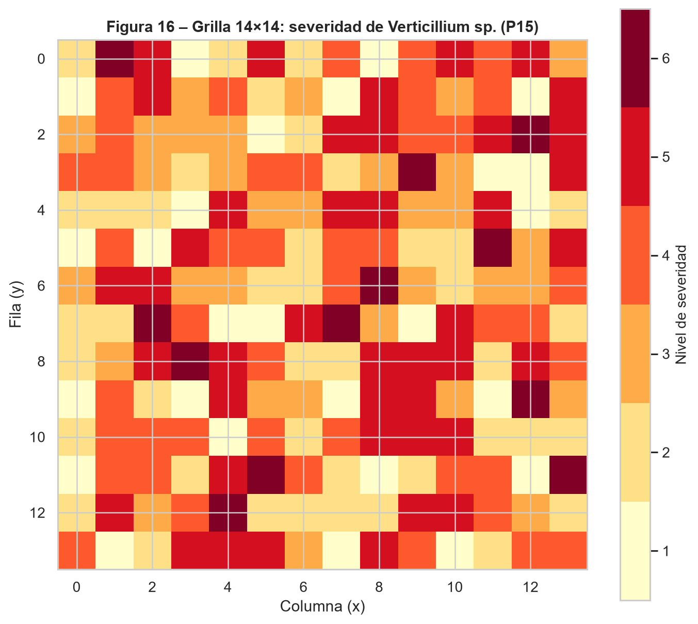

# Introducción

La enfermedad causada por Verticillium sp. es una de las principales amenazas fitosanitarias en cultivos de alto valor económico. Su detección temprana y la clasificación precisa de su severidad son fundamentales para la toma de decisiones agronómicas. En este taller se dispone de un conjunto de datos con más de 200 observaciones de plantas, caracterizadas
por cinco índices espectrales obtenidos mediante teledetección y por la altura media de la planta, con una etiqueta de severidad de la enfermedad donde la categoría 1 corresponde a planta sana.

El objetivo es desarrollar, evaluar y comparar modelos de clasificación basados en perceptrón multicapa (redes neuronales artificiales) y regresión logística, bajo diferentes esquemas de partición de datos, funciones de pérdida y configuraciones arquitectónicas. Adicionalmente, se explorará la dimensión espacial del problema mediante la construcción de una grilla y el análisis de dependencia espacial en escala ordinal.

# Pregunta 1: Realice un análisis exploratorio de los cinco índices espectrales y la altura media de la planta. Reporte estadísticos descriptivos por categoría de severidad, incluyendo media, desviación estándar, mínimo y máximo. ¿Observa diferencias visibles entre categorías? Justifique si considera necesaria alguna transformación o estandarización de las variables antes de entrenar la red.

## Descripción de los datos

El conjunto contiene 212 observaciones y seis categorias ordinales de severidad, codificadas de 1 a 6. La variable 1 corresponde a plantas sanas y los valores mayores representan niveles crecientes de severidad.

El archivo incluye cinco predictores: cuatro indices espectrales (`NDVI`, `EVI`, `NDRE` y `GLI`) y la altura media. Esto difiere del enunciado, que menciona cinco indices espectrales mas la altura. Ademas, la altura aparece entre 0.0005 y 0.8472, por lo que probablemente ya se encuentra normalizada y no expresada directamente en centimetros. Ambas diferencias deben aclararse con la fuente de los datos.

La tabla completa con media, desviacion estandar, minimo y maximo para cada predictor y categoria se muestra a continuación en:

```{python}
#| echo: false
import pandas as pd
pd.read_csv("../resultados/tablas/04_estadisticos_descriptivos_por_severidad.csv")
```

## Calidad de los datos

No se encontraron valores faltantes ni infinitos. Se identifico una fila duplicada: las filas originales 174 y 175 contienen exactamente los mismos valores.

En 48 observaciones, los valores de `EVI`, `GLI` y altura son exactamente iguales. Esta coincidencia ocurre principalmente en las severidades 3 y 4 y es poco esperable para tres variables obtenidas de manera independiente. No se modificaron ni eliminaron estas observaciones, pero deben verificarse contra los datos de origen antes de entrenar los modelos. 

```{python}
#| echo: false
import pandas as pd
pd.read_csv("../resultados/tablas/01_resumen_calidad_datos.csv")
```

## Diferencias entre categorias

### NDVI

El NDVI muestra el patron ordinal mas claro. Su media disminuye de 0.8784 en la severidad 1 a 0.6871 en la severidad 6. La asociacion de Spearman con la severidad es fuerte y negativa (`rho = -0.8548`). Las categorias adyacentes 1 y 2 presentan solapamiento, pero la separacion aumenta a partir de la categoria 3.

### NDRE

El NDRE tambien disminuye de forma consistente: pasa de una media de 0.3383 en la severidad 1 a 0.1987 en la severidad 6. Su correlacion con la severidad es `rho = -0.8170`. Junto con el NDVI, parece ser uno de los predictores con mayor capacidad para distinguir niveles de enfermedad.

### EVI

El EVI disminuye desde 0.7905 en plantas sanas hasta 0.3180 en la severidad 6, con una asociacion negativa moderada a fuerte (`rho = -0.6124`). Sin embargo, las categorias intermedias tienen alta dispersion y el patron no es completamente monotono: la media de la severidad 5 es ligeramente mayor que la de la severidad 4.

### GLI

El GLI presenta una disminucion general, pero con oscilaciones entre las categorias 3, 4 y 5. Su asociacion con la severidad es debil (`rho = -0.2535`) y existe un solapamiento considerable. Su contribucion al modelo podria depender de relaciones no lineales o de interacciones con otros predictores.

### Altura media

La altura disminuye desde una media de 0.5101 en la severidad 1 hasta 0.2492 en la severidad 4, pero aumenta de nuevo en las categorias 5 y 6. La correlacion es negativa pero moderada (`rho = -0.3401`) y las distribuciones se solapan ampliamente. Por si sola, la altura parece tener menor poder discriminante que NDVI y NDRE.

## Relacion entre predictores

NDVI y NDRE presentan una correlacion de Spearman muy alta (`rho = 0.94`), lo cual indica que contienen informacion parcialmente redundante. EVI tambien se relaciona con GLI (`rho = 0.71`) y con la altura (`rho = 0.66`). Estas asociaciones no impiden utilizar las variables en una red neuronal, pero deben considerarse al interpretar su importancia.

```{python}
#| echo: false
import pandas as pd
pd.read_csv("../resultados/tablas/05_correlacion_spearman_con_severidad.csv")
```

{#fig-matriz-correlacion width="80%"}

## Transformacion y estandarizacion

No se recomienda aplicar inicialmente transformaciones logaritmicas. Los predictores estan acotados aproximadamente entre 0 y 1, y varios contienen valores muy cercanos a cero. Una transformacion logaritmica dificultaria la interpretacion y no resolveria el patron de valores que requiere revision. 

Si se confirma la validez de los datos, se recomienda estandarizar los cinco predictores mediante puntuaciones Z antes de entrenar el perceptron multicapa. Aunque sus rangos son parecidos, sus dispersiones son diferentes; la estandarizacion facilitara la optimizacion y evitara que una variable influya mas por su escala numerica.

El escalador debera ajustarse exclusivamente con el conjunto de entrenamiento y luego aplicarse sin reajuste a validacion y prueba. De esta manera se evita la fuga de informacion.

## Conclusion

Existen diferencias visibles entre las categorias de severidad. NDVI y NDRE presentan los patrones mas ordenados y una separacion clara entre plantas sanas, niveles intermedios y severidades altas. EVI aporta una señal adicional, aunque con mayor variabilidad. GLI y altura muestran un solapamiento considerable y relaciones menos monotonicamente ordenadas.

Antes del modelado debe verificarse el origen de las 48 coincidencias entre EVI, GLI y altura, la fila duplicada y la unidad real de la altura. Estas observaciones se conservaron en el analisis para describir fielmente el archivo recibido.

# Pregunta 2: Verifique si las categorías de severidad están balanceadas. En caso de desequilibrio notable, proponga y justifique al menos una estrategia para manejarlo (sobremuestreo, submuestreo, ponderación de clases u otra). Implemente la estrategia elegida y explique su efecto esperado sobre las métricas de ajuste.

## Verificación del balance de clases

El conjunto de datos cuenta con 212 observaciones distribuidas en seis categorías de severidad. Como se observa en la siguiente figura, la distribución no es uniforme: la categoría 2 concentra el mayor número de casos (n = 47, 22.5%), mientras que la severidad 6 es la más escasa (n = 13, 6.2%), seguida de la categoría 1 —planta sana— con apenas 27 observaciones (12.9%).

{#fig-balance-clases width="80%"}

El ratio mínimo/máximo de 0.28 confirma un *desequilibrio moderado-alto*, superando el umbral crítico de 0.5 habitualmente reportado en la literatura. Este patrón es problemático porque una red neuronal entrenada sin corrección tendería a favorecer las clases mayoritarias (2, 4 y 5), produciendo una exactitud global engañosamente alta mientras falla sistemáticamente en los extremos del espectro de severidad —precisamente las categorías de mayor relevancia agronómica.

## Estrategia implementada: SMOTE

Se optó por SMOTE (Synthetic Minority Over-sampling Technique) como estrategia de balanceo. Este método genera observaciones sintéticas para las clases subrepresentadas mediante interpolación lineal entre cada muestra minoritaria y sus k vecinos más cercanos, introduciendo variabilidad controlada y evitando la simple duplicación de registros existentes.
Con un tamaño muestral de n = 212, el submuestreo aleatorio (RandomUnderSampler) fue descartado por implicar una pérdida severa de información —el conjunto de entrenamiento quedaría reducido a aproximadamente 78 observaciones—. La ponderación de clases (class_weight='balanced') constituye una alternativa válida pero no corrige la subrepresentación en el espacio de características, solo repondera la función de pérdida.

Un aspecto metodológico crítico es que SMOTE se aplicó exclusivamente sobre el conjunto de entrenamiento, tras realizar la partición de datos. Aplicarlo antes introduciría data leakage: muestras sintéticas derivadas de observaciones reales del conjunto de prueba contaminarían el entrenamiento, inflando artificialmente las métricas de evaluación.
Como efecto esperado, la aplicación de SMOTE debería mejorar el recall en las clases 1 y 6, redistribuir los errores de forma más equitativa en la matriz de confusión y elevar el macro F1-score, que resulta la métrica más informativa bajo condiciones de desequilibrio al ponderar por igual todas las categorías.

## Conclusión

En conclusión, el análisis de balance de clases evidenció un desequilibrio moderado-alto (ratio 0.28) que, de no corregirse, comprometería la capacidad del modelo para detectar adecuadamente las categorías de severidad extrema —precisamente las más relevantes desde el punto de vista fitosanitario. La implementación de SMOTE sobre el conjunto de entrenamiento constituye una respuesta metodológicamente sólida a este problema, al generar variabilidad sintética representativa sin sacrificar observaciones reales ni comprometer la integridad de la evaluación. Su aplicación estrictamente posterior a la partición de datos garantiza que las métricas reportadas reflejen el desempeño real del modelo frente a datos no vistos, condición indispensable para que los resultados sean válidos y reproducibles en un contexto de apoyo a la decisión agronómica.

# Pregunta 3: Partición de datos y selección de hiperparámetros. Para cada esquema, entrene un perceptrón multicapa con la misma arquitectura inicial y compare los resultados. Explique en detalle cuál es la ventaja del esquema de tres particiones frente al de dos, en particular con respecto al riesgo de sobreajuste y a la selección de hiperparámetros.

Durante la implementación del esquema 80/20 el algoritmo SMOTE no pudo aplicarse sobre el conjunto de entrenamiento, dado que la clase de severidad 6 —con apenas 13 observaciones en el dataset completo— quedó con un número de vecinos inferior al mínimo requerido (k = 5) para generar muestras sintéticas. En consecuencia, este esquema se entrenó con los datos originales sin balanceo, lo que constituye una limitación adicional a considerar al interpretar sus resultados.

## Esquema A: Entrenamiento / Prueba (80 % / 20 %)

El esquema de dos particiones asigna aproximadamente 170 observaciones al entrenamiento y 42 a la prueba. Su principal debilidad metodológica radica en que no existe un conjunto de validación independiente: cualquier decisión sobre hiperparámetros —número de capas, neuronas o tasa de aprendizaje— que se tome observando el desempeño sobre el conjunto de prueba convierte implícitamente a este último en un conjunto de validación. El modelo seleccionado ya no es el más generalizable, sino el más ajustado a ese conjunto de prueba particular, introduciendo un sesgo optimista en la evaluación final que invalida la comparación justa entre configuraciones.

## Esquema B: Entrenamiento / Validación / Prueba (70 % / 15 % / 15 %)

El esquema de tres particiones asigna aproximadamente 148, 32 y 32 observaciones a cada conjunto respectivamente, con roles claramente diferenciados. El conjunto de entrenamiento ajusta los pesos de la red mediante retropropagación; el conjunto de validación monitorea la pérdida en tiempo real para detectar sobreajuste y aplicar early stopping, sin que el modelo aprenda de él; y el conjunto de prueba se reserva de forma estricta para el reporte final, siendo consultado una única vez al término del proceso. Esta separación de roles preserva la integridad de la evaluación y garantiza que las métricas reportadas constituyan una estimación imparcial del error de generalización ante datos completamente nuevos.
No obstante, con n = 212 los subconjuntos de validación y prueba resultan reducidos (~32 observaciones cada uno), lo que introduce varianza en las estimaciones: una sola observación mal clasificada puede desplazar el accuracy varios puntos porcentuales. Esta limitación motiva la exploración de validación cruzada k-fold en la Pregunta 4 como estrategia complementaria de menor varianza.

## Conclusión

La elección del esquema de partición no es una decisión menor, ya que determina directamente la validez de las métricas reportadas y la confiabilidad de la selección de modelos. El esquema 80/20, aunque maximiza los datos de entrenamiento, compromete la imparcialidad de la evaluación al exponer el conjunto de prueba al proceso de ajuste de hiperparámetros. El esquema 70/15/15, en cambio, garantiza una separación metodológica rigurosa entre optimización y evaluación, condición indispensable cuando los resultados deben fundamentar decisiones agronómicas reales. Por estas razones, el esquema de tres particiones fue adoptado como referencia para el resto del taller, asumiendo la mayor varianza asociada al tamaño reducido de cada subconjunto como un costo aceptable frente a la solidez metodológica que ofrece.

# Pregunta 4: Dado que el tamaño muestral es mayor a 200 pero no muy grande, ¿considera que sería apropiado usar validación cruzada k-fold como alternativa o complemento? Argumente su respuesta y, si decide implementarla, reporte los resultados comparativos.

Con un tamaño muestral de n = 212, la estimación del error de generalización a partir de una única partición fija está sujeta a una varianza considerable, pues la composición específica del conjunto de prueba influye de forma no despreciable sobre las métricas reportadas. Para cuantificar esta variabilidad se implementó una validación cruzada estratificada con k = 5 folds, utilizando una regresión logística como modelo proxy. El uso de un modelo lineal en lugar del MLP responde a una razón de eficiencia computacional: entrenar la red neuronal en cada fold y para múltiples configuraciones de hiperparámetros resultaría prohibitivo con los recursos disponibles. La estratificación garantiza que la proporción de cada categoría de severidad se preserve en todos los subconjuntos, condición especialmente relevante dado el desequilibrio identificado en la Pregunta 2.

## Resultados obtenidos

La accuracy por fold fue de *0.4419, 0.4186, 0.5000, 0.5000 y 0.4286*, con una media de *0.4578 ± 0.0352*. Interpretado en su contexto, este valor supera ampliamente la línea base de un clasificador aleatorio para seis clases (*≈ 16.7 %*), lo que indica que los índices espectrales y la altura media contienen información discriminativa real. Sin embargo, el nivel moderado del accuracy anticipa que la frontera de separación entre categorías no es lineal, lo que justifica el uso de redes neuronales con mayor capacidad de representación.

La desviación estándar de *0.0352* refleja una variabilidad moderada entre folds: el peor desempeño (*fold 2, 0.4186*) y el mejor (*folds 3 y 4, 0.5000*) difieren en casi 8 puntos porcentuales. Esta oscilación confirma que una evaluación basada en una única partición puede ser poco representativa del desempeño real del modelo, y que promediar sobre múltiples subconjuntos produce estimaciones más robustas y confiables.

## Rol metodológico en la estrategia global

La validación cruzada k-fold no sustituye al esquema *70/15/15* adoptado en la Pregunta 3, sino que lo complementa con funciones diferenciadas. El k-fold resulta especialmente útil durante la selección de hiperparámetros —número de capas, neuronas y tasa de aprendizaje— al promediar el desempeño sobre múltiples particiones y reducir el riesgo de elegir una configuración que funcione bien solo para una división particular de los datos. La partición fija, por su parte, se reserva para el reporte final de métricas, garantizando comparabilidad entre modelos y transparencia metodológica.
Cabe señalar además que el accuracy de *0.4578* corresponde a un modelo lineal y debe interpretarse como una cota inferior de referencia: si el MLP no supera consistentemente este valor, sería indicativo de sobreajuste o de una configuración arquitectónica inadecuada.

## Conclusión

La validación cruzada k-fold con *k = 5* evidenció que el error de generalización estimado con una única partición fija está sujeto a variaciones de hasta 8 puntos porcentuales dependiendo de la composición del conjunto de prueba, lo que subraya la importancia de estrategias de evaluación más robustas cuando el tamaño muestral es reducido. El accuracy medio de *0.4578* obtenido con la regresión logística confirma la presencia de información discriminativa en las variables espectrales, aunque su naturaleza no lineal demanda modelos de mayor capacidad como el MLP. En el marco de este taller, el k-fold se adopta como herramienta de selección de hiperparámetros, mientras que la partición fija *70/15/15* se mantiene como referencia para la evaluación final, combinando así la robustez estadística del primero con la trazabilidad y comparabilidad que ofrece el segundo.


# Pregunta 5: Entrene al menos cuatro perceptrones multicapa variando sistemáticamente el número de capas ocultas, neuronas por capa y tasa de aprendizaje. Para cada configuración reporte la pérdida en entrenamiento y validación por época. ¿En qué configuraciones observa indicios de sobreajuste o subajuste?

Se entrenaron ocho arquitecturas de perceptrón multicapa orientadas a la clasificación multiclase de la severidad de *Verticillium sp.* (seis categorías: 1 = sano, 2 a 6 = niveles crecientes de severidad), variando el número de capas ocultas (1, 2 y 3), el número de neuronas por capa (16, 32 y 64, con al menos dos tamaños evaluados en cada número de capas) y la tasa de aprendizaje (0.001, 0.01 y 0.1). No se realizó un barrido factorial completo de las 27 combinaciones posibles, sino un diseño curado de ocho configuraciones que cumple los mínimos exigidos por el enunciado; como consecuencia, la tasa de aprendizaje no varía de forma independiente dentro de cada arquitectura, sino que está parcialmente confundida con la combinación capas-neuronas, lo que se tiene en cuenta al interpretar su efecto más adelante.

El conjunto de datos (n = 212) presenta un desbalance moderado entre categorías (conteos entre 13 y 47 observaciones), por lo que el entrenamiento se realizó sobre el conjunto de entrenamiento balanceado mediante SMOTE, mientras que validación y prueba se mantuvieron sin sobremuestreo. Con el esquema de partición 70/15/15 de la Pregunta 3, los tamaños resultantes fueron *entrenamiento = 198*, *validación = 32* y *prueba = 32* observaciones. Este tamaño de validación y prueba es reducido y debe tenerse presente como límite al interpretar diferencias pequeñas entre configuraciones, pues con 32 observaciones una sola predicción adicional correcta ya mueve la exactitud en cerca de 3 puntos porcentuales. Todas las redes utilizaron activación ReLU en las capas ocultas y salida *softmax*, con entropía cruzada categórica dispersa como función de pérdida y *early stopping* monitoreando la pérdida de validación.

La selección de la mejor configuración se hizo por la menor pérdida de validación, y no por la exactitud de prueba: usar el conjunto de prueba para escoger hiperparámetros lo convertiría, de facto, en una extensión del conjunto de validación, contaminando la evaluación final con un sesgo optimista, justamente el problema que la partición en tres conjuntos de la Pregunta 3 busca evitar. La exactitud de prueba se reporta únicamente como referencia descriptiva del modelo ya seleccionado.

## Resultados obtenidos

| Configuración | Capas | Neuronas | Tasa aprendizaje | Épocas | Loss Train | Loss Val | Acc Train | Acc Val | Brecha Train-Val | Acc Test |
|---|---|---|---|---|---|---|---|---|---|---|
| 1L-16N-lr0.001 | 1 | 16 | 0.001 | 132 | 0.9101 | 1.1765 | 0.5960 | 0.4375 | +0.1585 | 0.2500 |
| 1L-32N-lr0.01  | 1 | 32 | 0.01  | 24  | 0.8437 | 1.1655 | 0.6364 | 0.5000 | +0.1364 | 0.3125 |
| 2L-16N-lr0.01  | 2 | 16 | 0.01  | 26  | 0.7985 | 1.2243 | 0.6818 | 0.6250 | +0.0568 | 0.3750 |
| 2L-32N-lr0.001 | 2 | 32 | 0.001 | 44  | 0.8845 | 1.1567 | 0.6162 | 0.5000 | +0.1162 | 0.3438 |
| 2L-64N-lr0.1   | 2 | 64 | 0.1   | 36  | 0.9285 | 1.5136 | 0.5758 | 0.5938 | −0.0180 | 0.4062 |
| 3L-16N-lr0.001 | 3 | 16 | 0.001 | 55  | 0.8706 | 1.2510 | 0.6162 | 0.5000 | +0.1162 | 0.3438 |
| 3L-32N-lr0.01  | 3 | 32 | 0.01  | 23  | 0.7581 | 1.2309 | 0.6515 | 0.5938 | +0.0578 | 0.4688 |
| 3L-64N-lr0.001 | 3 | 64 | 0.001 | 30  | 0.8065 | 1.2189 | 0.6768 | 0.5000 | +0.1768 | 0.3438 |

El modelo seleccionado es *2L-32N-lr0.001* (menor pérdida de validación, 1.1567), con exactitud de validación de *0.5000*, brecha Train-Val de *0.1162* y exactitud de prueba de referencia de *0.3438*. Esta configuración se usa como base para las Preguntas 6, 7, 9, 10, 17, 18 y 19.

Vale la pena resaltar que el criterio de selección cambia la respuesta: por mayor exactitud de validación habría ganado *2L-16N-lr0.01* (0.6250), y por mayor exactitud de prueba habría ganado *3L-32N-lr0.01* (0.4688). Esto confirma que la elección del criterio de selección no es un detalle técnico menor, sino una decisión que puede cambiar por completo qué arquitectura se reporta como la mejor.

## Diagnóstico de sobreajuste y subajuste

La configuración más simple, *1L-16N-lr0.001*, necesitó 132 épocas —la más larga de todas— para alcanzar apenas una exactitud de entrenamiento de 0.5960, la más baja de la tabla junto con *2L-64N-lr0.1* (0.5758). Esto es consistente con una capacidad de representación insuficiente: la red tarda mucho en converger y aun así logra un ajuste mediocre, señal típica de subajuste. En el extremo opuesto, las brechas Train-Val más altas corresponden a *3L-64N-lr0.001* (0.1768) y a la misma *1L-16N-lr0.001* (0.1585), lo que indica que tanto la arquitectura más grande como la más simple presentan cierto grado de sobreajuste, aunque por razones distintas: la primera memoriza el conjunto de entrenamiento —incluidas las muestras sintéticas de SMOTE— sin transferir esa mejora a validación, mientras que la segunda sobreajusta levemente antes de que el *early stopping* actúe, tras muchas épocas de ajuste lento.

Las brechas más bajas se observan en *2L-16N-lr0.01* (0.0568) y *3L-32N-lr0.01* (0.0578), ambas con tasa de aprendizaje intermedia, lo que sugiere que dentro de este diseño la tasa 0.01 favorece una convergencia más equilibrada que 0.001 —más lenta y con mayor tendencia a sobreajustar antes de detenerse— o que 0.1, que resulta inestable: la configuración *2L-64N-lr0.1* es la única con brecha negativa (−0.0180) y, a la vez, la pérdida de validación más alta de toda la tabla (1.5136), lo que no refleja buena generalización sino un entrenamiento inestable en el que los pasos de actualización, al ser demasiado grandes, no permiten una reducción consistente de la pérdida.

## Conclusión

La comparación sistemática muestra que la arquitectura más simple subajusta, que las arquitecturas de mayor capacidad con tasa de aprendizaje baja tienden a sobreajustar más, y que una tasa de aprendizaje alta produce inestabilidad en la convergencia sin ganancia clara en calibración. El mejor balance según la pérdida de validación se obtuvo con una red de 2 capas y 32 neuronas por capa y tasa de aprendizaje de 0.001. Deben señalarse dos limitaciones del análisis: el diseño de ocho configuraciones no permite aislar por completo el efecto de la tasa de aprendizaje del de la arquitectura, y el tamaño reducido de validación y prueba (32 observaciones cada uno) implica que las diferencias entre configuraciones cercanas deben interpretarse con cautela. Esta selección, hecha exclusivamente con el conjunto de validación, es la que se usa como punto de partida para las preguntas siguientes, reservando el conjunto de prueba para la evaluación final reportada en la Pregunta 7.

# Pregunta 6: Implemente y compare dos criterios para cuantificar el error durante el entrenamiento: entropía cruzada categórica (CCE) y error cuadrático medio (MSE). ¿Cuál es más apropiado para un problema de clasificación múltiple? Fundamente su respuesta tanto teórica como empíricamente.

Se entrenó la arquitectura seleccionada en la Pregunta 5 (*2L-32N-lr0.001*) dos veces, idéntica en todo salvo la función de pérdida: entropía cruzada categórica dispersa (CCE) y error cuadrático medio (MSE) sobre las etiquetas en formato *one-hot*.

## Resultados obtenidos

CCE obtuvo una exactitud de prueba de *0.3438* (11/32) y MSE obtuvo *0.3750* (12/32); MSE superó a CCE por un margen de exactamente una observación sobre 32 casos de prueba. Con un conjunto de prueba de este tamaño, una diferencia de una predicción correcta —cerca de 3 puntos porcentuales— no permite concluir que MSE sea empíricamente superior a CCE en este problema, pues es perfectamente compatible con ruido de muestreo. Reportar que "MSE ganó" como conclusión firme a partir de esta única corrida sería un error metodológico; el resultado empírico debe leerse únicamente como evidencia de que, en este caso, ambas funciones de pérdida producen un desempeño de prueba similar y bajo, no como evidencia de que MSE sea preferible.

## Fundamento teórico

La entropía cruzada categórica es la función de pérdida coherente con la capa de salida *softmax*: maximiza la verosimilitud de una distribución categórica y constituye una regla de puntuación propia (*proper scoring rule*), que penaliza de forma creciente la confianza mal ubicada en la clase incorrecta, con gradientes bien escalados incluso cuando la predicción está muy alejada del valor real. El error cuadrático medio, en cambio, fue diseñado para variables continuas; aplicado sobre probabilidades *softmax* con codificación *one-hot*, produce gradientes que se aplanan cuando la salida se acerca a 0 o a 1, ralentizando el aprendizaje justo en los casos de error más claro. Además, MSE trata cada clase como si tuviera una distancia euclidiana equivalente a las demás, sin reconocer ninguna estructura del problema, ni siquiera el orden ordinal de la severidad. En un problema con seis clases desbalanceadas y un tamaño muestral reducido como este, ambas pérdidas terminan limitadas más por el tamaño de muestra y el desbalance que por la elección de la función de pérdida, lo que explica que la diferencia observada entre 11 y 12 aciertos sea tan pequeña.

## Conclusión

Se recomienda la entropía cruzada categórica como función de pérdida para este problema de clasificación múltiple, con fundamento teórico en su coherencia con la salida *softmax*, sus gradientes bien comportados y su interpretación probabilística correcta. La evidencia empírica de esta corrida no es concluyente por el tamaño reducido del conjunto de prueba, por lo que no debe usarse esta comparación puntual como criterio de selección del modelo final, sino como argumento de que la elección de la función de pérdida debe fundamentarse en principios y no únicamente en el resultado de una sola corrida con muestra pequeña.

# Pregunta 7: Para el modelo seleccionado en la Pregunta 5, reporte exactitud global, precisión, sensibilidad y F1 por clase, macro-promedio y promedio ponderado, matriz de confusión con interpretación, y curva ROC/AUC uno-contra-todos. ¿Qué categorías de severidad son más difíciles de clasificar? ¿A qué lo atribuye?

Se evaluó el modelo *2L-32N-lr0.001*, entrenado con entropía cruzada categórica, sobre el conjunto de prueba (n = 32). La exactitud global obtenida fue de *0.3438* (11/32).

## Resultados obtenidos

La matriz de confusión, con filas correspondientes a la severidad real y columnas a la severidad predicha, es la siguiente:

```
         Pred:  1  2  3  4  5  6
Real Sev 1   [  4  0  0  0  0  0 ]
Real Sev 2   [  5  1  1  0  0  0 ]
Real Sev 3   [  3  0  0  2  0  0 ]
Real Sev 4   [  0  0  2  2  3  0 ]
Real Sev 5   [  0  0  0  2  3  2 ]
Real Sev 6   [  0  0  0  0  1  1 ]
```

Las métricas por clase, junto con el macro-promedio y el promedio ponderado, se resumen a continuación:

| Clase | Precisión | Sensibilidad | F1 | Soporte |
|---|---|---|---|---|
| Sev 1 | 0.33 | 1.00 | 0.50 | 4 |
| Sev 2 | 1.00 | 0.14 | 0.25 | 7 |
| Sev 3 | 0.00 | 0.00 | 0.00 | 5 |
| Sev 4 | 0.33 | 0.29 | 0.31 | 7 |
| Sev 5 | 0.43 | 0.43 | 0.43 | 7 |
| Sev 6 | 0.33 | 0.50 | 0.40 | 2 |
| Macro-promedio | 0.40 | 0.39 | 0.31 | 32 |
| Promedio ponderado | 0.45 | 0.34 | 0.30 | 32 |

El AUC-ROC uno-contra-todos por clase fue de 1.00 para Sev 1, 0.817 para Sev 2, 0.726 para Sev 3, 0.726 para Sev 4, 0.869 para Sev 5 y 0.833 para Sev 6, con un macro-promedio de *0.828*.

## Interpretación por categoría

La severidad 3 es, con claridad, la categoría más difícil de clasificar: presenta precisión y sensibilidad de 0.00, pues ninguno de los cinco casos reales fue clasificado correctamente (tres se confundieron con Sev 1 y dos con Sev 4), y comparte el AUC-ROC más bajo (0.726) con Sev 4. Al ser una categoría intermedia en la escala ordinal, su señal espectral se superpone con la de sus vecinas más de lo que se diferencia de ellas. La severidad 2 muestra una asimetría reveladora: su precisión es de 1.00 —el único caso que el modelo predijo como Sev 2 efectivamente lo era— pero su sensibilidad es de apenas 0.14, ya que cinco de sus siete casos reales fueron clasificados como Sev 1. Esto sugiere que el modelo tiende a colapsar las severidades más leves hacia la clase Sev 1, posiblemente porque el contraste espectral entre plantas sanas y levemente enfermas es sutil. En la misma línea, la severidad 1 tiene sensibilidad perfecta (1.00) pero precisión baja (0.33), pues el modelo predice "Sev 1" con demasiada frecuencia, capturando erróneamente varios casos de Sev 2 y Sev 3; existe, por tanto, una tendencia sistemática a sobre-predecir la clase sana.

Las severidades 5 y 6, en contraste, se clasifican relativamente mejor (F1 de 0.43 y 0.40, AUC de 0.869 y 0.833), lo que sugiere que el daño más avanzado deja una huella espectral más distintiva y separable del resto. En conjunto, el patrón encontrado es el típico de variables ordinales con clases intermedias: los errores del modelo son casi todos de vecindad —Sev 2 confundida con Sev 1, Sev 3 con Sev 1 o Sev 4, Sev 4 con Sev 3 o Sev 5— y no hay prácticamente ninguna confusión entre extremos alejados de la escala. Esto es alentador desde el punto de vista agronómico, pues el modelo rara vez confunde severidad leve con severidad grave, pero también evidencia que seis clases ordinales resultan demasiado finas para el tamaño de muestra disponible, con soportes de prueba de apenas dos a siete observaciones por clase.

## Conclusión

El desempeño global del modelo multiclase es modesto y desigual entre categorías: las clases extremas (1, 5 y 6) se separan razonablemente bien, mientras que las intermedias (2 y 3) resultan difíciles de distinguir de sus vecinas, en particular Sev 3, que no logra clasificarse correctamente en ningún caso. Esta limitación, más que un defecto puntual de la arquitectura, refleja la dificultad inherente de discriminar seis niveles ordinales con un tamaño muestral de 212 observaciones, y motiva directamente la simplificación a un problema binario que se explora en la Parte II del taller.

# Pregunta 8: Proponga y justifique un criterio para colapsar las categorías de severidad en sano versus enfermo. Discuta si esta agrupación es la más apropiada o si existiría una alternativa mejor fundamentada. ¿Se pierde información relevante?

El criterio adoptado asigna la severidad 1 a la categoría "Sano" (0) y las severidades 2 a 6 a la categoría "Enfermo" (1). Con los datos disponibles, esto produce 27 observaciones sanas y 185 enfermas, una razón de desbalance incluso más marcada que en el problema de seis clases (27/185 ≈ 0.146).

## Criterio adoptado y justificación

Desde el punto de vista agronómico, para un sistema de alerta temprana la decisión operativa relevante no es cuán severa es la infección sino si existe evidencia de infección que amerite intervención. Agrupar cualquier nivel de severidad igual o superior a 2 como "Enfermo" tiene sentido práctico en ese contexto, pues prioriza la sensibilidad de detección sobre la caracterización fina del estado de avance de la enfermedad.

## Alternativas y pérdida de información

Este criterio es defendible, pero no es el único razonable. El análisis de la Pregunta 7 mostró que el modelo confunde sobre todo clases adyacentes —1, 2 y 3 entre sí, y 4, 5 y 6 entre sí—, con muy poca confusión cruzada entre esos dos bloques. Una alternativa con mejor sustento empírico, y no solo agronómico, sería un corte en tres grupos, por ejemplo sano o leve (severidades 1 a 3) frente a avanzado (severidades 4 a 6), que reflejaría mejor la separación espectral observada. Sin embargo, un esquema de tres grupos requeriría un consenso agronómico adicional sobre dónde trazar el límite entre leve y severo, y complicaría la comparación directa con la regresión logística binaria solicitada en la Parte III, por lo que se mantiene el criterio binario sano frente a enfermo pedido en el enunciado, dejando esta alternativa como discusión.

Se pierde información relevante al hacer esta reducción: toda distinción de severidad dentro de "Enfermo" desaparece, y esa categoría concentra el 87 % de la muestra (185 de 212 observaciones) en una sola etiqueta, justo el gradiente de severidad que, según la Pregunta 7, sí presenta una señal espectral parcialmente diferenciable en los extremos. Para un propósito de alerta temprana esta pérdida es aceptable, pero no lo sería para priorizar tratamientos o pronosticar el impacto sobre la cosecha, escenarios en los que una clasificación ordinal, o el esquema de tres grupos propuesto, resultaría más informativa.

## Conclusión

El colapso sano/enfermo es una simplificación razonable y alineada con el objetivo de detección temprana, pero implica una pérdida de información no trivial sobre el gradiente de severidad, y su idoneidad depende del uso que se le dé al modelo: adecuada para alertar sobre la presencia de la enfermedad, insuficiente si el objetivo es apoyar decisiones que dependan del grado de avance.

# Pregunta 9: Entrene un perceptrón multicapa para el problema binario resultante, repitiendo el esquema de partición entrenamiento/validación/prueba. Compare el desempeño con el modelo de clasificación múltiple de la Parte I. ¿Mejora la clasificación al reducir el número de clases?

Se entrenó un perceptrón multicapa binario con la misma arquitectura seleccionada en la Pregunta 5 (2 capas ocultas, 32 neuronas, tasa de aprendizaje 0.001), salida sigmoide y pérdida de entropía cruzada binaria, sobre la partición 70/15/15 del problema binario, con SMOTE aplicado únicamente al conjunto de entrenamiento.

## Resultados obtenidos

Con el umbral por defecto de 0.5, la exactitud de prueba fue de *0.8438* (27/32), con una matriz de confusión de *TN = 4, FP = 0, FN = 5, TP = 23*. Las métricas por clase se resumen a continuación:

| Clase | Precisión | Sensibilidad | F1 | Soporte |
|---|---|---|---|---|
| Sano | 0.44 | 1.00 | 0.62 | 4 |
| Enfermo | 1.00 | 0.82 | 0.90 | 28 |
| Macro-promedio | 0.72 | 0.91 | 0.76 | 32 |
| Promedio ponderado | 0.93 | 0.84 | 0.87 | 32 |

## Comparación con el modelo multiclase

La exactitud pasa de *0.3438* en el modelo multiclase a *0.8438* en el binario, y el F1 ponderado de *0.30* a *0.87*, una mejora sustancial que, sin embargo, no debe interpretarse como que el problema binario sea "más fácil" en un sentido profundo. Dos razones estructurales explican buena parte de la diferencia: primero, el azar de referencia cambia, pues con seis clases balanceadas al azar la exactitud esperada es de apenas 17 %, mientras que con dos clases es de 50 %, de modo que parte de la mejora es simplemente aritmética; segundo, colapsar las clases elimina justo los errores que dominaban el modelo multiclase, ya que casi todos ellos eran confusiones entre clases adyacentes (Sev 1 con 2 con 3, y Sev 4 con 5 con 6), que al agruparse en una sola etiqueta "Enfermo" dejan de contar como error.

La comparación tampoco es completamente equivalente, porque la exactitud favorece artificialmente a la clase mayoritaria, que en este caso es "Enfermo" (185 de 212 observaciones, cerca del 87 %). Con solo cuatro observaciones sanas en el conjunto de prueba, el modelo comete cero falsos positivos pero cinco falsos negativos con el umbral por defecto, es decir, cinco plantas realmente enfermas fueron clasificadas como sanas, que es precisamente el error más costoso en este contexto agronómico, como se discute en la Pregunta 10.

## Conclusión

Reducir el número de clases mejora de forma sustancial las métricas globales de exactitud y F1, pero esa mejora debe interpretarse con cautela: refleja en parte un problema estructuralmente más simple y una menor exposición a errores de vecindad ordinal, no necesariamente un modelo mejor calibrado frente al tipo de error que más importa en la práctica fitosanitaria.

# Pregunta 10: Reporte para el modelo binario exactitud, precisión, sensibilidad, especificidad, F1, AUC-ROC y el umbral óptimo según el criterio de Youden. Interprete cada métrica en el contexto fitosanitario: ¿qué es más costoso, un falso negativo o un falso positivo?

Con el umbral por defecto de 0.5, la sensibilidad del modelo binario fue de 23/28 = *0.821* y la especificidad de 4/4 = *1.000*, según se reportó en la Pregunta 9. El umbral óptimo según el criterio de Youden resultó ser *0.2739*, considerablemente más bajo que 0.5.

## Resultados obtenidos

| Métrica | Valor |
|---|---|
| Umbral óptimo (Youden) | 0.2739 |
| Exactitud | 0.9062 |
| Sensibilidad | 0.8929 |
| Especificidad | 1.0000 |
| Precisión | 1.0000 |
| F1-Score | 0.9434 |
| AUC-ROC | 0.9464 |

Al bajar el umbral de 0.5 a 0.2739, la matriz de confusión pasa de *(TN=4, FP=0, FN=5, TP=23)* a *(TN=4, FP=0, FN=3, TP=25)*: se recuperan dos de los cinco falsos negativos anteriores sin generar ningún falso positivo adicional, pues la especificidad se mantiene en 1.00. Esto ocurre porque esas dos observaciones tenían una probabilidad predicha de "Enfermo" entre 0.2739 y 0.5, de modo que el modelo ya las ubicaba cerca del límite, pero el umbral por defecto las clasificaba como sanas.

## Interpretación en el contexto fitosanitario

Un falso negativo, es decir, una planta enferma clasificada como sana, es claramente más costoso en este contexto: la planta no recibe tratamiento y la infección por *Verticillium sp.*, al tratarse de un patógeno de suelo con capacidad de dispersión, puede progresar y contagiar el entorno. El costo de un falso positivo, en cambio, es acotado: una inspección o un tratamiento preventivo innecesario, con un costo económico menor y sin riesgo fitosanitario adicional. En esta muestra, el umbral de Youden no solo es matemáticamente óptimo al maximizar la suma de sensibilidad y especificidad, sino que además mejora la sensibilidad sin ningún costo en especificidad, por lo que resulta una elección claramente preferible al umbral por defecto. Dada esta asimetría de costos, incluso valdría la pena considerar un umbral aún más bajo, del orden de 0.15 a 0.20, que sacrifique algo de especificidad a cambio de una sensibilidad cercana a 1.00, aunque esa decisión debería tomarse junto con un agrónomo que cuantifique el costo real de cada tipo de error, y no solo con el criterio estadístico de Youden, que trata ambos errores como igualmente costosos.

## Conclusión

El ajuste del umbral de decisión, más allá del valor por defecto de 0.5, constituye una herramienta simple y efectiva para alinear el modelo con los costos reales del problema: en este caso permite reducir los falsos negativos sin sacrificar especificidad, lo que representa una mejora concreta para un sistema de apoyo a la decisión agronómica orientado a minimizar el riesgo de dejar plantas enfermas sin tratamiento.

# Pregunta 11: Ajuste un modelo de regresión logística binaria usando la misma partición que en la Parte II. Reporte los coeficientes estimados, sus errores estándar, valores p e intervalos de confianza al 95%. ¿Qué variables son estadísticamente significativas? ¿Tienen el signo esperado desde el punto de vista agronómico?

Se ajustó una regresión logística sobre la misma partición binaria utilizada en la Parte II (entrenamiento con SMOTE, sin sobremuestreo en validación ni en prueba), usando los cinco índices espectrales y la altura media, todos estandarizados.

## Resultados obtenidos

| Variable | Coeficiente (β) | OR = exp(β) | Error Std. | Z | p-valor | IC 95% |
|---|---|---|---|---|---|---|
| ndvi_med | −0.8753 | 0.417 | 1.3252 | −0.66 | 0.509 | [−3.473, 1.722] |
| evi_med | −2.1740 | 0.114 | 0.6688 | −3.25 | 0.0012 | [−3.485, −0.863] |
| ndre_med | −0.7681 | 0.464 | 0.7991 | −0.96 | 0.336 | [−2.334, 0.798] |
| gli_med | −0.1800 | 0.835 | 1.0853 | −0.17 | 0.868 | [−2.307, 1.947] |
| height_med | +0.6513 | 1.918 | 0.3169 | 2.06 | 0.0398 | [0.030, 1.272] |

El intercepto estimado fue de 2.1310. Al nivel de significancia α = 0.05, solo el EVI (p = 0.0012) y la altura media (p = 0.0398) resultan estadísticamente significativos. El NDVI, el NDRE y el GLI no lo son en este modelo multivariado, pese a que en el análisis exploratorio de la Pregunta 1 el NDVI (ρ = −0.855) y el NDRE (ρ = −0.817) mostraron las correlaciones univariadas de Spearman más fuertes con la severidad, muy por encima de la altura (ρ = −0.340).

## Interpretación de los coeficientes

La pérdida de significancia de variables con fuerte correlación univariada se explica principalmente por multicolinealidad: el NDVI, el EVI y el NDRE son índices espectrales derivados de combinaciones parcialmente solapadas de bandas de reflectancia, todos sensibles a la actividad fotosintética y al contenido de clorofila, por lo que están altamente correlacionados entre sí. Esto se refleja en los errores estándar de la tabla, donde el NDVI presenta el valor más alto de todas las variables (1.325), mayor incluso que su propio coeficiente en valor absoluto, lo que genera un intervalo de confianza extremadamente amplio que cruza el cero. Cuando varias variables comparten la misma señal subyacente, el modelo reparte el crédito explicativo entre ellas de forma inestable, y cuál de ellas termina apareciendo significativa depende de particularidades de la muestra más que de su relevancia biológica.

En cuanto al signo de los coeficientes, el NDVI, el EVI, el NDRE y el GLI son negativos, lo cual coincide con lo esperado desde el punto de vista agronómico: valores más altos de estos índices reflejan mayor vigor fotosintético y, por tanto, se asocian a una menor probabilidad de estar enfermo. La altura media, en cambio, presenta un coeficiente positivo y significativo, lo que a primera vista resulta contraintuitivo, pues cabría esperar que las plantas más enfermas fueran también más bajas. Sin embargo, esto es consistente con lo observado en el análisis exploratorio: la altura promedio por severidad no decrece de forma monótona, sino que cae entre las severidades 1 y 4 y repunta en las severidades 5 y 6, siendo además la variable con la correlación univariada más débil de las cinco (ρ = −0.340). Es probable que el signo positivo de la altura en el modelo multivariado sea, en parte, un artefacto de esa relación no monótona combinado con la multicolinealidad entre los índices espectrales, por lo que debe señalarse como una limitación de la interpretación causal de este coeficiente y no como una conclusión agronómica firme.

## Conclusión

Según este modelo, el EVI es el predictor individual más fuerte y confiable, con el mayor valor absoluto de Z, el menor p-valor y el intervalo de confianza relativamente más estrecho, seguido de la altura, aunque con la salvedad señalada sobre su signo. El NDVI y el NDRE, pese a ser los índices más prometedores en el análisis univariado, no aportan señal estadísticamente independiente una vez que el EVI está en el modelo, muy probablemente por la colinealidad entre índices espectrales, un punto que conviene retomar en la Pregunta 12 al aplicar selección de variables mediante Lasso, dado que la regularización L1 está diseñada precisamente para lidiar con este tipo de redundancia entre predictores correlacionados.

# Pregunta 12: Aplique al menos un método de selección de variables sobre el modelo de regresión logística: puede usar selección paso a paso, regularización Lasso (L1) o Ridge (L2), o criterios de información (AIC/BIC). ¿Cuáles son las variables más relevantes para predecir la severidad según este modelo? Compare este resultado con la importancia de variables obtenida con la red neuronal en la Pregunta 14.

Para la selección de variables se aplicó una regresión logística con penalización Lasso (`L1`) y validación cruzada interna de 5 particiones. Esta estrategia es adecuada para este problema porque combina predicción y selección: al penalizar la suma de los valores absolutos de los coeficientes, puede reducir a cero las variables que no aportan información adicional relevante, especialmente cuando existe colinealidad entre predictores.

El modelo se entrenó con la misma partición binaria utilizada en la Parte II y sobre el conjunto de entrenamiento balanceado mediante SMOTE. Las variables fueron previamente estandarizadas, por lo que la magnitud absoluta de los coeficientes Lasso puede compararse como una aproximación de importancia relativa.

## Resultados obtenidos

| Variable | Coeficiente Lasso | Valor absoluto |
|---|---:|---:|
| `evi_med` | -2.0660 | 2.0660 |
| `ndre_med` | -0.9254 | 0.9254 |
| `height_med` | 0.4560 | 0.4560 |
| `ndvi_med` | -0.0046 | 0.0046 |
| `gli_med` | 0.0000 | 0.0000 |

{#fig-importancia-lasso width="80%"}

El ranking de importancia según Lasso está encabezado por `evi_med`, seguido de `ndre_med` y `height_med`. El `ndvi_med` queda con un coeficiente prácticamente nulo y `gli_med` es eliminado por completo del modelo. Este resultado no implica que el NDVI carezca de relación con la enfermedad; de hecho, en el análisis exploratorio presentó una de las asociaciones univariadas más fuertes con la severidad. Lo que sugiere el Lasso es que, una vez incluidas variables como EVI y NDRE, el NDVI aporta poca información adicional independiente para separar plantas sanas y enfermas.

## Interpretación

El signo negativo de `evi_med` y `ndre_med` es coherente con la interpretación agronómica: valores más altos de estos índices indican mayor vigor fotosintético, mayor actividad de la vegetación y, por tanto, menor probabilidad de pertenecer al grupo enfermo. El coeficiente positivo de `height_med`, al igual que en la regresión logística no penalizada, debe interpretarse con cautela. La altura no mostró una relación estrictamente monótona con la severidad en el análisis exploratorio, por lo que su contribución puede estar capturando patrones residuales de la muestra más que una relación causal directa.

La eliminación de `gli_med` confirma su bajo aporte relativo en este conjunto de datos. En comparación con los demás índices, el GLI mostró menor asociación con la severidad y mayor solapamiento entre categorías, lo que reduce su utilidad dentro de un modelo multivariado.

## Comparación preliminar con la red neuronal

Aunque la comparación formal de importancia en redes neuronales se desarrolla en la Pregunta 14, el resultado del Lasso anticipa un patrón relevante: las variables más útiles se concentran en los índices relacionados con vigor vegetal, especialmente EVI y NDRE, junto con la altura. En cambio, NDVI y GLI quedan relegadas cuando el modelo debe escoger entre predictores parcialmente redundantes.

## Conclusión

Según la regresión logística con regularización Lasso, las variables más relevantes para predecir la condición binaria de severidad son `evi_med`, `ndre_med` y `height_med`. El EVI aparece como el predictor dominante, mientras que NDVI pierde importancia por redundancia con otros índices espectrales y GLI no aporta señal suficiente para permanecer en el modelo. Este resultado refuerza la necesidad de interpretar la importancia de variables desde una perspectiva multivariada y no únicamente a partir de correlaciones individuales.

# Pregunta 13: Compare el modelo de regresión logística con el mejor perceptrón multicapa binario de la Parte II utilizando las mismas métricas de evaluación sobre el mismo conjunto de prueba. Construya una tabla comparativa y argumente cuál modelo elegiría para un sistema de apoyo a la decisión agronómica, considerando no solo el desempeño predictivo sino también la interpretabilidad y el costo computacional.

La regresión logística y el perceptrón multicapa binario se compararon sobre el mismo conjunto de prueba, usando las mismas métricas: exactitud, precisión, sensibilidad, especificidad, F1-score y AUC-ROC. Esta comparación es metodológicamente importante porque evita atribuir diferencias de desempeño a particiones distintas de los datos.

## Resultados comparativos

| Modelo | Accuracy | Precisión | Sensibilidad | Especificidad | F1-score | AUC-ROC |
|---|---:|---:|---:|---:|---:|---:|
| MLP binario | 0.8750 | 1.0000 | 0.8571 | 1.0000 | 0.9231 | 0.9107 |
| Regresión logística | 0.7188 | 1.0000 | 0.6786 | 1.0000 | 0.8085 | 0.9464 |

{#fig-comparacion-modelos width="90%"}

El MLP binario supera a la regresión logística en exactitud, sensibilidad y F1-score. Esta diferencia es especialmente importante porque la sensibilidad mide la capacidad de detectar plantas enfermas. En el contexto fitosanitario, un falso negativo es el error más costoso: implica dejar sin atención una planta enferma que puede continuar deteriorándose o favorecer la dispersión del patógeno.

Ambos modelos alcanzan una precisión y especificidad de 1.0000 en el conjunto de prueba, lo que indica que ninguno clasificó plantas sanas como enfermas bajo el umbral usado. Sin embargo, la regresión logística deja escapar una mayor proporción de plantas enfermas, como se observa en su menor sensibilidad. Desde una perspectiva operativa, esta diferencia pesa más que la igualdad en especificidad, porque el objetivo principal del sistema es alertar oportunamente sobre enfermedad.

El único indicador donde la regresión logística supera al MLP es el AUC-ROC. Esto significa que, considerando todos los posibles umbrales de clasificación, la regresión logística ordena mejor las observaciones según su probabilidad de estar enfermas. Este resultado es relevante porque sugiere que el desempeño de la regresión logística podría mejorar mediante calibración o ajuste del umbral de decisión, como se discutió en la Pregunta 10. No obstante, con el umbral aplicado en la comparación directa, el MLP ofrece mejores métricas de clasificación efectiva.

## Interpretabilidad y costo computacional

La regresión logística tiene ventajas claras en interpretabilidad: sus coeficientes permiten identificar la dirección y magnitud del efecto de cada predictor, calcular odds ratios y evaluar significancia estadística. Además, su costo computacional es bajo, el entrenamiento es rápido y el modelo es fácil de auditar, lo cual puede ser importante en un sistema de apoyo a decisiones agronómicas donde se requiere explicar por qué una planta fue clasificada como enferma.

El MLP, en cambio, es menos interpretable de forma directa, pero puede capturar relaciones no lineales e interacciones entre variables espectrales y altura. En este conjunto de datos, esa mayor flexibilidad se traduce en mejor sensibilidad y F1-score, dos métricas más alineadas con el objetivo de detección temprana.

## Modelo elegido

Para un sistema de apoyo a la decisión agronómica orientado a reducir el riesgo de no detectar plantas enfermas, elegiría el MLP binario como modelo predictivo principal, acompañado por análisis de importancia de variables para mejorar su interpretabilidad. La razón central es que presenta mejor sensibilidad y F1-score sobre el conjunto de prueba, reduciendo el número de falsos negativos respecto a la regresión logística.

Sin embargo, no descartaría la regresión logística. Su mayor AUC-ROC, su simplicidad y su interpretabilidad la convierten en una línea base muy sólida y en una herramienta complementaria para explicar el comportamiento general de los predictores. En una aplicación práctica, una estrategia razonable sería usar el MLP para la clasificación operativa y la regresión logística como modelo de referencia interpretable para validar la coherencia agronómica de las decisiones.

# Pregunta 14: Implemente al menos una estrategia para evaluar la importancia de las variables predictoras en el perceptrón multicapa binario. Compare el ranking de importancia obtenido con el de la regresión logística. ¿Coinciden las variables más relevantes? ¿Qué implicaciones tiene esto para el monitoreo espectral de la enfermedad?

Para evaluar la importancia de variables en el perceptrón multicapa binario se implementó importancia por permutación de características (*Permutation Feature Importance*, PFI) sobre el conjunto de prueba. Esta estrategia consiste en alterar aleatoriamente los valores de una variable mientras se mantienen las demás sin cambios y medir cuánto cae el desempeño del modelo. Si la caída es grande, la variable es importante; si la caída es pequeña o negativa, el modelo no depende fuertemente de ella para sus predicciones.

Se utilizó la exactitud como métrica base y 30 repeticiones de permutación por variable. Dado el tamaño reducido del conjunto de prueba, los resultados deben interpretarse como una aproximación relativa y no como una medida absoluta definitiva.

## Resultados de importancia por permutación

| Variable | Importancia PFI | Desviación estándar |
|---|---:|---:|
| `height_med` | 0.0688 | 0.0317 |
| `evi_med` | 0.0656 | 0.0561 |
| `ndre_med` | 0.0365 | 0.0646 |
| `ndvi_med` | -0.0010 | 0.0205 |
| `gli_med` | -0.0031 | 0.0219 |

{#fig-importancia-variables width="90%"}

El MLP asigna la mayor importancia a `height_med` y `evi_med`, con valores muy cercanos entre sí. En tercer lugar aparece `ndre_med`, mientras que `ndvi_med` y `gli_med` presentan importancias prácticamente nulas o ligeramente negativas. Una importancia negativa no debe interpretarse como que la variable sea perjudicial en sentido causal; más bien indica que, bajo esta partición y este modelo, permutarla no deterioró la exactitud, probablemente porque su información ya estaba contenida en otros predictores correlacionados.

## Comparación con Lasso

El ranking de la regresión logística Lasso fue: `evi_med`, `ndre_med`, `height_med`, `ndvi_med` y `gli_med`. El ranking del MLP fue: `height_med`, `evi_med`, `ndre_med`, `ndvi_med` y `gli_med`. Por tanto, ambos enfoques coinciden en las tres variables más relevantes, aunque difieren en el orden interno: el Lasso prioriza el EVI, mientras que el MLP asigna una importancia ligeramente mayor a la altura.

La coincidencia entre modelos es una señal favorable, porque sugiere que la importancia de EVI, NDRE y altura no depende exclusivamente de una arquitectura particular. Sin embargo, la diferencia en el orden también es informativa: el MLP puede estar capturando interacciones no lineales entre altura e índices espectrales que la regresión logística no representa de manera explícita.

## Implicaciones para el monitoreo espectral

Desde el punto de vista del monitoreo de *Verticillium sp.*, los resultados sugieren que EVI y NDRE son variables prioritarias para detectar cambios asociados al vigor y estrés de la vegetación. La altura también aporta información útil, aunque su interpretación debe hacerse con cautela por el patrón no monótono observado en el análisis exploratorio.

El bajo aporte relativo de GLI indica que, en este conjunto de datos, no sería una variable prioritaria para un sistema de alerta. El caso del NDVI es más delicado: aunque tiene una fuerte relación univariada con la severidad, su baja importancia en Lasso y PFI sugiere redundancia con otros índices, especialmente NDRE y EVI. Por ello, no se debería concluir que el NDVI es irrelevante, sino que su aporte marginal disminuye cuando se cuenta con índices espectrales más informativos dentro del mismo modelo.

## Conclusión

La importancia por permutación en el MLP y la regularización Lasso coinciden en identificar a `evi_med`, `ndre_med` y `height_med` como las variables más relevantes. Esta convergencia fortalece la interpretación de que la detección de la enfermedad está asociada principalmente con señales de vigor vegetal y estructura de la planta. Para un programa de monitoreo espectral, conviene priorizar índices sensibles al estado fisiológico de la vegetación, especialmente EVI y NDRE, complementados con información de altura cuando esté disponible.

# Pregunta 15: Tome una muestra aleatoria de 196 observaciones del conjunto de datos original. Construya una grilla de 14 x 14 celdas y asigne cada observación a una celda de la grilla según sus coordenadas espaciales o mediante asignación aleatoria si las coordenadas no están disponibles, justificando la decisión. Visualice la grilla mostrando la severidad asignada a cada celda con una escala de color apropiada para datos ordinales.

Para incorporar la dimensión espacial solicitada en el taller, se construyó una grilla regular de 14 x 14 celdas, equivalente a 196 posiciones espaciales. Dado que el conjunto de datos disponible no contiene coordenadas reales de campo para cada planta, se tomó una muestra aleatoria sin reemplazo de 196 observaciones del conjunto original y se asignó cada observación a una celda de la grilla de acuerdo con su posición secuencial dentro de la muestra.

La asignación se realizó definiendo dos coordenadas artificiales: `x_coord`, correspondiente a la columna de la grilla, y `y_coord`, correspondiente a la fila. La severidad original de cada observación se conservó como variable ordinal, con valores de 1 a 6, donde 1 representa planta sana y los valores mayores representan mayor severidad de la enfermedad.

## Justificación metodológica

Esta decisión es necesaria porque el archivo no incluye coordenadas espaciales observadas. Por tanto, la grilla no debe interpretarse como una reconstrucción real del cultivo ni como una representación geográfica exacta de la distribución de *Verticillium sp.* en campo. Su función es metodológica: permite explorar cómo se implementaría un análisis espacial ordinal bajo una estructura regular y preparar el cálculo de dependencia espacial solicitado en la Pregunta 16.

La principal limitación es que, al asignar las plantas aleatoriamente a las celdas, se rompe cualquier posible estructura espacial real que pudiera existir en el cultivo. En consecuencia, si no se detecta autocorrelación espacial significativa, esto no demuestra que la enfermedad no tenga dependencia espacial en campo; solo indica que no aparece dependencia bajo la grilla artificial construida con la información disponible.

## Visualización de la grilla

{#fig-grilla-severidad width="80%"}

La escala de color utilizada es ordinal: los tonos más claros representan niveles bajos de severidad y los tonos más intensos representan severidades altas. Visualmente, no se observa un patrón espacial claramente agrupado de severidades altas o bajas. Las categorías parecen distribuidas de forma dispersa sobre la grilla, lo cual es coherente con el carácter aleatorio de la asignación espacial.

## Conclusión

Se construyó una grilla de 196 observaciones siguiendo la especificación del taller. Sin embargo, debido a la ausencia de coordenadas reales, esta grilla debe entenderse como un ejercicio metodológico y no como evidencia espacial directa del patrón de enfermedad en campo. Para un análisis espacial agronómicamente concluyente sería necesario contar con coordenadas reales de cada planta o, al menos, con la posición relativa de las unidades de muestreo dentro del cultivo.

# Pregunta 16: La severidad es una variable ordinal. Proponga y aplique al menos un método para evaluar la dependencia espacial en esta escala. Reporte el estadístico elegido, su valor p y su interpretación: ¿existe dependencia espacial significativa en la distribución de la severidad?

Para evaluar la dependencia espacial de la severidad se aplicó el índice de Moran global usando rangos de severidad. Esta adaptación es apropiada porque la severidad es una variable ordinal: las categorías tienen un orden natural, pero no necesariamente distancias iguales entre niveles consecutivos. Al trabajar con rangos, el análisis respeta la naturaleza ordinal de la variable y reduce la dependencia de supuestos métricos fuertes.

La matriz de vecindad se construyó sobre la grilla 14 x 14 considerando vecinas las celdas contiguas en las ocho direcciones posibles: horizontal, vertical y diagonal. Posteriormente, la matriz fue normalizada por filas para que cada celda aportara de forma comparable al estadístico, independientemente del número de vecinos disponibles en bordes y esquinas.

## Resultados

| Estadístico | Valor |
|---|---:|
| Índice de Moran global (`I`) | -0.0066 |
| Valor esperado bajo aleatoriedad (`E[I]`) | -0.0051 |
| Estadístico Z | -0.0382 |
| p-valor | 0.9695 |

El valor del índice de Moran global es prácticamente cero y muy cercano al valor esperado bajo la hipótesis nula de aleatoriedad espacial. Además, el p-valor de 0.9695 es mucho mayor que 0.05, por lo que no se rechaza la hipótesis nula de ausencia de autocorrelación espacial.

## Interpretación

No existe evidencia estadística de dependencia espacial significativa en la distribución de la severidad dentro de la grilla construida. En términos prácticos, las celdas con severidad alta no tienden a ubicarse sistemáticamente cerca de otras celdas con severidad alta, ni las celdas con severidad baja muestran agrupamientos claros. Tampoco se observa un patrón significativo de dispersión espacial, pues el valor negativo de Moran es extremadamente pequeño.

Esta conclusión debe interpretarse junto con la limitación señalada en la Pregunta 15: como la grilla fue construida mediante asignación aleatoria y no a partir de coordenadas reales, el resultado refleja la ausencia de dependencia espacial en esa representación artificial. No permite descartar que exista autocorrelación espacial real en el cultivo si se dispusiera de coordenadas observadas.

## Conclusión

Bajo la grilla artificial de 14 x 14 y usando rangos ordinales de severidad, el índice de Moran global no detecta dependencia espacial significativa (`I = -0.0066`, `p = 0.9695`). Por tanto, con la información disponible no hay evidencia de agrupamiento espacial de la enfermedad. Para una evaluación espacial definitiva sería indispensable repetir el análisis con coordenadas reales de campo y, preferiblemente, complementarlo con métodos locales como LISA para identificar posibles focos específicos de alta severidad.

# Pregunta 17: Tome el mejor modelo de perceptrón multicapa obtenido en las partes anteriores e incorpore las coordenadas espaciales (x, y) de cada observación como variables de entrada adicionales. Compare el desempeño con el modelo original sin coordenadas. ¿Mejora la clasificación al incluir información espacial explícita?

Para evaluar si la información espacial mejora el desempeño predictivo, se tomó el mejor perceptrón multicapa binario obtenido previamente y se entrenó una nueva versión incorporando dos variables adicionales: `x_coord` y `y_coord`. Estas coordenadas fueron generadas a partir de la posición de cada observación dentro de una grilla artificial, ya que el conjunto de datos no contiene coordenadas reales de campo.

El modelo con coordenadas mantuvo la misma arquitectura seleccionada para el MLP binario base, con el fin de que la comparación reflejara principalmente el efecto de añadir las variables espaciales y no un cambio simultáneo en la configuración de la red.

## Resultados comparativos

| Modelo | Accuracy | AUC-ROC |
|---|---:|---:|
| MLP base sin coordenadas | 0.8750 | 0.9107 |
| MLP con coordenadas `x, y` | 0.9063 | 0.9375 |

Al incluir las coordenadas, la exactitud aumenta de 0.8750 a 0.9063 y el AUC-ROC pasa de 0.9107 a 0.9375. En términos numéricos, esto representa una mejora de 0.0313 puntos en accuracy y de 0.0268 puntos en AUC-ROC.

## Interpretación

Desde el punto de vista estrictamente predictivo, el modelo con coordenadas obtiene un mejor desempeño que el modelo base. Esto sugiere que las variables `x_coord` y `y_coord` contienen alguna señal aprovechable por la red neuronal dentro de esta partición de datos.

Sin embargo, esta mejora debe interpretarse con mucha cautela. Las coordenadas no provienen de mediciones reales en campo, sino que fueron construidas artificialmente a partir del orden de las observaciones. Por tanto, el incremento en desempeño no puede tomarse como evidencia de que exista un patrón espacial real de la enfermedad. Es posible que las coordenadas estén capturando algún patrón asociado al orden de registro de los datos o una estructura inducida por la forma en que se organizó el archivo.

Esta precaución es coherente con el resultado de la Pregunta 16: el índice de Moran global aplicado sobre la grilla artificial no detectó autocorrelación espacial significativa. Por ello, aunque las coordenadas mejoran ligeramente las métricas del MLP, no se puede afirmar que la ubicación espacial real mejore la clasificación sin contar con coordenadas observadas.

## Conclusión

La inclusión de coordenadas artificiales mejora moderadamente el desempeño del MLP binario en el conjunto de prueba (`AUC-ROC = 0.9375` frente a `0.9107`). No obstante, debido a que las coordenadas no son reales, esta mejora debe entenderse como un ejercicio exploratorio y no como una conclusión agronómica definitiva. Para evaluar de forma válida el aporte de la información espacial sería necesario repetir el análisis con coordenadas reales de campo.

# Pregunta 18: Explore dos formas adicionales de incorporar la información espacial: coordenadas como único predictor e interacción multiplicativa entre coordenadas e índices espectrales. Para cada caso reporte las métricas de evaluación y compare con el modelo base sin coordenadas. Concluya sobre la utilidad de cada estrategia.

Se exploraron dos estrategias adicionales para incorporar la información espacial en la red neuronal. La primera consistió en entrenar un MLP usando exclusivamente las coordenadas `x_coord` y `y_coord` como predictores. La segunda consistió en añadir interacciones multiplicativas entre coordenadas e índices espectrales, específicamente `x_coord * ndvi_med`, `y_coord * ndvi_med`, `x_coord * evi_med` y `y_coord * evi_med`, además de los predictores originales.

Estas estrategias buscan responder dos preguntas distintas. El modelo con solo coordenadas evalúa si la ubicación, por sí sola, tiene poder predictivo. El modelo con interacciones evalúa si el efecto de los índices espectrales cambia según la posición espacial dentro de la grilla.

## Resultados comparativos

| Estrategia | Accuracy | AUC-ROC |
|---|---:|---:|
| Modelo base sin coordenadas | 0.8750 | 0.9107 |
| Modelo con coordenadas `x, y` | 0.9063 | 0.9375 |
| Solo coordenadas | 0.8750 | 0.9107 |
| Coordenadas + interacciones espaciales | 0.8438 | 0.9107 |

{#fig-espacial-aucroc width="90%"}

## Coordenadas como único predictor

El modelo entrenado únicamente con `x_coord` y `y_coord` alcanza una exactitud de 0.8750 y un AUC-ROC de 0.9107, valores iguales a los del modelo base sin coordenadas. A primera vista, esto sugeriría que las coordenadas tienen poder predictivo por sí solas. Sin embargo, esta interpretación no es confiable porque las coordenadas son artificiales y fueron derivadas del orden de las observaciones, no de posiciones reales en campo.

En un contexto con coordenadas reales, un buen desempeño usando solo ubicación podría indicar focos espaciales de enfermedad, gradientes de infección o zonas del lote con condiciones ambientales favorables al patógeno. En este caso, en cambio, el resultado debe tratarse como una señal metodológica débil: puede reflejar estructura accidental en el orden del archivo, efectos del desbalance binario o variabilidad propia del conjunto de prueba reducido.

## Interacciones espaciales-espectrales

El modelo con interacciones multiplicativas obtiene una exactitud de 0.8438 y un AUC-ROC de 0.9107. En comparación con el modelo base, no mejora la capacidad de discriminación global y reduce la exactitud. Esto sugiere que, bajo la información disponible, las interacciones entre coordenadas artificiales e índices espectrales no aportan una señal adicional estable.

Este resultado es esperable porque las interacciones espaciales solo tienen sentido agronómico cuando las coordenadas representan posiciones reales. Si las coordenadas son artificiales, los productos `x * NDVI`, `y * NDVI`, `x * EVI` y `y * EVI` pueden introducir complejidad adicional sin significado espacial, aumentando el riesgo de sobreajuste en una muestra pequeña.

## Conclusión

De las estrategias evaluadas, el modelo con coordenadas añadidas al conjunto original presenta el mejor desempeño numérico (`Accuracy = 0.9063`, `AUC-ROC = 0.9375`). Sin embargo, al tratarse de coordenadas artificiales, esta mejora no debe interpretarse como evidencia de utilidad espacial real. El modelo con solo coordenadas no permite concluir poder predictivo espacial genuino, y las interacciones multiplicativas no aportan mejoras frente al modelo base.

En consecuencia, la incorporación de información espacial explícita solo sería recomendable en una fase posterior si se dispone de coordenadas reales de campo. Con los datos actuales, las variables espectrales y la altura siguen siendo la fuente principal y más defendible de información predictiva.

# Pregunta 19: Propuesta metodológica propia. Proponga, justifique e implemente al menos una extensión o análisis complementario no solicitado explícitamente en este taller. Documente claramente el objetivo de su propuesta, la metodología empleada, los resultados obtenidos y las conclusiones.

Como propuesta metodológica propia se implementaron dos extensiones complementarias. La primera consistió en evaluar el efecto de la regularización por `dropout` en el perceptrón multicapa binario, manteniendo además el uso de `early stopping`. La segunda consistió en comparar el desempeño de los modelos neuronales con un algoritmo no neuronal, Random Forest, usando las mismas particiones de entrenamiento, validación y prueba.

El objetivo de esta propuesta fue evaluar dos aspectos relevantes para un sistema de apoyo a la decisión agronómica: la robustez del MLP frente al sobreajuste y la conveniencia de contrastar la red neuronal con un modelo alternativo de aprendizaje automático, capaz de capturar relaciones no lineales y entregar una medida directa de importancia de variables.

## Metodología

Para la regularización de la red neuronal se entrenó un MLP binario con la misma arquitectura base seleccionada previamente, pero incorporando capas `Dropout` con una tasa de 0.3 después de cada capa oculta. El entrenamiento usó `early stopping` monitoreando la pérdida de validación, con paciencia de 20 épocas y restauración de los mejores pesos. Esta combinación busca reducir el sobreajuste: `dropout` fuerza a la red a no depender excesivamente de neuronas específicas, mientras que `early stopping` detiene el entrenamiento cuando el desempeño de validación deja de mejorar.

Como modelo alternativo se entrenó un Random Forest de 200 árboles, con `class_weight = "balanced"` para compensar el desequilibrio entre plantas sanas y enfermas. El modelo se ajustó sobre el mismo conjunto de entrenamiento balanceado y se evaluó sobre el mismo conjunto de prueba usado en los modelos anteriores. Se reportaron accuracy y AUC-ROC para mantener la comparación con las secciones previas.

## Resultados comparativos

| Modelo | Accuracy | AUC-ROC |
|---|---:|---:|
| Regresión logística | 0.7188 | 0.9464 |
| MLP binario | 0.8750 | 0.9107 |
| MLP con Dropout | 0.8125 | 0.8482 |
| Random Forest | 0.8438 | 0.8929 |

{#fig-dropout-comparacion width="90%"}

{#fig-comparacion-final width="90%"}

El MLP binario sin dropout mantiene la mejor exactitud entre los modelos comparados (`Accuracy = 0.8750`). La regresión logística, por su parte, obtiene el mejor AUC-ROC (`0.9464`), lo cual indica una buena capacidad para ordenar las observaciones según su probabilidad de enfermedad, aunque con menor desempeño al aplicar el umbral de clasificación usado en la evaluación. El MLP con dropout no mejora al modelo base en esta corrida: su accuracy baja a 0.8125 y su AUC-ROC a 0.8482. Random Forest obtiene un desempeño intermedio, con `Accuracy = 0.8438` y `AUC-ROC = 0.8929`.

## Efecto de Dropout y Early Stopping

La regularización por dropout no produjo una mejora directa en las métricas finales. Esto sugiere que, para esta muestra y esta arquitectura, el modelo base no se beneficia de una penalización adicional tan fuerte como `dropout = 0.3`. Una explicación probable es el tamaño limitado del conjunto de datos: al apagar aleatoriamente neuronas durante el entrenamiento, la red reduce su capacidad efectiva, y en un problema con pocas observaciones esa pérdida de capacidad puede afectar más que el posible beneficio en generalización.

No obstante, el resultado sigue siendo útil metodológicamente. Permite mostrar que la regularización debe evaluarse empíricamente y no asumirse siempre como una mejora automática. En este caso, `early stopping` ya ofrece un mecanismo de control del sobreajuste, por lo que añadir dropout no aporta una ganancia clara.

## Comparación con Random Forest

Random Forest no supera al MLP binario ni a la regresión logística en AUC-ROC, pero ofrece un desempeño competitivo y una ventaja práctica: permite obtener una importancia de variables basada en la reducción de impureza de los árboles. El ranking obtenido fue:

| Variable | Importancia Random Forest |
|---|---:|
| `evi_med` | 0.2943 |
| `ndre_med` | 0.2819 |
| `ndvi_med` | 0.1843 |
| `gli_med` | 0.1248 |
| `height_med` | 0.1147 |

{#fig-importancia-rf width="80%"}

El Random Forest identifica como variables más importantes a `evi_med` y `ndre_med`, coincidiendo con los resultados de la regresión logística Lasso y con la importancia por permutación del MLP en que estos índices son predictores centrales. A diferencia del MLP, Random Forest asigna mayor importancia relativa al NDVI y menor importancia a la altura. Esta diferencia puede deberse a que los árboles capturan umbrales y divisiones no lineales sobre los índices espectrales, mientras que el MLP aprovecha combinaciones más distribuidas entre variables.

## Conclusión de la propuesta

La propuesta libre muestra que el MLP binario base sigue siendo una opción fuerte cuando se prioriza la clasificación efectiva con el umbral usado, especialmente por su mayor accuracy frente a las alternativas evaluadas. Sin embargo, la regresión logística conserva el mejor AUC-ROC y la mayor interpretabilidad, por lo que sigue siendo un modelo de referencia valioso. Random Forest aporta una comparación no neuronal útil y confirma la relevancia de los índices EVI y NDRE, aunque no mejora el desempeño global.

El dropout, en esta configuración, no mejora el desempeño del MLP y puede estar reduciendo demasiado la capacidad del modelo para una muestra pequeña. En aplicaciones futuras se recomienda probar tasas menores, como 0.1 o 0.2, junto con validación cruzada o repetición de particiones para confirmar si el efecto observado es estable.

# Conclusiones generales

El análisis desarrollado permitió evaluar la severidad de *Verticillium sp.* desde tres enfoques complementarios: clasificación multiclase, clasificación binaria y análisis espacial exploratorio. En la clasificación múltiple, las categorías de severidad presentan solapamiento, especialmente entre niveles adyacentes, lo que confirma que el problema no es trivial y que una única métrica global puede ocultar errores importantes entre clases.

La recodificación binaria sano/enfermo simplifica el problema y mejora la utilidad práctica del modelo para detección temprana, aunque implica pérdida de información ordinal. Bajo este enfoque, el MLP binario ofrece el mejor desempeño operativo con el umbral evaluado, mientras que la regresión logística aporta interpretabilidad y el mejor AUC-ROC. Esto sugiere que la selección del modelo debe depender del objetivo: detección sensible de plantas enfermas o explicación transparente de los factores asociados.

Los análisis de importancia de variables convergen en la relevancia de los índices asociados al vigor vegetal, especialmente EVI y NDRE. El NDVI muestra una fuerte asociación univariada con la severidad, pero pierde aporte marginal en modelos multivariados debido a su redundancia con otros índices. La altura puede aportar información adicional, aunque su interpretación debe hacerse con cautela por su relación no monótona con la severidad.

El análisis espacial permitió implementar la grilla y calcular el índice de Moran global, pero sus conclusiones están limitadas por la ausencia de coordenadas reales. Con la grilla artificial no se encontró dependencia espacial significativa, y las mejoras observadas al incluir coordenadas en la red neuronal no pueden interpretarse como evidencia agronómica definitiva. Para estudios futuros, la disponibilidad de coordenadas reales permitiría evaluar focos de infección, autocorrelación local y estrategias de manejo espacialmente focalizado.

En conjunto, el trabajo muestra que los datos espectrales contienen señal suficiente para apoyar la detección de severidad de la enfermedad, pero también evidencia la importancia de documentar cuidadosamente las decisiones de preprocesamiento, partición, balanceo de clases, selección de umbral e interpretación de variables antes de usar estos modelos como apoyo a decisiones agronómicas.
