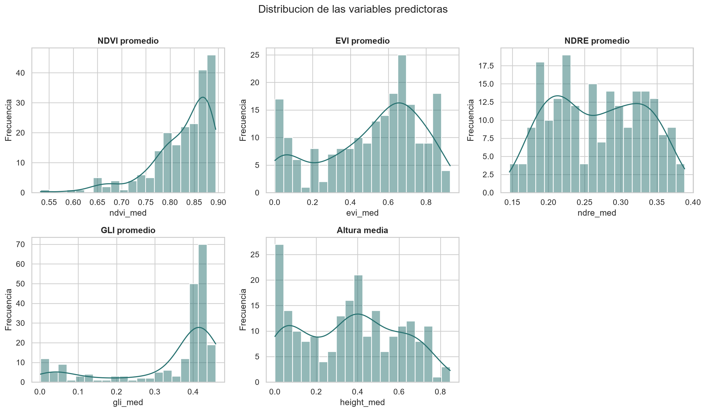
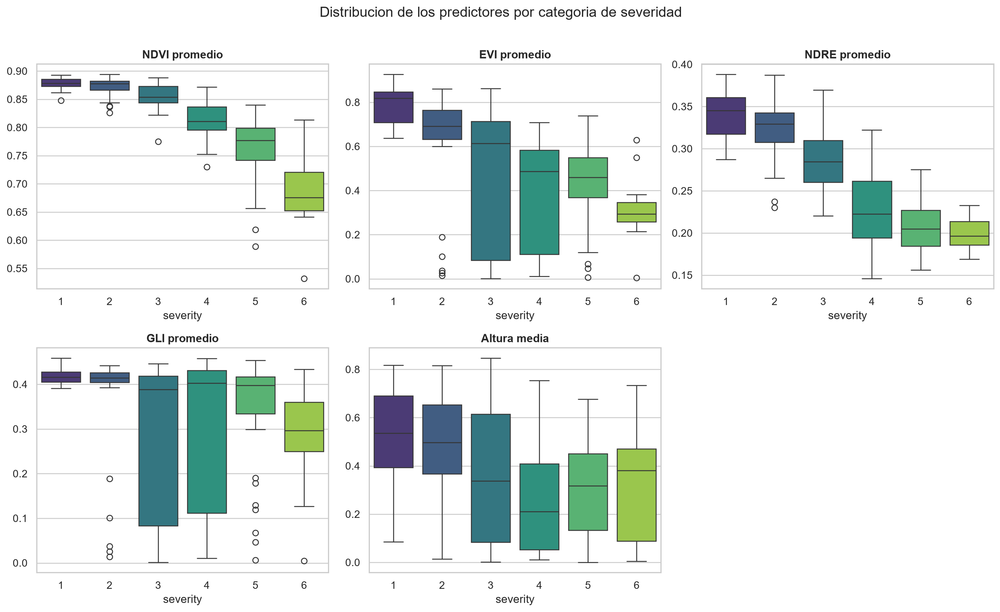
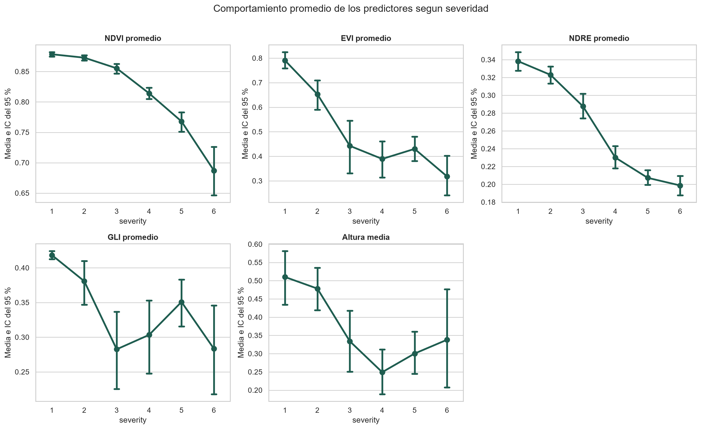
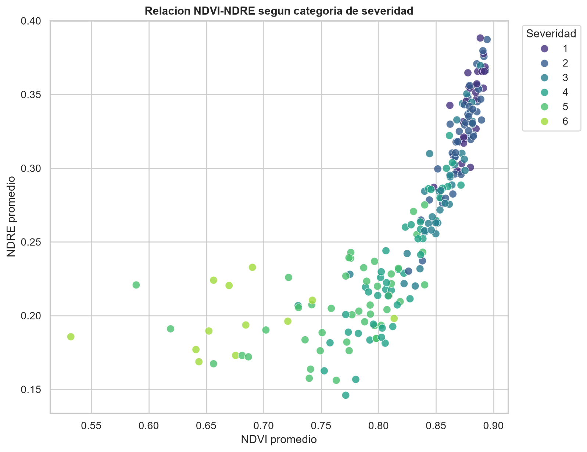
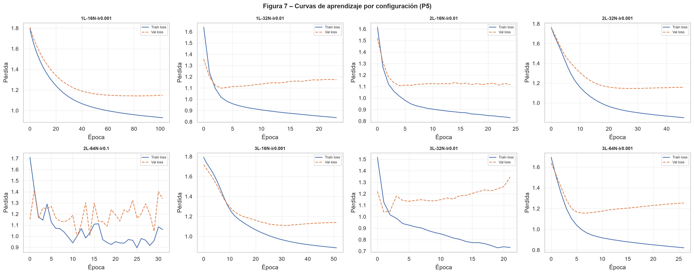
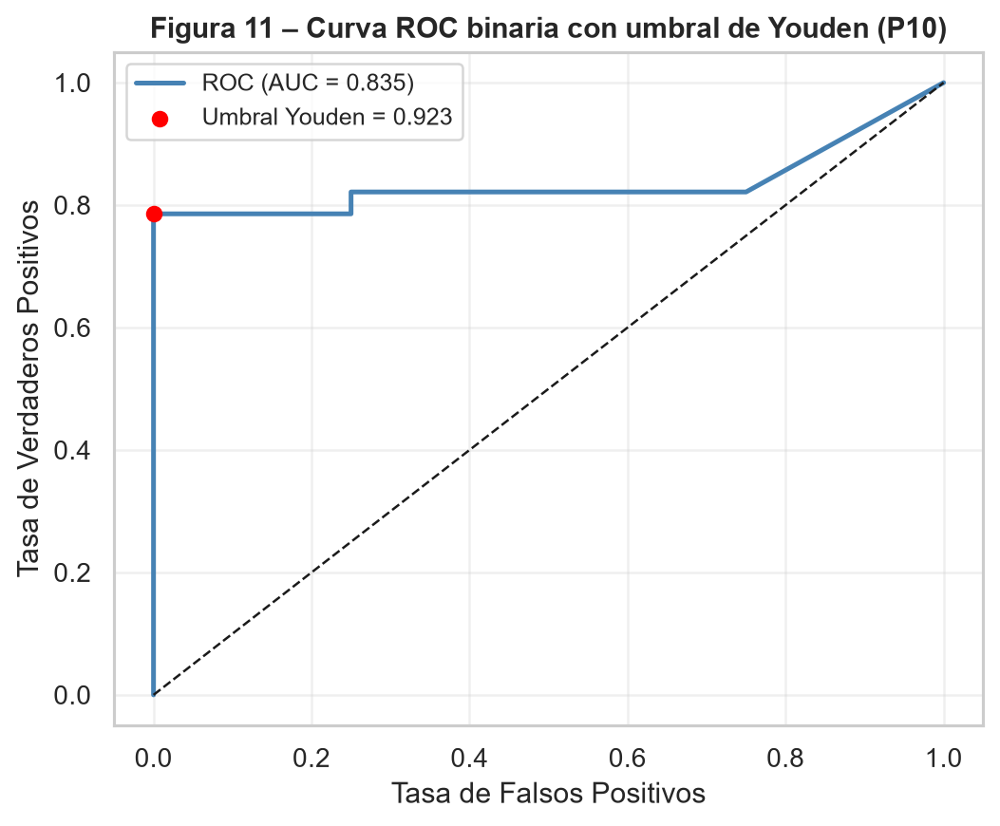
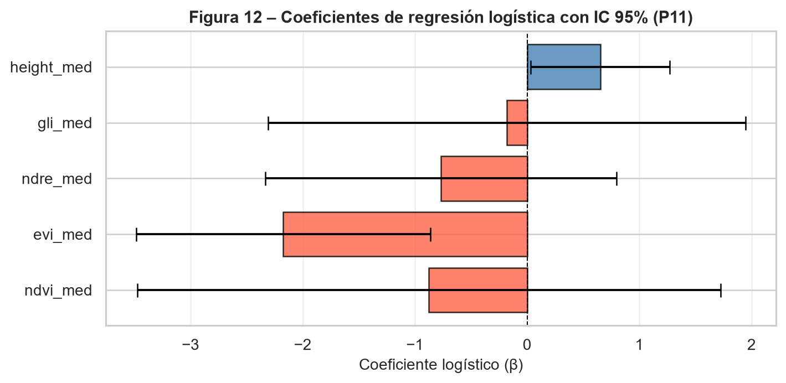

# Introducción

La enfermedad causada por Verticillium sp. es una de las principales amenazas fitosanitarias en cultivos de alto valor económico. Su detección temprana y la clasificación precisa de su severidad son fundamentales para la toma de decisiones agronómicas. En este taller se dispone de un conjunto de datos con más de 200 observaciones de plantas, caracterizadas
por cinco índices espectrales obtenidos mediante teledetección y por la altura media de la planta, con una etiqueta de severidad de la enfermedad donde la categoría 1 corresponde a planta sana.

El objetivo es desarrollar, evaluar y comparar modelos de clasificación basados en perceptrón multicapa (redes neuronales artificiales) y regresión logística, bajo diferentes esquemas de partición de datos, funciones de pérdida y configuraciones arquitectónicas. Adicionalmente, se explorará la dimensión espacial del problema mediante la construcción de una grilla y el análisis de dependencia espacial en escala ordinal.

# Parte I: Clasificación múltiple de severidad con perceptrón multicapa

## Exploración y preprocesamiento

### Pregunta 1: Realice un análisis exploratorio de los cinco índices espectrales y la altura media de la planta. Reporte estadísticos descriptivos por categoría de severidad, incluyendo media, desviación estándar, mínimo y máximo. ¿Observa diferencias visibles entre categorías? Justifique si considera necesaria alguna transformación o estandarización de las variables antes de entrenar la red.


#### Descripción de los datos

El conjunto contiene 212 observaciones y seis categorias ordinales de severidad, codificadas de 1 a 6. La variable 1 corresponde a plantas sanas y los valores mayores representan niveles crecientes de severidad.

El archivo incluye cinco predictores: cuatro indices espectrales (`NDVI`, `EVI`, `NDRE` y `GLI`) y la altura media. Esto difiere del enunciado, que menciona cinco indices espectrales mas la altura. Ademas, la altura aparece entre 0.0005 y 0.8472, por lo que probablemente ya se encuentra normalizada y no expresada directamente en centimetros. Ambas diferencias deben aclararse con la fuente de los datos.

La tabla completa con media, desviacion estandar, minimo y maximo para cada predictor y categoria se muestra a continuación en:

```{python}
#| echo: false
import pandas as pd
pd.read_csv("../resultados/tablas/04_estadisticos_descriptivos_por_severidad.csv")
```

Antes de comparar las categorías de severidad, conviene observar la forma general de las variables predictoras. La siguiente figura resume sus distribuciones y permite identificar diferencias de dispersión, asimetrías y concentración de valores.

{#fig-distribuciones-variables width="90%"}


#### Calidad de los datos

No se encontraron valores faltantes ni infinitos. Se identifico una fila duplicada: las filas originales 174 y 175 contienen exactamente los mismos valores.

En 48 observaciones, los valores de `EVI`, `GLI` y altura son exactamente iguales. Esta coincidencia ocurre principalmente en las severidades 3 y 4 y es poco esperable para tres variables obtenidas de manera independiente. No se modificaron ni eliminaron estas observaciones, pero deben verificarse contra los datos de origen antes de entrenar los modelos. 

```{python}
#| echo: false
import pandas as pd
pd.read_csv("../resultados/tablas/01_resumen_calidad_datos.csv")
```


#### Diferencias entre categorias

La comparación visual por categoría se presenta en la siguiente figura. Los boxplots permiten observar tanto los cambios en la mediana como la dispersión de cada predictor dentro de cada nivel de severidad.

{#fig-boxplots-severidad width="90%"}

La tendencia promedio por severidad se resume en la siguiente figura. Esta visualización facilita identificar qué variables cambian de forma más ordenada conforme aumenta la severidad y cuáles presentan patrones menos monotónicos.

{#fig-medias-severidad width="90%"}


##### NDVI

El NDVI muestra el patron ordinal mas claro. Su media disminuye de 0.8784 en la severidad 1 a 0.6871 en la severidad 6. La asociacion de Spearman con la severidad es fuerte y negativa (`rho = -0.8548`). Las categorias adyacentes 1 y 2 presentan solapamiento, pero la separacion aumenta a partir de la categoria 3.


##### NDRE

El NDRE tambien disminuye de forma consistente: pasa de una media de 0.3383 en la severidad 1 a 0.1987 en la severidad 6. Su correlacion con la severidad es `rho = -0.8170`. Junto con el NDVI, parece ser uno de los predictores con mayor capacidad para distinguir niveles de enfermedad.

La figura siguiente destaca precisamente el comportamiento de NDVI y NDRE frente a la severidad. Ambos índices muestran una disminución progresiva, lo que refuerza su utilidad como señales espectrales de deterioro fisiológico asociado a la enfermedad.

{#fig-ndvi-ndre-severidad width="85%"}


##### EVI

El EVI disminuye desde 0.7905 en plantas sanas hasta 0.3180 en la severidad 6, con una asociacion negativa moderada a fuerte (`rho = -0.6124`). Sin embargo, las categorias intermedias tienen alta dispersion y el patron no es completamente monotono: la media de la severidad 5 es ligeramente mayor que la de la severidad 4.


##### GLI

El GLI presenta una disminucion general, pero con oscilaciones entre las categorias 3, 4 y 5. Su asociacion con la severidad es debil (`rho = -0.2535`) y existe un solapamiento considerable. Su contribucion al modelo podria depender de relaciones no lineales o de interacciones con otros predictores.


##### Altura media

La altura disminuye desde una media de 0.5101 en la severidad 1 hasta 0.2492 en la severidad 4, pero aumenta de nuevo en las categorias 5 y 6. La correlacion es negativa pero moderada (`rho = -0.3401`) y las distribuciones se solapan ampliamente. Por si sola, la altura parece tener menor poder discriminante que NDVI y NDRE.


#### Relacion entre predictores

NDVI y NDRE presentan una correlacion de Spearman muy alta (`rho = 0.94`), lo cual indica que contienen informacion parcialmente redundante. EVI tambien se relaciona con GLI (`rho = 0.71`) y con la altura (`rho = 0.66`). Estas asociaciones no impiden utilizar las variables en una red neuronal, pero deben considerarse al interpretar su importancia.

```{python}
#| echo: false
import pandas as pd
pd.read_csv("../resultados/tablas/05_correlacion_spearman_con_severidad.csv")
```

{#fig-matriz-correlacion width="80%"}


#### Transformacion y estandarizacion

No se recomienda aplicar inicialmente transformaciones logaritmicas. Los predictores estan acotados aproximadamente entre 0 y 1, y varios contienen valores muy cercanos a cero. Una transformacion logaritmica dificultaria la interpretacion y no resolveria el patron de valores que requiere revision. 

Si se confirma la validez de los datos, se recomienda estandarizar los cinco predictores mediante puntuaciones Z antes de entrenar el perceptron multicapa. Aunque sus rangos son parecidos, sus dispersiones son diferentes; la estandarizacion facilitara la optimizacion y evitara que una variable influya mas por su escala numerica.

El escalador debera ajustarse exclusivamente con el conjunto de entrenamiento y luego aplicarse sin reajuste a validacion y prueba. De esta manera se evita la fuga de informacion.


#### Conclusion

Existen diferencias visibles entre las categorias de severidad. NDVI y NDRE presentan los patrones mas ordenados y una separacion clara entre plantas sanas, niveles intermedios y severidades altas. EVI aporta una señal adicional, aunque con mayor variabilidad. GLI y altura muestran un solapamiento considerable y relaciones menos monotonicamente ordenadas.

Antes del modelado debe verificarse el origen de las 48 coincidencias entre EVI, GLI y altura, la fila duplicada y la unidad real de la altura. Estas observaciones se conservaron en el analisis para describir fielmente el archivo recibido.


### Pregunta 2: Verifique si las categorías de severidad están balanceadas. En caso de desequilibrio notable, proponga y justifique al menos una estrategia para manejarlo (sobremuestreo, submuestreo, ponderación de clases u otra). Implemente la estrategia elegida y explique su efecto esperado sobre las métricas de ajuste.

#### Verificación del balance de clases

El conjunto de datos cuenta con 212 observaciones distribuidas en seis categorías de severidad. Como se observa en la siguiente figura, la distribución no es uniforme: la categoría 2 concentra el mayor número de casos (n = 47, 22.5%), mientras que la severidad 6 es la más escasa (n = 13, 6.2%), seguida de la categoría 1 —planta sana— con apenas 27 observaciones (12.9%).

{#fig-balance-clases width="80%"}

El ratio mínimo/máximo de 0.28 confirma un *desequilibrio moderado-alto*, superando el umbral crítico de 0.5 habitualmente reportado en la literatura. Este patrón es problemático porque una red neuronal entrenada sin corrección tendería a favorecer las clases mayoritarias (2, 4 y 5), produciendo una exactitud global engañosamente alta mientras falla sistemáticamente en los extremos del espectro de severidad —precisamente las categorías de mayor relevancia agronómica.


#### Estrategia implementada: SMOTE

Se optó por SMOTE (Synthetic Minority Over-sampling Technique) como estrategia de balanceo. Este método genera observaciones sintéticas para las clases subrepresentadas mediante interpolación lineal entre cada muestra minoritaria y sus k vecinos más cercanos, introduciendo variabilidad controlada y evitando la simple duplicación de registros existentes.

Con un tamaño muestral de n = 212, el submuestreo aleatorio (RandomUnderSampler) fue descartado por implicar una pérdida severa de información —el conjunto de entrenamiento quedaría reducido a aproximadamente 78 observaciones—. La ponderación de clases (class_weight='balanced') constituye una alternativa válida pero no corrige la subrepresentación en el espacio de características, solo repondera la función de pérdida.

Un aspecto metodológico crítico es que SMOTE se aplicó exclusivamente sobre el conjunto de entrenamiento, tras realizar la partición de datos. Aplicarlo antes introduciría data leakage: muestras sintéticas derivadas de observaciones reales del conjunto de prueba contaminarían el entrenamiento, inflando artificialmente las métricas de evaluación.

Para documentar la implementación, la siguiente tabla resume el balance del conjunto de entrenamiento del esquema 70/15/15 antes y después de aplicar SMOTE.

| Severidad | Entrenamiento antes de SMOTE | Entrenamiento después de SMOTE |
|---|---:|---:|
| 1 | 19 | 33 |
| 2 | 33 | 33 |
| 3 | 25 | 33 |
| 4 | 31 | 33 |
| 5 | 31 | 33 |
| 6 | 9 | 33 |

Después del sobremuestreo, todas las categorías quedaron representadas con 33 observaciones en el conjunto de entrenamiento. Los conjuntos de validación y prueba se mantuvieron sin modificar, conservando la distribución original para evaluar el desempeño del modelo en condiciones realistas.

Como efecto esperado, la aplicación de SMOTE debería mejorar el recall en las clases 1 y 6, redistribuir los errores de forma más equitativa en la matriz de confusión y elevar el macro F1-score, que resulta la métrica más informativa bajo condiciones de desequilibrio al ponderar por igual todas las categorías.


#### Conclusión

En conclusión, el análisis de balance de clases evidenció un desequilibrio moderado-alto (ratio 0.28) que, de no corregirse, comprometería la capacidad del modelo para detectar adecuadamente las categorías de severidad extrema —precisamente las más relevantes desde el punto de vista fitosanitario. La implementación de SMOTE sobre el conjunto de entrenamiento constituye una respuesta metodológicamente sólida a este problema, al generar variabilidad sintética representativa sin sacrificar observaciones reales ni comprometer la integridad de la evaluación. Su aplicación estrictamente posterior a la partición de datos garantiza que las métricas reportadas reflejen el desempeño real del modelo frente a datos no vistos, condición indispensable para que los resultados sean válidos y reproducibles en un contexto de apoyo a la decisión agronómica.


## Partición de datos

### Pregunta 3: Partición de datos y selección de hiperparámetros. Para cada esquema, entrene un perceptrón multicapa con la misma arquitectura inicial y compare los resultados. Explique en detalle cuál es la ventaja del esquema de tres particiones frente al de dos, en particular con respecto al riesgo de sobreajuste y a la selección de hiperparámetros.

Se implementaron dos particiones estratificadas para conservar, en la medida de lo posible, la proporción original de categorías de severidad en cada subconjunto. En ambos casos, el sobremuestreo mediante SMOTE se aplicó únicamente sobre el conjunto de entrenamiento. En el esquema 80/20, el entrenamiento original quedó con 169 observaciones y fue balanceado hasta 222 registros; el conjunto de prueba quedó con 43 observaciones. En el esquema 70/15/15, el entrenamiento original quedó con 148 observaciones y fue balanceado hasta 198 registros; validación y prueba conservaron 32 observaciones cada uno.


#### Esquema A: Entrenamiento / Prueba (80 % / 20 %)

El esquema de dos particiones asigna 169 observaciones originales al entrenamiento y 43 a la prueba. Su principal debilidad metodológica radica en que no existe un conjunto de validación independiente: cualquier decisión sobre hiperparámetros —número de capas, neuronas o tasa de aprendizaje— que se tome observando el desempeño sobre el conjunto de prueba convierte implícitamente a este último en un conjunto de validación. El modelo seleccionado ya no es el más generalizable, sino el más ajustado a ese conjunto de prueba particular, introduciendo un sesgo optimista en la evaluación final que invalida la comparación justa entre configuraciones.


#### Esquema B: Entrenamiento / Validación / Prueba (70 % / 15 % / 15 %)

El esquema de tres particiones asigna aproximadamente 148, 32 y 32 observaciones a cada conjunto respectivamente, con roles claramente diferenciados. El conjunto de entrenamiento ajusta los pesos de la red mediante retropropagación; el conjunto de validación monitorea la pérdida en tiempo real para detectar sobreajuste y aplicar early stopping, sin que el modelo aprenda de él; y el conjunto de prueba se reserva de forma estricta para el reporte final, siendo consultado una única vez al término del proceso. Esta separación de roles preserva la integridad de la evaluación y garantiza que las métricas reportadas constituyan una estimación imparcial del error de generalización ante datos completamente nuevos.
No obstante, con n = 212 los subconjuntos de validación y prueba resultan reducidos (~32 observaciones cada uno), lo que introduce varianza en las estimaciones: una sola observación mal clasificada puede desplazar el accuracy varios puntos porcentuales. Esta limitación motiva la exploración de validación cruzada k-fold en la Pregunta 4 como estrategia complementaria de menor varianza.


#### Comparación experimental del MLP inicial

Para cumplir la comparación solicitada, se entrenó la misma arquitectura inicial en ambos esquemas: una capa oculta con 16 neuronas, activación ReLU, salida *softmax*, tasa de aprendizaje de 0.001 y pérdida de entropía cruzada categórica. En el esquema 80/20, al no existir conjunto de validación independiente, el modelo se entrenó con un número fijo de épocas; en el esquema 70/15/15 se utilizó el conjunto de validación para monitorear la pérdida y aplicar *early stopping*.

```{python}
#| echo: false
#| tbl-cap: "Comparación de esquemas de partición con la misma arquitectura inicial de MLP."
import pandas as pd

tabla_p3 = pd.read_csv("../resultados/tablas/p3_comparacion_esquemas_particion.csv")
tabla_p3 = tabla_p3[
    [
        "Esquema",
        "Entrenamiento",
        "Validacion",
        "Prueba",
        "Epocas ejecutadas",
        "Accuracy entrenamiento",
        "Accuracy validacion",
        "Accuracy prueba",
        "Loss prueba",
    ]
].rename(
    columns={
        "Entrenamiento": "Entrenamiento usado",
        "Validacion": "Validación",
        "Epocas ejecutadas": "Épocas ejecutadas",
        "Accuracy entrenamiento": "Accuracy entrenamiento",
        "Accuracy validacion": "Accuracy validación",
        "Accuracy prueba": "Accuracy prueba",
        "Loss prueba": "Loss prueba",
    }
)
tabla_p3["Validación"] = tabla_p3["Validación"].replace(0, "-")
tabla_p3.fillna("-")
```

El esquema 80/20 obtuvo mayor exactitud en prueba para esta arquitectura inicial. Sin embargo, esta diferencia no implica que sea el esquema metodológicamente preferible: al no existir validación independiente, cualquier ajuste de arquitectura o hiperparámetros basado en la prueba contaminaría la evaluación final. El esquema 70/15/15, aunque sacrifica datos de entrenamiento y puede mostrar mayor variabilidad por el tamaño reducido de validación y prueba, permite separar claramente tres decisiones: ajuste de pesos, selección de hiperparámetros y evaluación final.


#### Conclusión

La elección del esquema de partición no es una decisión menor, ya que determina directamente la validez de las métricas reportadas y la confiabilidad de la selección de modelos. El esquema 80/20, aunque maximiza los datos de entrenamiento, compromete la imparcialidad de la evaluación al exponer el conjunto de prueba al proceso de ajuste de hiperparámetros. El esquema 70/15/15, en cambio, garantiza una separación metodológica rigurosa entre optimización y evaluación, condición indispensable cuando los resultados deben fundamentar decisiones agronómicas reales. Por estas razones, el esquema de tres particiones fue adoptado como referencia para el resto del taller, asumiendo la mayor varianza asociada al tamaño reducido de cada subconjunto como un costo aceptable frente a la solidez metodológica que ofrece.

### Pregunta 4: Dado que el tamaño muestral es mayor a 200 pero no muy grande, ¿considera que sería apropiado usar validación cruzada k-fold como alternativa o complemento? Argumente su respuesta y, si decide implementarla, reporte los resultados comparativos.

Con un tamaño muestral de n = 212, la estimación del error de generalización a partir de una única partición fija está sujeta a una varianza considerable, pues la composición específica del conjunto de prueba influye de forma no despreciable sobre las métricas reportadas. Por esta razón, se considera apropiado usar validación cruzada estratificada k-fold como complemento del esquema 70/15/15, no como reemplazo de la evaluación final.

Se implementó una validación cruzada estratificada con k = 5 folds usando el mismo tipo de modelo de la Parte I: un perceptrón multicapa con una capa oculta de 16 neuronas, activación ReLU, salida *softmax*, tasa de aprendizaje de 0.001 y pérdida de entropía cruzada categórica. Para evitar fuga de información, en cada fold el escalador se ajustó únicamente con el subconjunto de entrenamiento y luego se aplicó al subconjunto de validación; de igual forma, SMOTE se aplicó solo sobre el entrenamiento de cada fold, manteniendo intacta la validación.


#### Resultados por fold

```{python}
#| echo: false
#| tbl-cap: "Validación cruzada estratificada k-fold con MLP inicial."
import pandas as pd

tabla_p4_folds = pd.read_csv("../resultados/tablas/p4_kfold_mlp_por_fold.csv")
tabla_p4_folds = tabla_p4_folds[
    [
        "Fold",
        "Entrenamiento original",
        "Entrenamiento usado",
        "Validacion",
        "SMOTE aplicado",
        "Epocas ejecutadas",
        "Accuracy validacion",
        "F1 macro validacion",
        "Loss validacion",
    ]
].rename(
    columns={
        "Validacion": "Validación",
        "Epocas ejecutadas": "Épocas ejecutadas",
        "Accuracy validacion": "Accuracy validación",
        "F1 macro validacion": "F1 macro validación",
        "Loss validacion": "Loss validación",
    }
)
tabla_p4_folds
```

Los resultados muestran accuracies de validación entre *0.4048* y *0.5476*, con una media de *0.4763* y una desviación estándar de *0.0526*. Esta variabilidad confirma que, con una muestra de 212 observaciones, el desempeño estimado depende de forma apreciable de la composición del subconjunto usado para evaluar. El F1 macro medio fue de *0.4563 ± 0.0318*, lo cual es especialmente relevante porque el problema presenta desequilibrio entre categorías y la exactitud global puede ocultar errores en clases minoritarias.


#### Comparación con la partición fija

```{python}
#| echo: false
#| tbl-cap: "Comparación entre partición fija y validación cruzada k-fold."
import pandas as pd

tabla_p4_comp = pd.read_csv("../resultados/tablas/p4_comparacion_kfold_particion_fija.csv")
tabla_p4_comp = tabla_p4_comp.rename(
    columns={
        "Estrategia": "Estrategia",
        "Modelo": "Modelo",
        "Conjunto evaluado": "Conjunto evaluado",
        "Accuracy medio": "Accuracy",
        "Desviacion accuracy": "Desv. accuracy",
        "F1 macro medio": "F1 macro",
        "Desviacion F1 macro": "Desv. F1 macro",
        "Uso recomendado": "Uso recomendado",
    }
)
tabla_p4_comp.fillna("-")
```

La partición fija 70/15/15 obtuvo una exactitud de prueba de *0.4375* para el MLP inicial, mientras que la validación cruzada k-fold estimó una exactitud media de *0.4763*. La diferencia no debe interpretarse como superioridad absoluta de una estrategia sobre la otra, porque evalúan de manera distinta: la partición fija reserva un conjunto de prueba único para el reporte final, mientras que k-fold promedia cinco evaluaciones internas y ofrece una medida más estable de variabilidad.


#### Rol metodológico en la estrategia global

La validación cruzada k-fold resulta útil como complemento durante la selección de hiperparámetros, porque reduce el riesgo de elegir una configuración que funcione bien únicamente para una división específica de los datos. Sin embargo, no sustituye la partición fija 70/15/15 adoptada en la Pregunta 3, ya que esta conserva un conjunto de prueba independiente y trazable para reportar las métricas finales del modelo seleccionado.


#### Conclusión

La validación cruzada estratificada con *k = 5* es apropiada para este problema como herramienta complementaria. Sus resultados confirman que el error de generalización presenta variabilidad no despreciable entre particiones, pero también que los predictores espectrales contienen señal suficiente para superar ampliamente una clasificación aleatoria de seis clases. En el marco del taller, k-fold se utiliza para estimar la estabilidad del desempeño y apoyar la selección de hiperparámetros, mientras que la partición fija 70/15/15 se mantiene como referencia para la evaluación final.


## Arquitectura y entrenamiento

### Pregunta 5: Entrene al menos cuatro perceptrones multicapa variando sistemáticamente el número de capas ocultas, neuronas por capa y tasa de aprendizaje. Para cada configuración reporte la pérdida en entrenamiento y validación por época. ¿En qué configuraciones observa indicios de sobreajuste o subajuste?

Se entrenaron ocho arquitecturas de perceptrón multicapa orientadas a la clasificación multiclase de la severidad de *Verticillium sp.* (seis categorías: 1 = sano, 2 a 6 = niveles crecientes de severidad), variando el número de capas ocultas (1, 2 y 3), el número de neuronas por capa (16, 32 y 64, con al menos dos tamaños evaluados en cada número de capas) y la tasa de aprendizaje (0.001, 0.01 y 0.1). No se realizó un barrido factorial completo de las 27 combinaciones posibles, sino un diseño curado de ocho configuraciones que cumple los mínimos exigidos por el enunciado; como consecuencia, la tasa de aprendizaje no varía de forma independiente dentro de cada arquitectura, sino que está parcialmente confundida con la combinación capas-neuronas, lo que se tiene en cuenta al interpretar su efecto más adelante.

El conjunto de datos (n = 212) presenta un desbalance moderado entre categorías (conteos entre 13 y 47 observaciones), por lo que el entrenamiento se realizó sobre el conjunto de entrenamiento balanceado mediante SMOTE, mientras que validación y prueba se mantuvieron sin sobremuestreo. Con el esquema de partición 70/15/15 de la Pregunta 3, los tamaños resultantes fueron *entrenamiento = 198*, *validación = 32* y *prueba = 32* observaciones. Este tamaño de validación y prueba es reducido y debe tenerse presente como límite al interpretar diferencias pequeñas entre configuraciones, pues con 32 observaciones una sola predicción adicional correcta ya mueve la exactitud en cerca de 3 puntos porcentuales. Todas las redes utilizaron activación ReLU en las capas ocultas y salida *softmax*, con entropía cruzada categórica dispersa como función de pérdida y *early stopping* monitoreando la pérdida de validación.

La selección de la mejor configuración se hizo por la menor pérdida de validación, y no por la exactitud de prueba: usar el conjunto de prueba para escoger hiperparámetros lo convertiría, de facto, en una extensión del conjunto de validación, contaminando la evaluación final con un sesgo optimista, justamente el problema que la partición en tres conjuntos de la Pregunta 3 busca evitar. La exactitud de prueba se reporta únicamente como referencia descriptiva del modelo ya seleccionado.


#### Resultados obtenidos

La tabla siguiente resume el desempeño de las ocho configuraciones entrenadas. El historial completo de pérdida y exactitud por época para cada arquitectura se guardó en `resultados/tablas/14_p5_historial_perdida_por_epoca.csv`; por extensión, en el informe se presenta la síntesis numérica y las curvas de aprendizaje.

```{python}
#| echo: false
#| tbl-cap: "Comparación de arquitecturas de perceptrón multicapa para clasificación multiclase."
import pandas as pd

tabla_p5 = pd.read_csv("../resultados/tablas/13_p5_comparacion_arquitecturas_mlp.csv")
tabla_p5_resumen = tabla_p5[
    [
        "Configuración",
        "Capas ocultas",
        "Neuronas/capa",
        "Tasa aprendizaje",
        "Épocas ejecutadas",
        "Loss Train mínima",
        "Loss Val mínima",
        "Acc Train (máx)",
        "Acc Val (máx)",
        "Brecha Acc Train-Val",
        "Acc Test",
    ]
].rename(
    columns={
        "Capas ocultas": "Capas",
        "Neuronas/capa": "Neuronas",
        "Épocas ejecutadas": "Épocas",
        "Loss Train mínima": "Loss Train mín.",
        "Loss Val mínima": "Loss Val mín.",
        "Acc Train (máx)": "Acc Train",
        "Acc Val (máx)": "Acc Val",
    }
)
tabla_p5_resumen
```

Las curvas de aprendizaje muestran, para cada configuración, la evolución de la pérdida en entrenamiento y validación por época. Esta visualización permite identificar si la red reduce ambas pérdidas de manera coordinada, si la pérdida de entrenamiento sigue bajando mientras la validación empeora, o si ambas permanecen altas.

{#fig-curvas-aprendizaje-p5 width="100%"}

El modelo seleccionado según el criterio predefinido de menor pérdida mínima de validación fue *2L-64N-lr0.1* (*Loss Val mínima = 0.9958*), con exactitud máxima de validación de *0.5938*, brecha Train-Val de *0.0174* y exactitud de prueba de referencia de *0.3438*. Aunque *2L-16N-lr0.01* obtuvo la mayor exactitud de prueba de referencia (*0.4688*), esta métrica no se usó para seleccionar la arquitectura, porque hacerlo contaminaría el conjunto de prueba. El criterio de pérdida de validación mantiene la selección dentro del proceso de entrenamiento y reserva la prueba para la evaluación final.


#### Diagnóstico de sobreajuste y subajuste

La configuración más simple, *1L-16N-lr0.001*, necesitó 103 épocas y alcanzó una exactitud máxima de entrenamiento de apenas *0.6010*. Esta combinación de muchas épocas, pérdida de validación relativamente alta (*1.1424*) y desempeño de entrenamiento moderado sugiere subajuste: la red aprende lentamente y su capacidad de representación parece limitada para separar seis categorías con solapamiento espectral.

Los indicios más claros de sobreajuste aparecen en configuraciones con mayor brecha entre entrenamiento y validación, especialmente *3L-64N-lr0.001* (*Brecha Acc Train-Val = 0.1304; Brecha Loss Val-Train = 0.3350*) y *2L-32N-lr0.001* (*Brecha Acc Train-Val = 0.1253; Brecha Loss Val-Train = 0.2959*). En estas redes, la mejora en entrenamiento no se transfiere con la misma intensidad a validación, patrón compatible con memorización parcial del conjunto de entrenamiento, incluidas las muestras sintéticas generadas por SMOTE.

La configuración *2L-64N-lr0.1* muestra el mejor valor mínimo de pérdida de validación y una brecha de exactitud muy baja, pero su curva debe interpretarse con cautela: la tasa de aprendizaje alta permite alcanzar rápidamente una buena región, aunque la pérdida de validación se deteriora después del mínimo. En este caso, el *early stopping* es crucial para recuperar los pesos de la época con mejor validación y evitar que el entrenamiento continúe hacia una zona menos estable.


#### Conclusión

La comparación sistemática muestra que la arquitectura más simple tiende al subajuste, mientras que algunas arquitecturas de mayor capacidad presentan señales de sobreajuste cuando la brecha entre entrenamiento y validación aumenta. El mejor modelo según la pérdida mínima de validación fue *2L-64N-lr0.1*, aunque su tasa de aprendizaje alta exige apoyarse en *early stopping* para conservar la mejor época. Deben señalarse dos limitaciones: el diseño de ocho configuraciones no permite aislar por completo el efecto de la tasa de aprendizaje del de la arquitectura, y el tamaño reducido de validación y prueba (32 observaciones cada uno) implica que diferencias pequeñas entre configuraciones deben interpretarse con cautela.


### Pregunta 6: Implemente y compare dos criterios para cuantificar el error durante el entrenamiento: entropía cruzada categórica (CCE) y error cuadrático medio (MSE). ¿Cuál es más apropiado para un problema de clasificación múltiple? Fundamente su respuesta tanto teórica como empíricamente.

Se entrenó la arquitectura seleccionada en la Pregunta 5 (*2L-64N-lr0.1*) dos veces, idéntica en todo salvo la función de pérdida. Para la entropía cruzada se usó `sparse_categorical_crossentropy`, que es equivalente a la entropía cruzada categórica cuando las etiquetas se almacenan como enteros; para MSE se usaron etiquetas en formato *one-hot*.


#### Resultados obtenidos

```{python}
#| echo: false
#| tbl-cap: "Comparación empírica entre entropía cruzada categórica y MSE."
import pandas as pd

tabla_p6 = pd.read_csv("../resultados/tablas/p6_comparacion_funciones_perdida.csv")
tabla_p6 = tabla_p6[
    [
        "Funcion perdida",
        "Implementacion",
        "Arquitectura",
        "Accuracy prueba",
        "Aciertos prueba",
        "Total prueba",
        "Decision metodologica",
    ]
].rename(
    columns={
        "Funcion perdida": "Función de pérdida",
        "Implementacion": "Implementación",
        "Accuracy prueba": "Accuracy prueba",
        "Aciertos prueba": "Aciertos",
        "Total prueba": "Total",
        "Decision metodologica": "Decisión metodológica",
    }
)
tabla_p6
```

Con la arquitectura seleccionada en la Pregunta 5, CCE obtuvo una exactitud de prueba de *0.4375* (14/32), mientras que MSE obtuvo *0.2188* (7/32). La diferencia empírica favorece claramente a CCE en esta ejecución: el modelo entrenado con entropía cruzada clasificó correctamente el doble de observaciones que el modelo entrenado con MSE.

{#fig-cce-vs-mse width="85%"}

Las curvas de entrenamiento muestran que ambas funciones reducen la pérdida durante el ajuste, pero no optimizan el mismo objetivo probabilístico. Por esta razón, la comparación directa de los valores de pérdida entre CCE y MSE debe hacerse con cautela: lo más informativo es observar la estabilidad de la validación y el desempeño final sobre prueba.


#### Fundamento teórico

La entropía cruzada categórica es la función de pérdida coherente con la capa de salida *softmax*: maximiza la verosimilitud de una distribución categórica y constituye una regla de puntuación propia (*proper scoring rule*), que penaliza de forma creciente la confianza mal ubicada en la clase incorrecta, con gradientes bien escalados incluso cuando la predicción está muy alejada del valor real. El error cuadrático medio, en cambio, fue diseñado para variables continuas; aplicado sobre probabilidades *softmax* con codificación *one-hot*, produce gradientes que pueden ser menos informativos cuando la salida se acerca a 0 o a 1, ralentizando el aprendizaje justo en casos de error claro. Además, MSE trata las probabilidades de clase como coordenadas continuas y no como una distribución categórica que debe asignar alta probabilidad a una única clase verdadera.


#### Conclusión

Se recomienda la entropía cruzada categórica como función de pérdida para este problema de clasificación múltiple. La recomendación se sostiene teóricamente por su coherencia con la salida *softmax* y empíricamente porque, con la arquitectura seleccionada, obtuvo mayor exactitud de prueba que MSE. Aunque el conjunto de prueba es pequeño y las métricas deben interpretarse con cautela, en esta comparación la evidencia práctica y el fundamento estadístico apuntan en la misma dirección: CCE es más apropiada que MSE para entrenar el perceptrón multicapa multiclase.


## Métricas de evaluación

### Pregunta 7: Para el modelo seleccionado en la Pregunta 5, reporte exactitud global, precisión, sensibilidad y F1 por clase, macro-promedio y promedio ponderado, matriz de confusión con interpretación, y curva ROC/AUC uno-contra-todos. ¿Qué categorías de severidad son más difíciles de clasificar? ¿A qué lo atribuye?

Se evaluó el modelo seleccionado en la Pregunta 5, *2L-64N-lr0.1*, entrenado con entropía cruzada categórica, sobre el conjunto de prueba reservado (n = 32). La exactitud global obtenida fue de *0.4375*; es decir, el modelo clasificó correctamente 14 de las 32 observaciones de prueba.


#### Resumen global

```{python}
#| echo: false
#| tbl-cap: "Resumen de métricas globales del modelo multiclase en prueba."
import pandas as pd

tabla_p7_resumen = pd.read_csv("../resultados/tablas/p7_resumen_metricas_multiclase.csv")
tabla_p7_resumen
```


#### Métricas por clase

```{python}
#| echo: false
#| tbl-cap: "Precisión, sensibilidad y F1-score por clase, macro-promedio y promedio ponderado."
import pandas as pd

tabla_p7_metricas = pd.read_csv("../resultados/tablas/p7_metricas_clasificacion_multiclase.csv")
tabla_p7_metricas
```

El macro F1-score fue de *0.3137*, inferior al F1 ponderado (*0.3909*). Esta diferencia indica que el desempeño global está favorecido por las clases con mayor soporte en prueba, mientras que las clases minoritarias o difíciles, especialmente Sev 1 y Sev 6, reducen de forma marcada el promedio no ponderado.


#### Matriz de confusión

La matriz de confusión, con filas correspondientes a la severidad real y columnas a la severidad predicha, se presenta a continuación.

```{python}
#| echo: false
#| tbl-cap: "Matriz de confusión del modelo multiclase."
import pandas as pd

pd.read_csv("../resultados/tablas/p7_matriz_confusion_multiclase.csv")
```

{#fig-confusion-multiclase width="80%"}

La matriz evidencia una tendencia a concentrar predicciones en severidades intermedias y altas: todos los casos reales de Sev 1 fueron clasificados como Sev 2, y ninguno de los dos casos reales de Sev 6 fue clasificado correctamente. En cambio, Sev 2 y Sev 5 concentran la mayor cantidad de aciertos absolutos, con 6/7 y 4/7 casos correctos, respectivamente.


#### Curvas ROC y AUC

```{python}
#| echo: false
#| tbl-cap: "AUC-ROC por clase bajo esquema uno-contra-todos."
import pandas as pd

pd.read_csv("../resultados/tablas/p7_auc_roc_ovr_multiclase.csv")
```

{#fig-roc-multiclase width="85%"}

El AUC-ROC macro fue de *0.7588*, lo que sugiere que el modelo conserva cierta capacidad de ordenamiento probabilístico entre clases, incluso cuando la decisión final por *argmax* produce errores importantes. Esta diferencia entre AUC y F1 es especialmente visible en Sev 1: su AUC es relativamente alto (*0.8571*), pero su F1 es 0 porque, bajo la regla de clase final, ningún caso real de Sev 1 fue asignado correctamente.


#### Interpretación por categoría

Las categorías más difíciles de clasificar correctamente fueron Sev 1 y Sev 6, ambas con precisión, sensibilidad y F1-score iguales a 0. En Sev 1, los cuatro casos reales fueron desplazados hacia Sev 2, lo que indica que el modelo no logra separar de forma robusta plantas sanas de plantas con severidad leve bajo la regla de decisión final. En Sev 6, los dos casos disponibles en prueba fueron clasificados como Sev 3 y Sev 4; este resultado debe interpretarse con cautela por el soporte extremadamente pequeño, pero confirma que la clase más severa no está bien representada.

Entre las clases intermedias, Sev 4 también presenta dificultad: su AUC-ROC es el más bajo (*0.6914*) y solo 2 de 7 casos reales fueron clasificados correctamente. Esto es consistente con el carácter ordinal del problema: las severidades intermedias comparten señales espectrales con categorías vecinas y se solapan en variables como EVI, GLI y altura. Por contraste, Sev 5 fue la categoría con mejor F1-score (*0.6154*) y mayor AUC (*0.8657*), lo que sugiere una señal espectral más distinguible para niveles altos pero no extremos de daño.


#### Conclusión

El desempeño multiclase del MLP es moderado y desigual entre categorías. La exactitud global de *0.4375* supera la clasificación aleatoria esperada para seis clases, pero el macro F1-score de *0.3137* revela que el modelo no trata todas las severidades con la misma eficacia. Las clases más problemáticas son Sev 1 y Sev 6 por ausencia de aciertos directos, y Sev 4 por su bajo AUC y confusión con clases vecinas. Esto sugiere que seis niveles ordinales pueden ser demasiado finos para el tamaño muestral disponible y anticipa la pertinencia de explorar la clasificación binaria en la Parte II.

# Parte II: Clasificación binaria de severidad

## Colapso de categorías

### Pregunta 8: Proponga y justifique un criterio para colapsar las categorías de severidad en sano versus enfermo. Discuta si esta agrupación es la más apropiada o si existiría una alternativa mejor fundamentada. ¿Se pierde información relevante?

El criterio adoptado asigna la severidad 1 a la categoría "Sano" (0) y las severidades 2 a 6 a la categoría "Enfermo" (1). Con los datos disponibles, esto produce una distribución binaria fuertemente desbalanceada:

```{python}
#| echo: false
#| tbl-cap: "Distribución de clases después del colapso binario."
import pandas as pd

pd.read_csv("../resultados/tablas/p8_distribucion_binaria.csv")
```

#### Criterio adoptado y justificación

Desde el punto de vista agronómico, para un sistema de alerta temprana la decisión operativa relevante no es cuán severa es la infección sino si existe evidencia de infección que amerite intervención. Agrupar cualquier nivel de severidad igual o superior a 2 como "Enfermo" tiene sentido práctico en ese contexto, pues prioriza la sensibilidad de detección sobre la caracterización fina del estado de avance de la enfermedad.

#### Alternativas y pérdida de información

Este criterio es defendible, pero no es el único razonable. Los resultados actualizados de la Pregunta 7 muestran que el modelo multiclase tiene dificultades importantes en los extremos Sev 1 y Sev 6, ambas con F1-score igual a 0, y también en Sev 4 por su baja separación probabilística. En particular, los cuatro casos reales de Sev 1 fueron clasificados como Sev 2, lo que indica que separar estrictamente sano de severidad leve es difícil con la información disponible.

Desde ese punto de vista, una alternativa mejor fundamentada para algunos usos agronómicos sería trabajar con tres grupos ordinales: sano (Sev 1), enfermedad leve o intermedia (Sev 2 a 4) y enfermedad avanzada (Sev 5 a 6). Esta alternativa conservaría parte del gradiente de severidad y evitaría mezclar en una sola clase "Enfermo" casos muy distintos, desde síntomas leves hasta daño avanzado. Sin embargo, como el enunciado solicita explícitamente una clasificación binaria sano versus enfermo, y como en un sistema de alerta temprana la prioridad es detectar cualquier indicio de infección, se mantiene el colapso Sev 1 frente a Sev 2-6.

Sí se pierde información relevante al hacer esta reducción: toda distinción de severidad dentro de "Enfermo" desaparece, y esa categoría concentra el 87.26 % de la muestra (185 de 212 observaciones). La pérdida no es menor, porque Sev 2 y Sev 5 tuvieron desempeños bastante diferentes en la Pregunta 7: Sev 2 alcanzó alta sensibilidad, mientras que Sev 5 obtuvo el mejor F1-score y el mayor AUC. Al fusionarlas, el modelo binario deja de informar si la enfermedad es leve, intermedia o avanzada.

#### Conclusión

El colapso sano/enfermo es una simplificación razonable y alineada con el objetivo de detección temprana, pero implica una pérdida de información no trivial sobre el gradiente de severidad, y su idoneidad depende del uso que se le dé al modelo: adecuada para alertar sobre la presencia de la enfermedad, insuficiente si el objetivo es apoyar decisiones que dependan del grado de avance.

### Pregunta 9: Entrene un perceptrón multicapa para el problema binario resultante, repitiendo el esquema de partición entrenamiento/validación/prueba. Compare el desempeño con el modelo de clasificación múltiple de la Parte I. ¿Mejora la clasificación al reducir el número de clases?

Se entrenó un perceptrón multicapa binario usando la misma arquitectura seleccionada en la Pregunta 5 (*2L-64N-lr0.1*), adaptada a salida sigmoide y pérdida de entropía cruzada binaria. Se repitió el esquema de partición 70/15/15 y SMOTE se aplicó únicamente sobre el conjunto de entrenamiento.

```{python}
#| echo: false
#| tbl-cap: "Partición del problema binario y balanceo con SMOTE."
import pandas as pd

pd.read_csv("../resultados/tablas/p9_particion_binaria.csv")
```

#### Resultados obtenidos

Con el umbral por defecto de 0.5, la exactitud de prueba fue de *0.7812* (25/32), con una matriz de confusión de *TN = 3, FP = 1, FN = 6, TP = 22*. Las métricas por clase se resumen a continuación:

```{python}
#| echo: false
#| tbl-cap: "Métricas del MLP binario con umbral 0.5."
import pandas as pd

pd.read_csv("../resultados/tablas/p9_metricas_binarias_umbral_05.csv")
```

#### Comparación con el modelo multiclase

La comparación con el modelo multiclase seleccionado en la Parte I se presenta usando métricas comunes: exactitud, precisión macro y ponderada, sensibilidad macro y ponderada, y F1 macro y ponderado.

```{python}
#| echo: false
#| tbl-cap: "Comparación entre MLP multiclase y MLP binario sobre el conjunto de prueba."
import pandas as pd

pd.read_csv("../resultados/tablas/p9_comparacion_mlp_multiclase_binario.csv")
```

La exactitud pasa de *0.4375* en el modelo multiclase a *0.7812* en el binario, y el F1 ponderado de *0.3909* a *0.8126*. También mejora el F1 macro, de *0.3137* a *0.6621*, lo que indica que la mejora no se debe únicamente al peso de la clase mayoritaria. No obstante, esta comparación debe interpretarse con cautela: al reducir seis categorías ordinales a dos clases, desaparecen muchos errores entre niveles de severidad que antes contaban como fallos, especialmente las confusiones entre severidad sana/leve y entre categorías intermedias.

La comparación tampoco es completamente equivalente porque el problema binario queda fuertemente desbalanceado: en prueba hay 4 observaciones sanas y 28 enfermas. Con el umbral por defecto, el modelo comete 1 falso positivo y deja 6 falsos negativos; es decir, seis plantas realmente enfermas fueron clasificadas como sanas. Desde el punto de vista fitosanitario, este error es especialmente relevante y se analiza con mayor detalle en la Pregunta 10.

#### Conclusión

Reducir el número de clases mejora de forma sustancial las métricas comunes frente al modelo multiclase. La mejora ocurre porque el problema binario es estructuralmente más simple y porque el colapso de categorías elimina errores de vecindad ordinal. Sin embargo, la mejora global no garantiza que el modelo sea suficiente para una decisión agronómica: con umbral 0.5 todavía produce falsos negativos, el tipo de error más costoso en un sistema de alerta temprana.

### Pregunta 10: Reporte para el modelo binario exactitud, precisión, sensibilidad, especificidad, F1, AUC-ROC y el umbral óptimo según el criterio de Youden. Interprete cada métrica en el contexto fitosanitario: ¿qué es más costoso, un falso negativo o un falso positivo?

Con el umbral por defecto de 0.5, la sensibilidad del modelo binario fue de 22/28 = *0.7857* y la especificidad de 3/4 = *0.7500*, según se reportó en la Pregunta 9. El umbral óptimo según el criterio de Youden resultó ser *0.9226*, más alto que 0.5.

#### Resultados obtenidos

```{python}
#| echo: false
#| tbl-cap: "Métricas del modelo binario usando el umbral óptimo de Youden."
import pandas as pd

pd.read_csv("../resultados/tablas/p10_metricas_umbral_youden.csv")
```

También se comparó el umbral por defecto de 0.5 con el umbral óptimo de Youden:

```{python}
#| echo: false
#| tbl-cap: "Comparación entre umbral por defecto y umbral de Youden."
import pandas as pd

pd.read_csv("../resultados/tablas/p10_comparacion_umbrales.csv")
```

Al subir el umbral de 0.5 a 0.9226, la matriz de confusión pasa de *(TN=3, FP=1, FN=6, TP=22)* a *(TN=4, FP=0, FN=6, TP=22)*. En esta corrida, el criterio de Youden elimina el único falso positivo y aumenta la especificidad de 0.75 a 1.00, pero no recupera falsos negativos: la sensibilidad se mantiene en 0.7857. Esto muestra que el umbral óptimo según Youden mejora el equilibrio estadístico entre sensibilidad y especificidad, aunque no necesariamente maximiza el objetivo fitosanitario de detectar todas las plantas enfermas.

{#fig-roc-binario width="80%"}

#### Interpretación en el contexto fitosanitario

Un falso negativo, es decir, una planta enferma clasificada como sana, es claramente más costoso en este contexto: la planta no recibe tratamiento y la infección por *Verticillium sp.*, al tratarse de un patógeno de suelo con capacidad de dispersión, puede progresar y contagiar el entorno. El costo de un falso positivo, en cambio, es acotado: una inspección o un tratamiento preventivo innecesario, con un costo económico menor y sin riesgo fitosanitario adicional. En esta muestra, el umbral de Youden mejora la exactitud y la especificidad, pero no reduce los falsos negativos frente al umbral 0.5. Por tanto, aunque es un criterio estadístico útil, para un sistema de alerta temprana convendría evaluar umbrales alternativos definidos por una sensibilidad mínima deseada, junto con un agrónomo que cuantifique el costo real de cada tipo de error.

#### Conclusión

El ajuste del umbral de decisión, más allá del valor por defecto de 0.5, constituye una herramienta simple para alinear el modelo con los costos reales del problema. En esta corrida, Youden mejora la especificidad y elimina falsos positivos, pero mantiene 6 falsos negativos. Por ello, la selección final del umbral no debería depender solo de Youden: si el objetivo operativo es minimizar plantas enfermas no detectadas, debe priorizarse explícitamente la sensibilidad.

# Parte III: Regresión logística y comparación de modelos

## Modelo de regresión logística binaria

### Pregunta 11: Ajuste un modelo de regresión logística binaria usando la misma partición que en la Parte II. Reporte los coeficientes estimados, sus errores estándar, valores p e intervalos de confianza al 95%. ¿Qué variables son estadísticamente significativas? ¿Tienen el signo esperado desde el punto de vista agronómico?

Se ajustó una regresión logística sobre la misma partición binaria utilizada en la Parte II (entrenamiento con SMOTE, sin sobremuestreo en validación ni en prueba), usando los cinco índices espectrales y la altura media, todos estandarizados.

#### Resultados obtenidos

```{python}
#| echo: false
import pandas as pd
tabla_p11 = pd.read_csv("../resultados/tablas/p11_coeficientes_logisticos_inferencia.csv")
tabla_p11_mostrar = tabla_p11.copy()
tabla_p11_mostrar["IC 95%"] = tabla_p11_mostrar.apply(
    lambda fila: f"[{fila['IC95 Inf']:.3f}, {fila['IC95 Sup']:.3f}]",
    axis=1,
)
tabla_p11_mostrar = tabla_p11_mostrar[
    [
        "Variable",
        "Coeficiente",
        "OR (exp(β))",
        "Error Std",
        "Z",
        "p-valor",
        "IC 95%",
        "Significativa (alpha=0.05)",
        "Signo esperado",
    ]
]
for columna in ["Coeficiente", "OR (exp(β))", "Error Std", "Z", "p-valor"]:
    tabla_p11_mostrar[columna] = tabla_p11_mostrar[columna].round(4)
tabla_p11_mostrar
```

El intercepto estimado fue:

```{python}
#| echo: false
pd.read_csv("../resultados/tablas/p11_intercepto_logistico.csv").round(4)
```

{#fig-p11-coeficientes-logisticos width="80%"}

Al nivel de significancia α = 0.05, solo el EVI (p = 0.0012) y la altura media (p = 0.0398) resultan estadísticamente significativos. El NDVI, el NDRE y el GLI no lo son en este modelo multivariado, pese a que en el análisis exploratorio de la Pregunta 1 el NDVI (ρ = −0.855) y el NDRE (ρ = −0.817) mostraron las correlaciones univariadas de Spearman más fuertes con la severidad, muy por encima de la altura (ρ = −0.340).

#### Interpretación de los coeficientes

La pérdida de significancia de variables con fuerte correlación univariada se explica principalmente por multicolinealidad: el NDVI, el EVI y el NDRE son índices espectrales derivados de combinaciones parcialmente solapadas de bandas de reflectancia, todos sensibles a la actividad fotosintética y al contenido de clorofila, por lo que están altamente correlacionados entre sí. Esto se refleja en los errores estándar de la tabla, donde el NDVI presenta el valor más alto de todas las variables (1.325), mayor incluso que su propio coeficiente en valor absoluto, lo que genera un intervalo de confianza extremadamente amplio que cruza el cero. Cuando varias variables comparten la misma señal subyacente, el modelo reparte el crédito explicativo entre ellas de forma inestable, y cuál de ellas termina apareciendo significativa depende de particularidades de la muestra más que de su relevancia biológica.

En cuanto al signo de los coeficientes, el NDVI, el EVI, el NDRE y el GLI son negativos, lo cual coincide con lo esperado desde el punto de vista agronómico: valores más altos de estos índices reflejan mayor vigor fotosintético y, por tanto, se asocian a una menor probabilidad de estar enfermo. La altura media, en cambio, presenta un coeficiente positivo y significativo, lo que a primera vista resulta contraintuitivo, pues cabría esperar que las plantas más enfermas fueran también más bajas. Sin embargo, esto es consistente con lo observado en el análisis exploratorio: la altura promedio por severidad no decrece de forma monótona, sino que cae entre las severidades 1 y 4 y repunta en las severidades 5 y 6, siendo además la variable con la correlación univariada más débil de las cinco (ρ = −0.340). Es probable que el signo positivo de la altura en el modelo multivariado sea, en parte, un artefacto de esa relación no monótona combinado con la multicolinealidad entre los índices espectrales, por lo que debe señalarse como una limitación de la interpretación causal de este coeficiente y no como una conclusión agronómica firme.

#### Conclusión

Según este modelo, el EVI es el predictor individual más fuerte y confiable, con el mayor valor absoluto de Z, el menor p-valor y el intervalo de confianza relativamente más estrecho, seguido de la altura, aunque con la salvedad señalada sobre su signo. El NDVI y el NDRE, pese a ser los índices más prometedores en el análisis univariado, no aportan señal estadísticamente independiente una vez que el EVI está en el modelo, muy probablemente por la colinealidad entre índices espectrales, un punto que conviene retomar en la Pregunta 12 al aplicar selección de variables mediante Lasso, dado que la regularización L1 está diseñada precisamente para lidiar con este tipo de redundancia entre predictores correlacionados.

### Pregunta 12: Aplique al menos un método de selección de variables sobre el modelo de regresión logística: puede usar selección paso a paso, regularización Lasso (L1) o Ridge (L2), o criterios de información (AIC/BIC). ¿Cuáles son las variables más relevantes para predecir la severidad según este modelo? Compare este resultado con la importancia de variables obtenida con la red neuronal en la Pregunta 14.

Para la selección de variables se aplicó una regresión logística con penalización Lasso (`L1`) y validación cruzada interna de 5 particiones. Esta estrategia es adecuada para este problema porque combina predicción y selección: al penalizar la suma de los valores absolutos de los coeficientes, puede reducir a cero las variables que no aportan información adicional relevante, especialmente cuando existe colinealidad entre predictores.

El modelo se entrenó con la misma partición binaria utilizada en la Parte II y sobre el conjunto de entrenamiento balanceado mediante SMOTE. Las variables fueron previamente estandarizadas, por lo que la magnitud absoluta de los coeficientes Lasso puede compararse como una aproximación de importancia relativa.

#### Resultados obtenidos

El parámetro de regularización seleccionado por validación cruzada fue:

```{python}
#| echo: false
import pandas as pd
pd.read_csv("../resultados/tablas/p12_parametros_lasso.csv").round(4)
```

La importancia de variables estimada a partir de la magnitud absoluta de los coeficientes Lasso fue:

```{python}
#| echo: false
tabla_p12_lasso = pd.read_csv("../resultados/tablas/p12_importancia_lasso.csv")
tabla_p12_lasso = tabla_p12_lasso.rename(
    columns={
        "Coef. Lasso": "Coeficiente Lasso",
        "Abs(Coef)": "Valor absoluto",
    }
)
tabla_p12_lasso.round(4)
```

{#fig-importancia-lasso width="80%"}

El ranking de importancia según Lasso está encabezado por `evi_med`, seguido de `ndre_med` y `height_med`. El `ndvi_med` queda con un coeficiente prácticamente nulo y `gli_med` es eliminado por completo del modelo. Este resultado no implica que el NDVI carezca de relación con la enfermedad; de hecho, en el análisis exploratorio presentó una de las asociaciones univariadas más fuertes con la severidad. Lo que sugiere el Lasso es que, una vez incluidas variables como EVI y NDRE, el NDVI aporta poca información adicional independiente para separar plantas sanas y enfermas.

#### Interpretación

El signo negativo de `evi_med` y `ndre_med` es coherente con la interpretación agronómica: valores más altos de estos índices indican mayor vigor fotosintético, mayor actividad de la vegetación y, por tanto, menor probabilidad de pertenecer al grupo enfermo. El coeficiente positivo de `height_med`, al igual que en la regresión logística no penalizada, debe interpretarse con cautela. La altura no mostró una relación estrictamente monótona con la severidad en el análisis exploratorio, por lo que su contribución puede estar capturando patrones residuales de la muestra más que una relación causal directa.

La eliminación de `gli_med` confirma su bajo aporte relativo en este conjunto de datos. En comparación con los demás índices, el GLI mostró menor asociación con la severidad y mayor solapamiento entre categorías, lo que reduce su utilidad dentro de un modelo multivariado.

#### Comparación con la red neuronal

La comparación con la importancia de variables del perceptrón multicapa binario se realizó usando la importancia por permutación calculada en la Pregunta 14. Aunque la red neuronal y el Lasso miden importancia de forma distinta, la comparación permite evaluar si ambos modelos identifican las mismas señales predictivas dominantes.

```{python}
#| echo: false
tabla_p12_comp = pd.read_csv("../resultados/tablas/p12_comparacion_lasso_mlp_pfi.csv")
tabla_p12_comp = tabla_p12_comp.rename(
    columns={
        "Coef. Lasso": "Coeficiente Lasso",
        "Abs(Coef)": "|Coeficiente Lasso|",
        "Importancia PFI": "Importancia MLP (PFI)",
        "Std": "Desv. Est. PFI",
    }
)
tabla_p12_comp.round(4)
```

El ranking de la regresión logística Lasso fue: `evi_med`, `ndre_med`, `height_med`, `ndvi_med` y `gli_med`. El ranking del MLP por importancia de permutación fue: `height_med`, `evi_med`, `ndre_med`, `gli_med` y `ndvi_med`. Por tanto, ambos enfoques coinciden en las tres variables más relevantes, pero no en el orden: Lasso prioriza los índices espectrales EVI y NDRE, mientras que el MLP asigna mayor caída de exactitud a la altura.

#### Conclusión

Según la regresión logística con regularización Lasso, las variables más relevantes para predecir la condición binaria de severidad son `evi_med`, `ndre_med` y `height_med`. La comparación con el MLP confirma que esas mismas tres variables concentran la señal predictiva principal, aunque el orden cambia: el MLP sitúa primero a la altura y después a EVI y NDRE. El NDVI pierde importancia relativa por redundancia con otros índices espectrales y GLI queda con bajo aporte marginal. Este resultado refuerza la necesidad de interpretar la importancia de variables desde una perspectiva multivariada y no únicamente a partir de correlaciones individuales.

### Pregunta 13: Compare el modelo de regresión logística con el mejor perceptrón multicapa binario de la Parte II utilizando las mismas métricas de evaluación sobre el mismo conjunto de prueba. Construya una tabla comparativa y argumente cuál modelo elegiría para un sistema de apoyo a la decisión agronómica, considerando no solo el desempeño predictivo sino también la interpretabilidad y el costo computacional.

La regresión logística y el perceptrón multicapa binario se compararon sobre el mismo conjunto de prueba, usando las mismas métricas: exactitud, precisión, sensibilidad, especificidad, F1-score y AUC-ROC. Esta comparación es metodológicamente importante porque evita atribuir diferencias de desempeño a particiones distintas de los datos.

Para separar el efecto del modelo del efecto del umbral de clasificación, se reportan dos comparaciones: una con el umbral por defecto de 0.5 en ambos modelos y otra usando el umbral óptimo de Youden para cada modelo.

#### Resultados comparativos

Con el umbral por defecto de 0.5, el resultado fue:

```{python}
#| echo: false
#| tbl-cap: "Comparación entre MLP binario y regresión logística usando umbral 0.5."
import pandas as pd
pd.read_csv("../resultados/tablas/p13_comparacion_modelos_umbral_05.csv").round(4)
```

Con el umbral de Youden calculado para cada modelo, el resultado fue:

```{python}
#| echo: false
#| tbl-cap: "Comparación entre MLP binario y regresión logística usando umbral de Youden."
import pandas as pd
pd.read_csv("../resultados/tablas/p13_comparacion_modelos_youden.csv").round(4)
```

{#fig-comparacion-modelos width="90%"}

Con el umbral por defecto de 0.5, el MLP binario supera a la regresión logística en exactitud, sensibilidad y F1-score. El MLP clasifica correctamente 25 de las 32 observaciones de prueba, mientras que la regresión logística clasifica correctamente 23. La diferencia principal está en los falsos negativos: el MLP deja sin detectar 6 plantas enfermas y la regresión logística deja sin detectar 9.

Con el umbral 0.5, la regresión logística alcanza precisión y especificidad de 1.0000, mientras que el MLP presenta precisión de 0.9565 y especificidad de 0.7500 debido a un falso positivo. Sin embargo, la regresión logística presenta un AUC-ROC mayor (0.9464 frente a 0.8348), lo que significa que ordena mejor las observaciones según su probabilidad estimada de enfermedad, aunque su clasificación directa con umbral 0.5 sea peor.

Cuando se permite ajustar el umbral mediante Youden, la regresión logística supera al MLP en exactitud, sensibilidad, F1-score y AUC-ROC. Con este criterio, la regresión logística alcanza una sensibilidad de 0.9286, detectando 26 de las 28 plantas enfermas del conjunto de prueba, mientras que el MLP detecta 22 de 28. Además, ambos modelos mantienen especificidad de 1.0000, por lo que la mejora de sensibilidad de la regresión logística no genera falsos positivos adicionales en esta partición.

#### Interpretabilidad y costo computacional

La regresión logística tiene ventajas claras en interpretabilidad: sus coeficientes permiten identificar la dirección y magnitud del efecto de cada predictor, calcular odds ratios y evaluar significancia estadística. Además, su costo computacional es bajo, el entrenamiento es rápido y el modelo es fácil de auditar, lo cual puede ser importante en un sistema de apoyo a decisiones agronómicas donde se requiere explicar por qué una planta fue clasificada como enferma.

El MLP, en cambio, es menos interpretable de forma directa y requiere mayor costo computacional de entrenamiento, pero puede capturar relaciones no lineales e interacciones entre variables espectrales y altura. En este conjunto de datos, esa flexibilidad mejora la clasificación directa frente a la regresión logística cuando ambos modelos usan el umbral por defecto de 0.5; sin embargo, esa ventaja desaparece cuando ambos modelos se comparan con umbrales ajustados y con AUC-ROC.

#### Modelo elegido

Para un sistema de apoyo a la decisión agronómica orientado a reducir el riesgo de no detectar plantas enfermas, elegiría la regresión logística con umbral ajustado por Youden como modelo principal en esta comparación. La razón es doble: alcanza el mejor desempeño operativo sobre el conjunto de prueba, especialmente en sensibilidad y F1-score, y además ofrece mayor interpretabilidad y menor costo computacional que el MLP.

Esta elección no implica descartar el MLP. El perceptrón multicapa sigue siendo útil como modelo flexible y como contraste no lineal, especialmente si en futuras muestras aparecen interacciones que la regresión logística no capture. No obstante, con los resultados actuales, la regresión logística logra una combinación más favorable de desempeño, explicación y simplicidad. Dado que el conjunto de prueba es pequeño, esta decisión debe validarse con nuevas particiones o datos independientes antes de adoptarse como recomendación definitiva.

## Importancia de variables en redes neuronales

### Pregunta 14: Implemente al menos una estrategia para evaluar la importancia de las variables predictoras en el perceptrón multicapa binario. Compare el ranking de importancia obtenido con el de la regresión logística. ¿Coinciden las variables más relevantes? ¿Qué implicaciones tiene esto para el monitoreo espectral de la enfermedad?

Para evaluar la importancia de variables en el perceptrón multicapa binario se implementó importancia por permutación de características (*Permutation Feature Importance*, PFI) sobre el conjunto de prueba. Esta estrategia consiste en alterar aleatoriamente los valores de una variable mientras se mantienen las demás sin cambios y medir cuánto cae el desempeño del modelo. Si la caída es grande, la variable es importante; si la caída es pequeña o negativa, el modelo no depende fuertemente de ella para sus predicciones.

Se utilizó la exactitud como métrica base y 30 repeticiones de permutación por variable. Dado el tamaño reducido del conjunto de prueba, los resultados deben interpretarse como una aproximación relativa y no como una medida absoluta definitiva.

#### Resultados de importancia por permutación

```{python}
#| echo: false
#| tbl-cap: "Importancia por permutación del MLP binario sobre el conjunto de prueba."
import pandas as pd
tabla_p14_pfi = pd.read_csv("../resultados/tablas/09_importancia_pfi.csv")
tabla_p14_pfi = tabla_p14_pfi.rename(
    columns={
        "Importancia PFI": "Importancia PFI",
        "Std": "Desviación estándar",
    }
)
tabla_p14_pfi.round(4)
```

{#fig-importancia-variables width="90%"}

El MLP asigna la mayor importancia a `height_med`, seguido por `evi_med` y `ndre_med`. En cuarto lugar aparece `gli_med` y, finalmente, `ndvi_med`. Dado que la importancia se calculó como caída promedio en exactitud, estos valores indican cuánto se deteriora el desempeño del modelo cuando se destruye aleatoriamente la información de cada predictor. Las importancias de `gli_med` y `ndvi_med` son negativas, lo que indica que permutarlas no redujo la exactitud en esta partición; esto suele interpretarse como señal de bajo aporte marginal, redundancia o inestabilidad asociada al tamaño pequeño del conjunto de prueba.

#### Comparación con Lasso

```{python}
#| echo: false
#| tbl-cap: "Comparación del ranking de importancia entre Lasso y MLP."
tabla_p14_comp = pd.read_csv("../resultados/tablas/p14_comparacion_importancia_variables.csv")
tabla_p14_comp = tabla_p14_comp.rename(
    columns={
        "Coef. Lasso": "Coeficiente Lasso",
        "Abs(Coef)": "|Coeficiente Lasso|",
        "Importancia PFI": "Importancia MLP (PFI)",
        "Std": "Desv. Est. PFI",
    }
)
tabla_p14_comp.round(4)
```

El ranking de la regresión logística Lasso fue: `evi_med`, `ndre_med`, `height_med`, `ndvi_med` y `gli_med`. El ranking del MLP fue: `height_med`, `evi_med`, `ndre_med`, `gli_med` y `ndvi_med`. Por tanto, ambos enfoques coinciden en las tres variables más relevantes, pero no en el orden completo. Esta coincidencia parcial es una señal favorable, porque sugiere que EVI, NDRE y altura concentran la mayor parte de la información predictiva, aunque cada modelo usa esa información de manera distinta.

#### Implicaciones para el monitoreo espectral

Desde el punto de vista del monitoreo de *Verticillium sp.*, los resultados sugieren que EVI y NDRE son variables prioritarias para detectar cambios asociados al vigor y estrés de la vegetación. La altura también aporta información útil como complemento estructural, aunque su interpretación debe hacerse con cautela por el patrón no monótono observado en el análisis exploratorio.

El menor aporte relativo de GLI y NDVI en los modelos multivariados indica que, en este conjunto de datos, no serían las variables prioritarias para un sistema de alerta si se dispone de EVI, NDRE y altura. El caso del NDVI es más delicado: aunque tiene una fuerte relación univariada con la severidad, su menor importancia relativa en Lasso y PFI sugiere redundancia con otros índices, especialmente NDRE y EVI. Por ello, no se debería concluir que el NDVI es irrelevante, sino que su aporte marginal disminuye cuando se cuenta con índices espectrales más informativos dentro del mismo modelo.

#### Conclusión

La importancia por permutación en el MLP y la regularización Lasso coinciden en identificar a `evi_med`, `ndre_med` y `height_med` como las variables más relevantes, aunque no en el mismo orden. Esta convergencia parcial fortalece la interpretación de que la detección de la enfermedad está asociada principalmente con señales de vigor vegetal y estructura de la planta. Para un programa de monitoreo espectral, conviene priorizar índices sensibles al estado fisiológico de la vegetación, especialmente EVI y NDRE, complementados con información de altura cuando esté disponible.

# Parte IV: Análisis de dependencia espacial

## Construcción de la grilla y asignación de severidad

### Pregunta 15: Tome una muestra aleatoria de 196 observaciones del conjunto de datos original. Construya una grilla de 14 x 14 celdas y asigne cada observación a una celda de la grilla según sus coordenadas espaciales o mediante asignación aleatoria si las coordenadas no están disponibles, justificando la decisión. Visualice la grilla mostrando la severidad asignada a cada celda con una escala de color apropiada para datos ordinales.

Para incorporar la dimensión espacial solicitada en el taller, se construyó una grilla regular de 14 x 14 celdas, equivalente a 196 posiciones espaciales. Dado que el conjunto de datos disponible no contiene coordenadas reales de campo para cada planta, se tomó una muestra aleatoria sin reemplazo de 196 observaciones del conjunto original y se asignó cada observación a una celda de la grilla de acuerdo con su posición secuencial dentro de la muestra.

La asignación se realizó definiendo dos coordenadas artificiales: `x_coord`, correspondiente a la columna de la grilla, y `y_coord`, correspondiente a la fila. La severidad original de cada observación se conservó como variable ordinal, con valores de 1 a 6, donde 1 representa planta sana y los valores mayores representan mayor severidad de la enfermedad.

El resumen de la construcción de la grilla se presenta a continuación:

```{python}
#| echo: false
#| tbl-cap: "Resumen de la construcción de la grilla 14 x 14."
import pandas as pd
pd.read_csv("../resultados/tablas/p15_resumen_grilla.csv")
```

La muestra de 196 observaciones conserva representación de todos los niveles de severidad:

```{python}
#| echo: false
#| tbl-cap: "Distribución de severidad en la muestra asignada a la grilla."
pd.read_csv("../resultados/tablas/p15_distribucion_severidad_grilla.csv")
```

La asignación completa de cada observación a su fila y columna de la grilla se guardó en `resultados/tablas/p15_asignacion_grilla.csv`.

#### Justificación metodológica

Esta decisión es necesaria porque el archivo no incluye coordenadas espaciales observadas. Por tanto, la grilla no debe interpretarse como una reconstrucción real del cultivo ni como una representación geográfica exacta de la distribución de *Verticillium sp.* en campo. Su función es metodológica: permite explorar cómo se implementaría un análisis espacial ordinal bajo una estructura regular y preparar el cálculo de dependencia espacial solicitado en la Pregunta 16.

La principal limitación es que, al asignar las plantas aleatoriamente a las celdas, se rompe cualquier posible estructura espacial real que pudiera existir en el cultivo. En consecuencia, si no se detecta autocorrelación espacial significativa, esto no demuestra que la enfermedad no tenga dependencia espacial en campo; solo indica que no aparece dependencia bajo la grilla artificial construida con la información disponible.

#### Visualización de la grilla

{#fig-grilla-severidad width="80%"}

La escala de color utilizada es ordinal: los tonos más claros representan niveles bajos de severidad y los tonos más intensos representan severidades altas. Visualmente, no se observa un patrón espacial claramente agrupado de severidades altas o bajas. Las categorías parecen distribuidas de forma dispersa sobre la grilla, lo cual es coherente con el carácter aleatorio de la asignación espacial.

#### Conclusión

Se construyó una grilla de 196 observaciones siguiendo la especificación del taller. Sin embargo, debido a la ausencia de coordenadas reales, esta grilla debe entenderse como un ejercicio metodológico y no como evidencia espacial directa del patrón de enfermedad en campo. Para un análisis espacial agronómicamente concluyente sería necesario contar con coordenadas reales de cada planta o, al menos, con la posición relativa de las unidades de muestreo dentro del cultivo.

### Pregunta 16: La severidad es una variable ordinal. Proponga y aplique al menos un método para evaluar la dependencia espacial en esta escala. Reporte el estadístico elegido, su valor p y su interpretación: ¿existe dependencia espacial significativa en la distribución de la severidad?

Para evaluar la dependencia espacial de la severidad se aplicó el índice de Moran global usando rangos de severidad. Esta adaptación es apropiada porque la severidad es una variable ordinal: las categorías tienen un orden natural, pero no necesariamente distancias iguales entre niveles consecutivos. Al trabajar con rangos, el análisis respeta la naturaleza ordinal de la variable y reduce la dependencia de supuestos métricos fuertes.

La matriz de vecindad se construyó sobre la grilla 14 x 14 considerando vecinas las celdas contiguas en las ocho direcciones posibles: horizontal, vertical y diagonal. Posteriormente, la matriz fue normalizada por filas para que cada celda aportara de forma comparable al estadístico, independientemente del número de vecinos disponibles en bordes y esquinas.

El método aplicado se resume en la siguiente tabla:

```{python}
#| echo: false
#| tbl-cap: "Configuración del índice de Moran global para severidad ordinal."
import pandas as pd
pd.read_csv("../resultados/tablas/p16_metodo_moran_ordinal.csv")
```

#### Resultados

```{python}
#| echo: false
#| tbl-cap: "Resultados del índice de Moran global usando rangos de severidad."
pd.read_csv("../resultados/tablas/p16_moran_global_ordinal.csv").round(4)
```

El valor del índice de Moran global es prácticamente cero y muy cercano al valor esperado bajo la hipótesis nula de aleatoriedad espacial. Además, el p-valor de 0.9695 es mucho mayor que 0.05, por lo que no se rechaza la hipótesis nula de ausencia de autocorrelación espacial.

#### Interpretación

No existe evidencia estadística de dependencia espacial significativa en la distribución de la severidad dentro de la grilla construida. En términos prácticos, las celdas con severidad alta no tienden a ubicarse sistemáticamente cerca de otras celdas con severidad alta, ni las celdas con severidad baja muestran agrupamientos claros. Tampoco se observa un patrón significativo de dispersión espacial, pues el valor negativo de Moran es extremadamente pequeño.

Esta conclusión debe interpretarse junto con la limitación señalada en la Pregunta 15: como la grilla fue construida mediante asignación aleatoria y no a partir de coordenadas reales, el resultado refleja la ausencia de dependencia espacial en esa representación artificial. No permite descartar que exista autocorrelación espacial real en el cultivo si se dispusiera de coordenadas observadas.

#### Conclusión

Bajo la grilla artificial de 14 x 14 y usando rangos ordinales de severidad, el índice de Moran global no detecta dependencia espacial significativa (`I = -0.0066`, `p = 0.9695`). Por tanto, con la información disponible no hay evidencia de agrupamiento espacial de la enfermedad. Para una evaluación espacial definitiva sería indispensable repetir el análisis con coordenadas reales de campo y, preferiblemente, complementarlo con métodos locales como LISA para identificar posibles focos específicos de alta severidad.

## Incorporación de coordenadas en la red neuronal

### Pregunta 17: Tome el mejor modelo de perceptrón multicapa obtenido en las partes anteriores e incorpore las coordenadas espaciales (x, y) de cada observación como variables de entrada adicionales. Compare el desempeño con el modelo original sin coordenadas. ¿Mejora la clasificación al incluir información espacial explícita?

Para evaluar si la información espacial mejora el desempeño predictivo, se tomó el mejor perceptrón multicapa binario obtenido previamente y se entrenó una nueva versión incorporando dos variables adicionales: `x_coord` y `y_coord`. Estas coordenadas fueron generadas a partir de la posición de cada observación dentro de una grilla artificial, ya que el conjunto de datos no contiene coordenadas reales de campo.

El modelo con coordenadas mantuvo la misma arquitectura seleccionada para el MLP binario base, con el fin de que la comparación reflejara principalmente el efecto de añadir las variables espaciales y no un cambio simultáneo en la configuración de la red.

La configuración del experimento fue:

```{python}
#| echo: false
#| tbl-cap: "Configuración del MLP con coordenadas espaciales."
import pandas as pd
pd.read_csv("../resultados/tablas/p17_configuracion_mlp_coordenadas.csv")
```

#### Resultados comparativos

```{python}
#| echo: false
#| tbl-cap: "Comparación entre MLP binario base y MLP con coordenadas artificiales."
pd.read_csv("../resultados/tablas/p17_comparacion_mlp_coordenadas.csv").round(4)
```

Al incluir las coordenadas, la exactitud disminuye de 0.7812 a 0.6562, lo que representa una caída de 0.1250 puntos. Sin embargo, el AUC-ROC aumenta de 0.8348 a 0.9196, con una diferencia de 0.0848 puntos. Por tanto, el efecto no es uniforme: las coordenadas artificiales empeoran la clasificación discreta bajo el umbral 0.5, pero mejoran la capacidad global de ordenamiento probabilístico del modelo.

#### Interpretación

Desde el punto de vista estrictamente predictivo, el modelo con coordenadas obtiene menor exactitud que el modelo base, pero un AUC-ROC claramente mayor. Esto sugiere que las variables `x_coord` y `y_coord` pueden ayudar a ordenar mejor las observaciones según su probabilidad de enfermedad, aunque el umbral de clasificación usado no convierte esa mejor discriminación probabilística en más aciertos directos.

Sin embargo, esta mejora debe interpretarse con mucha cautela. Las coordenadas no provienen de mediciones reales en campo, sino que fueron construidas artificialmente a partir del orden de las observaciones. Por tanto, el incremento en desempeño no puede tomarse como evidencia de que exista un patrón espacial real de la enfermedad. Es posible que las coordenadas estén capturando algún patrón asociado al orden de registro de los datos o una estructura inducida por la forma en que se organizó el archivo.

Esta precaución es coherente con el resultado de la Pregunta 16: el índice de Moran global aplicado sobre la grilla artificial no detectó autocorrelación espacial significativa. Por ello, aunque las coordenadas mejoran el AUC-ROC del MLP, no se puede afirmar que la ubicación espacial real mejore la clasificación sin contar con coordenadas observadas.

#### Conclusión

La inclusión de coordenadas artificiales modifica el desempeño del MLP binario de forma ambivalente: reduce la exactitud, pero mejora el AUC-ROC. Por tanto, la respuesta a la pregunta es matizada: sí hay una mejora en la discriminación probabilística, pero no en la clasificación discreta bajo el umbral 0.5. Como las coordenadas son artificiales, esta mejora no constituye evidencia sólida de que la información espacial real mejore la clasificación. Para evaluar de forma válida el aporte espacial sería necesario repetir el análisis con coordenadas reales de campo.

### Pregunta 18: Explore dos formas adicionales de incorporar la información espacial: coordenadas como único predictor e interacción multiplicativa entre coordenadas e índices espectrales. Para cada caso reporte las métricas de evaluación y compare con el modelo base sin coordenadas. Concluya sobre la utilidad de cada estrategia.

Se exploraron dos estrategias adicionales para incorporar la información espacial en la red neuronal. La primera consistió en entrenar un MLP usando exclusivamente las coordenadas `x_coord` y `y_coord` como predictores. La segunda consistió en añadir interacciones multiplicativas entre coordenadas e índices espectrales, específicamente `x_coord * ndvi_med`, `y_coord * ndvi_med`, `x_coord * evi_med` y `y_coord * evi_med`, además de los predictores originales.

Estas estrategias buscan responder dos preguntas distintas. El modelo con solo coordenadas evalúa si la ubicación, por sí sola, tiene poder predictivo. El modelo con interacciones evalúa si el efecto de los índices espectrales cambia según la posición espacial dentro de la grilla.

La configuración de las estrategias comparadas fue:

```{python}
#| echo: false
#| tbl-cap: "Estrategias de incorporación de información espacial evaluadas."
import pandas as pd
pd.read_csv("../resultados/tablas/p18_configuracion_estrategias_espaciales.csv")
```

#### Resultados comparativos

```{python}
#| echo: false
#| tbl-cap: "Comparación de estrategias espaciales en el MLP binario."
pd.read_csv("../resultados/tablas/p18_comparacion_estrategias_espaciales.csv").round(4)
```

{#fig-espacial-aucroc width="90%"}

#### Coordenadas como único predictor

El modelo entrenado únicamente con `x_coord` y `y_coord` alcanza una exactitud de 0.8750, superior a la del modelo base sin coordenadas (0.7812). También obtiene un AUC-ROC mayor (0.8929 frente a 0.8348). Esto indica que, dentro de esta grilla artificial, la ubicación por sí sola muestra poder predictivo aparente.

En un contexto con coordenadas reales, un buen desempeño usando solo ubicación podría indicar focos espaciales de enfermedad, gradientes de infección o zonas del lote con condiciones ambientales favorables al patógeno. En este caso, en cambio, el resultado debe tratarse como una señal metodológica débil: puede reflejar estructura accidental en el orden del archivo, efectos del desbalance binario, el tamaño reducido del conjunto de prueba o sensibilidad a la partición usada.

#### Interacciones espaciales-espectrales

El modelo con interacciones multiplicativas obtiene una exactitud de 0.8125, superior a la del modelo base (0.7812), y su AUC-ROC aumenta de 0.8348 a 0.8973. En comparación con el modelo base, aporta una mejora moderada tanto en clasificación discreta como en discriminación probabilística. Sin embargo, no supera al modelo de solo coordenadas en exactitud ni al modelo con coordenadas simples en AUC-ROC.

Este resultado debe leerse con cautela porque las interacciones espaciales solo tienen sentido agronómico cuando las coordenadas representan posiciones reales. Si las coordenadas son artificiales, los productos `x * NDVI`, `y * NDVI`, `x * EVI` y `y * EVI` pueden introducir complejidad adicional sin significado espacial y capturar patrones accidentales de la muestra.

#### Conclusión

De las estrategias evaluadas, el modelo con solo coordenadas obtiene la mayor exactitud (`Accuracy = 0.8750`), mientras que el modelo con coordenadas simples añadidas a los predictores originales obtiene el mayor AUC-ROC (`0.9196`). El modelo con interacciones multiplicativas también supera al modelo base en ambas métricas, aunque de forma más moderada.

En consecuencia, las estrategias espaciales muestran mejoras numéricas frente al modelo base en algunas métricas, especialmente en AUC-ROC, pero esas mejoras no pueden interpretarse como evidencia agronómica de dependencia espacial porque las coordenadas son artificiales. La incorporación de información espacial explícita solo sería recomendable en una fase posterior si se dispone de coordenadas reales de campo. Con los datos actuales, las variables espectrales y la altura siguen siendo la fuente principal y más defendible de información predictiva.

# Parte V: Propuesta libre del estudiante

### Pregunta 19: Propuesta metodológica propia. Proponga, justifique e implemente al menos una extensión o análisis complementario no solicitado explícitamente en este taller. Documente claramente el objetivo de su propuesta, la metodología empleada, los resultados obtenidos y las conclusiones.

Como propuesta metodológica propia se implementaron dos extensiones complementarias. La primera consistió en evaluar el efecto de la regularización por `dropout` en el perceptrón multicapa binario, manteniendo además el uso de `early stopping`. La segunda consistió en comparar el desempeño de los modelos neuronales con un algoritmo no neuronal, Random Forest, usando las mismas particiones de entrenamiento, validación y prueba.

El objetivo de esta propuesta fue evaluar dos aspectos relevantes para un sistema de apoyo a la decisión agronómica: la robustez del MLP frente al sobreajuste y la conveniencia de contrastar la red neuronal con un modelo alternativo de aprendizaje automático, capaz de capturar relaciones no lineales y entregar una medida directa de importancia de variables.

#### Metodología

Para la regularización de la red neuronal se entrenó un MLP binario con la misma arquitectura base seleccionada previamente, pero incorporando capas `Dropout` con una tasa de 0.3 después de cada capa oculta. El entrenamiento usó `early stopping` monitoreando la pérdida de validación, con paciencia de 20 épocas y restauración de los mejores pesos. Esta combinación busca reducir el sobreajuste: `dropout` fuerza a la red a no depender excesivamente de neuronas específicas, mientras que `early stopping` detiene el entrenamiento cuando el desempeño de validación deja de mejorar.

Como modelo alternativo se entrenó un Random Forest de 200 árboles, con `class_weight = "balanced"` para compensar el desequilibrio entre plantas sanas y enfermas. El modelo se ajustó sobre el mismo conjunto de entrenamiento balanceado y se evaluó sobre el mismo conjunto de prueba usado en los modelos anteriores. Se reportaron accuracy y AUC-ROC para mantener la comparación con las secciones previas.

Las extensiones implementadas se resumen en:

```{python}
#| echo: false
#| tbl-cap: "Extensiones metodológicas implementadas en la propuesta libre."
import pandas as pd
pd.read_csv("../resultados/tablas/p19_configuracion_propuesta.csv")
```

#### Resultados comparativos

Para hacer la comparación operativa de forma consistente con las secciones anteriores, se usó el umbral óptimo de Youden en cada modelo. Las métricas obtenidas fueron:

```{python}
#| echo: false
#| tbl-cap: "Comparación final de modelos usando el umbral de Youden."
pd.read_csv("../resultados/tablas/p19_comparacion_modelos.csv").round(4)
```

{#fig-dropout-comparacion width="90%"}

{#fig-comparacion-final width="90%"}

La regresión logística obtiene el mayor AUC-ROC (`0.9464`) y también una exactitud de `0.9375` con el umbral de Youden. El MLP con Dropout alcanza la misma exactitud, sensibilidad y F1-score que la regresión logística, aunque con un AUC-ROC menor (`0.9286`). El MLP binario base obtiene una exactitud de `0.8125` y AUC-ROC de `0.8348`, mientras que Random Forest presenta un desempeño intermedio (`Accuracy = 0.8438`, `AUC-ROC = 0.8929`).

#### Efecto de Dropout y Early Stopping

El comportamiento de entrenamiento de los dos MLP se resume en:

```{python}
#| echo: false
#| tbl-cap: "Resumen del entrenamiento del MLP base y del MLP con Dropout."
pd.read_csv("../resultados/tablas/p19_resumen_dropout.csv").round(4)
```

El Dropout cambia de forma importante la dinámica de entrenamiento: el modelo con Dropout se detiene después de 23 épocas, mientras que el MLP base entrena 40 épocas. En el conjunto de prueba, el MLP con Dropout mejora frente al MLP base al usar el umbral de Youden: la exactitud pasa de `0.8125` a `0.9375`, la sensibilidad de `0.7857` a `0.9286` y el AUC-ROC de `0.8348` a `0.9286`. Esto sugiere que la regularización puede ayudar a generalizar mejor en esta corrida.

Sin embargo, la pérdida mínima de validación del MLP base es menor que la del modelo con Dropout. Por tanto, no se debe concluir de forma absoluta que Dropout sea siempre superior; más bien, se observa una mejora empírica en las métricas de prueba bajo esta partición y este umbral. Dado el tamaño reducido del conjunto de prueba, sería recomendable repetir el experimento con varias semillas o validación cruzada antes de adoptar Dropout como decisión definitiva.

#### Comparación con Random Forest

Random Forest no supera a la regresión logística ni al MLP con Dropout en AUC-ROC, pero sí supera al MLP binario base en esta corrida y ofrece una ventaja práctica: permite obtener una importancia de variables basada en la reducción de impureza de los árboles. El ranking obtenido fue:

```{python}
#| echo: false
#| tbl-cap: "Importancia de variables según Random Forest."
pd.read_csv("../resultados/tablas/p19_importancia_random_forest.csv").round(4)
```

{#fig-importancia-rf width="80%"}

El Random Forest identifica como variables más importantes a `evi_med` y `ndre_med`, coincidiendo con la regresión logística Lasso en que estos índices son predictores centrales. A diferencia del MLP por permutación, que ubica primero a la altura, Random Forest asigna mayor importancia relativa al NDVI y menor importancia a la altura. Esta diferencia puede deberse a que los árboles capturan umbrales y divisiones no lineales sobre los índices espectrales, mientras que el MLP aprovecha combinaciones más distribuidas entre variables.

#### Conclusión de la propuesta

La propuesta libre cumple dos objetivos complementarios. Primero, muestra que incorporar Dropout y early stopping puede mejorar las métricas de prueba del MLP binario en esta partición, aunque el resultado debe confirmarse con repeticiones por la variabilidad propia de las redes neuronales y el tamaño reducido del conjunto de prueba. Segundo, la comparación con Random Forest aporta un contraste no neuronal útil: aunque no mejora el desempeño global, confirma la relevancia de los índices EVI y NDRE.

En conjunto, la regresión logística sigue siendo el modelo más sólido por su mayor AUC-ROC e interpretabilidad, mientras que el MLP con Dropout aparece como una alternativa competitiva cuando se priorizan métricas operativas como sensibilidad y F1-score. Para trabajos futuros se recomienda probar varias tasas de Dropout, por ejemplo 0.1, 0.2 y 0.3, y repetir las particiones para evaluar si la mejora observada es estable.

# Conclusiones generales

El análisis desarrollado permitió evaluar la severidad de *Verticillium sp.* desde tres enfoques complementarios: clasificación multiclase, clasificación binaria y análisis espacial exploratorio. En la clasificación múltiple, las categorías de severidad presentan solapamiento, especialmente entre niveles adyacentes, lo que confirma que el problema no es trivial y que una única métrica global puede ocultar errores importantes entre clases.

La recodificación binaria sano/enfermo simplifica el problema y mejora la utilidad práctica del modelo para detección temprana, aunque implica pérdida de información ordinal. Bajo este enfoque, la regresión logística con umbral ajustado ofrece la combinación más sólida de AUC-ROC, sensibilidad e interpretabilidad, mientras que el MLP con Dropout aparece como una alternativa competitiva en métricas operativas. Esto sugiere que la selección del modelo debe depender del objetivo: detección sensible de plantas enfermas, explicación transparente de los factores asociados o exploración de relaciones no lineales.

Los análisis de importancia de variables convergen en la relevancia de los índices asociados al vigor vegetal, especialmente EVI y NDRE. El NDVI muestra una fuerte asociación univariada con la severidad, pero pierde aporte marginal en modelos multivariados debido a su redundancia con otros índices. La altura puede aportar información adicional, aunque su interpretación debe hacerse con cautela por su relación no monótona con la severidad.

El análisis espacial permitió implementar la grilla y calcular el índice de Moran global, pero sus conclusiones están limitadas por la ausencia de coordenadas reales. Con la grilla artificial no se encontró dependencia espacial significativa, y las mejoras observadas al incluir coordenadas en la red neuronal no pueden interpretarse como evidencia agronómica definitiva. Para estudios futuros, la disponibilidad de coordenadas reales permitiría evaluar focos de infección, autocorrelación local y estrategias de manejo espacialmente focalizado.

En conjunto, el trabajo muestra que los datos espectrales contienen señal suficiente para apoyar la detección de severidad de la enfermedad, pero también evidencia la importancia de documentar cuidadosamente las decisiones de preprocesamiento, partición, balanceo de clases, selección de umbral e interpretación de variables antes de usar estos modelos como apoyo a decisiones agronómicas.
