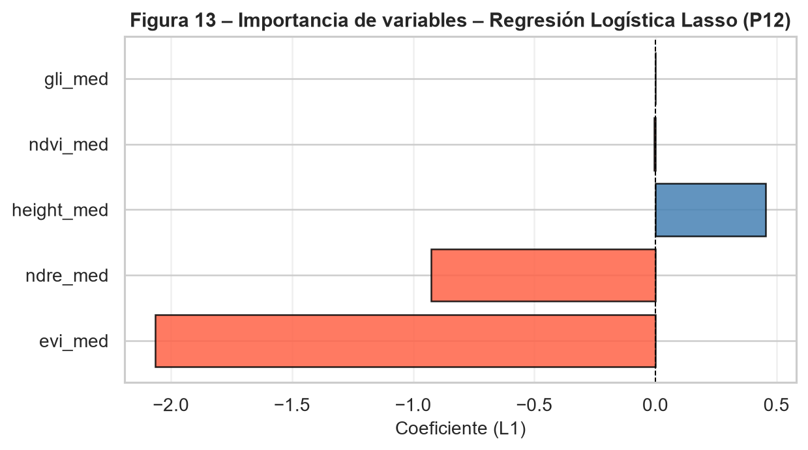

# Pregunta 12: Selección de variables en regresión logística y comparación con la red neuronal

Para la selección de variables se aplicó una regresión logística con penalización Lasso (`L1`) y validación cruzada interna de 5 particiones. Esta estrategia es adecuada para este problema porque combina predicción y selección: al penalizar la suma de los valores absolutos de los coeficientes, puede reducir a cero las variables que no aportan información adicional relevante, especialmente cuando existe colinealidad entre predictores.

El modelo se entrenó con la misma partición binaria utilizada en la Parte II y sobre el conjunto de entrenamiento balanceado mediante SMOTE. Las variables fueron previamente estandarizadas, por lo que la magnitud absoluta de los coeficientes Lasso puede compararse como una aproximación de importancia relativa.

## Resultados obtenidos

El parámetro de regularización seleccionado por validación cruzada fue:

```{python}
#| echo: false
import pandas as pd
pd.read_csv("../resultados/tablas/p12_parametros_lasso.csv").round(4)
```

La importancia de variables estimada a partir de la magnitud absoluta de los coeficientes Lasso fue:

```{python}
#| echo: false
tabla_p12_lasso = pd.read_csv("../resultados/tablas/p12_importancia_lasso.csv")
tabla_p12_lasso = tabla_p12_lasso.rename(
    columns={
        "Coef. Lasso": "Coeficiente Lasso",
        "Abs(Coef)": "Valor absoluto",
    }
)
tabla_p12_lasso.round(4)
```

{#fig-importancia-lasso width="80%"}

El ranking de importancia según Lasso está encabezado por `evi_med`, seguido de `ndre_med` y `height_med`. El `ndvi_med` queda con un coeficiente prácticamente nulo y `gli_med` es eliminado por completo del modelo. Este resultado no implica que el NDVI carezca de relación con la enfermedad; de hecho, en el análisis exploratorio presentó una de las asociaciones univariadas más fuertes con la severidad. Lo que sugiere el Lasso es que, una vez incluidas variables como EVI y NDRE, el NDVI aporta poca información adicional independiente para separar plantas sanas y enfermas.

## Interpretación

El signo negativo de `evi_med` y `ndre_med` es coherente con la interpretación agronómica: valores más altos de estos índices indican mayor vigor fotosintético, mayor actividad de la vegetación y, por tanto, menor probabilidad de pertenecer al grupo enfermo. El coeficiente positivo de `height_med`, al igual que en la regresión logística no penalizada, debe interpretarse con cautela. La altura no mostró una relación estrictamente monótona con la severidad en el análisis exploratorio, por lo que su contribución puede estar capturando patrones residuales de la muestra más que una relación causal directa.

La eliminación de `gli_med` confirma su bajo aporte relativo en este conjunto de datos. En comparación con los demás índices, el GLI mostró menor asociación con la severidad y mayor solapamiento entre categorías, lo que reduce su utilidad dentro de un modelo multivariado.

## Comparación con la red neuronal

La comparación con la importancia de variables del perceptrón multicapa binario se realizó usando la importancia por permutación calculada en la Pregunta 14. Aunque la red neuronal y el Lasso miden importancia de forma distinta, la comparación permite evaluar si ambos modelos identifican las mismas señales predictivas dominantes.

```{python}
#| echo: false
tabla_p12_comp = pd.read_csv("../resultados/tablas/p12_comparacion_lasso_mlp_pfi.csv")
tabla_p12_comp = tabla_p12_comp.rename(
    columns={
        "Coef. Lasso": "Coeficiente Lasso",
        "Abs(Coef)": "|Coeficiente Lasso|",
        "Importancia PFI": "Importancia MLP (PFI)",
        "Std": "Desv. Est. PFI",
    }
)
tabla_p12_comp.round(4)
```

El ranking de la regresión logística Lasso fue: `evi_med`, `ndre_med`, `height_med`, `ndvi_med` y `gli_med`. El ranking del MLP por importancia de permutación fue: `height_med`, `evi_med`, `ndre_med`, `gli_med` y `ndvi_med`. Por tanto, ambos enfoques coinciden en las tres variables más relevantes, pero no en el orden: Lasso prioriza los índices espectrales EVI y NDRE, mientras que el MLP asigna mayor caída de exactitud a la altura.

## Conclusión

Según la regresión logística con regularización Lasso, las variables más relevantes para predecir la condición binaria de severidad son `evi_med`, `ndre_med` y `height_med`. La comparación con el MLP confirma que esas mismas tres variables concentran la señal predictiva principal, aunque el orden cambia: el MLP sitúa primero a la altura y después a EVI y NDRE. El NDVI pierde importancia relativa por redundancia con otros índices espectrales y GLI queda con bajo aporte marginal. Este resultado refuerza la necesidad de interpretar la importancia de variables desde una perspectiva multivariada y no únicamente a partir de correlaciones individuales.
