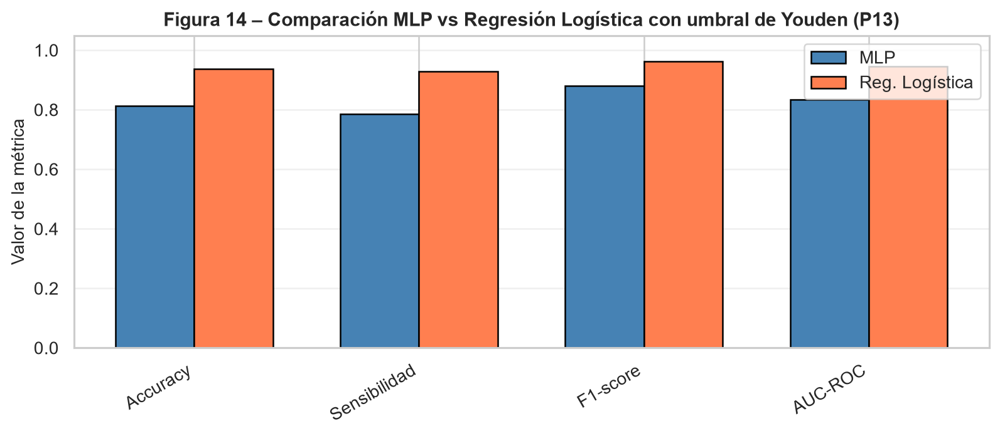

# Pregunta 13: Comparación entre regresión logística y MLP binario

La regresión logística y el perceptrón multicapa binario se compararon sobre el mismo conjunto de prueba, usando las mismas métricas: exactitud, precisión, sensibilidad, especificidad, F1-score y AUC-ROC. Esta comparación es metodológicamente importante porque evita atribuir diferencias de desempeño a particiones distintas de los datos.

Para separar el efecto del modelo del efecto del umbral de clasificación, se reportan dos comparaciones: una con el umbral por defecto de 0.5 en ambos modelos y otra usando el umbral óptimo de Youden para cada modelo.

## Resultados comparativos

Con el umbral por defecto de 0.5, el resultado fue:

```{python}
#| echo: false
#| tbl-cap: "Comparación entre MLP binario y regresión logística usando umbral 0.5."
import pandas as pd
pd.read_csv("../resultados/tablas/p13_comparacion_modelos_umbral_05.csv").round(4)
```

Con el umbral de Youden calculado para cada modelo, el resultado fue:

```{python}
#| echo: false
#| tbl-cap: "Comparación entre MLP binario y regresión logística usando umbral de Youden."
import pandas as pd
pd.read_csv("../resultados/tablas/p13_comparacion_modelos_youden.csv").round(4)
```

{#fig-comparacion-modelos width="90%"}

Con el umbral por defecto de 0.5, el MLP binario supera a la regresión logística en exactitud, sensibilidad y F1-score. El MLP clasifica correctamente 25 de las 32 observaciones de prueba, mientras que la regresión logística clasifica correctamente 23. La diferencia principal está en los falsos negativos: el MLP deja sin detectar 6 plantas enfermas y la regresión logística deja sin detectar 9.

Con el umbral 0.5, la regresión logística alcanza precisión y especificidad de 1.0000, mientras que el MLP presenta precisión de 0.9565 y especificidad de 0.7500 debido a un falso positivo. Sin embargo, la regresión logística presenta un AUC-ROC mayor (0.9464 frente a 0.8348), lo que significa que ordena mejor las observaciones según su probabilidad estimada de enfermedad, aunque su clasificación directa con umbral 0.5 sea peor.

Cuando se permite ajustar el umbral mediante Youden, la regresión logística supera al MLP en exactitud, sensibilidad, F1-score y AUC-ROC. Con este criterio, la regresión logística alcanza una sensibilidad de 0.9286, detectando 26 de las 28 plantas enfermas del conjunto de prueba, mientras que el MLP detecta 22 de 28. Además, ambos modelos mantienen especificidad de 1.0000, por lo que la mejora de sensibilidad de la regresión logística no genera falsos positivos adicionales en esta partición.

## Interpretabilidad y costo computacional

La regresión logística tiene ventajas claras en interpretabilidad: sus coeficientes permiten identificar la dirección y magnitud del efecto de cada predictor, calcular odds ratios y evaluar significancia estadística. Además, su costo computacional es bajo, el entrenamiento es rápido y el modelo es fácil de auditar, lo cual puede ser importante en un sistema de apoyo a decisiones agronómicas donde se requiere explicar por qué una planta fue clasificada como enferma.

El MLP, en cambio, es menos interpretable de forma directa y requiere mayor costo computacional de entrenamiento, pero puede capturar relaciones no lineales e interacciones entre variables espectrales y altura. En este conjunto de datos, esa flexibilidad mejora la clasificación directa frente a la regresión logística cuando ambos modelos usan el umbral por defecto de 0.5; sin embargo, esa ventaja desaparece cuando ambos modelos se comparan con umbrales ajustados y con AUC-ROC.

## Modelo elegido

Para un sistema de apoyo a la decisión agronómica orientado a reducir el riesgo de no detectar plantas enfermas, elegiría la regresión logística con umbral ajustado por Youden como modelo principal en esta comparación. La razón es doble: alcanza el mejor desempeño operativo sobre el conjunto de prueba, especialmente en sensibilidad y F1-score, y además ofrece mayor interpretabilidad y menor costo computacional que el MLP.

Esta elección no implica descartar el MLP. El perceptrón multicapa sigue siendo útil como modelo flexible y como contraste no lineal, especialmente si en futuras muestras aparecen interacciones que la regresión logística no capture. No obstante, con los resultados actuales, la regresión logística logra una combinación más favorable de desempeño, explicación y simplicidad. Dado que el conjunto de prueba es pequeño, esta decisión debe validarse con nuevas particiones o datos independientes antes de adoptarse como recomendación definitiva.
