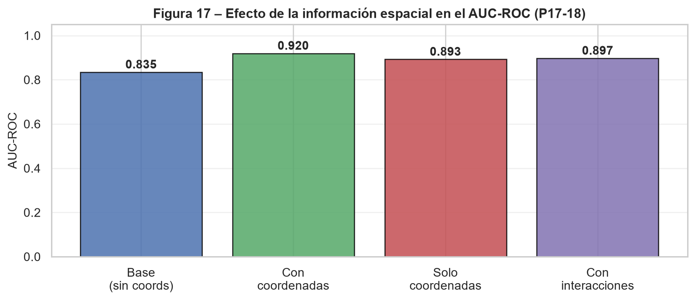

# Pregunta 18: Estrategias adicionales para incorporar información espacial

Se exploraron dos estrategias adicionales para incorporar la información espacial en la red neuronal. La primera consistió en entrenar un MLP usando exclusivamente las coordenadas `x_coord` y `y_coord` como predictores. La segunda consistió en añadir interacciones multiplicativas entre coordenadas e índices espectrales, específicamente `x_coord * ndvi_med`, `y_coord * ndvi_med`, `x_coord * evi_med` y `y_coord * evi_med`, además de los predictores originales.

Estas estrategias buscan responder dos preguntas distintas. El modelo con solo coordenadas evalúa si la ubicación, por sí sola, tiene poder predictivo. El modelo con interacciones evalúa si el efecto de los índices espectrales cambia según la posición espacial dentro de la grilla.

La configuración de las estrategias comparadas fue:

```{python}
#| echo: false
#| tbl-cap: "Estrategias de incorporación de información espacial evaluadas."
import pandas as pd
pd.read_csv("../resultados/tablas/p18_configuracion_estrategias_espaciales.csv")
```

## Resultados comparativos

```{python}
#| echo: false
#| tbl-cap: "Comparación de estrategias espaciales en el MLP binario."
pd.read_csv("../resultados/tablas/p18_comparacion_estrategias_espaciales.csv").round(4)
```

{#fig-espacial-aucroc width="90%"}

## Coordenadas como único predictor

El modelo entrenado únicamente con `x_coord` y `y_coord` alcanza una exactitud de 0.8750, superior a la del modelo base sin coordenadas (0.7812). También obtiene un AUC-ROC mayor (0.8929 frente a 0.8348). Esto indica que, dentro de esta grilla artificial, la ubicación por sí sola muestra poder predictivo aparente.

En un contexto con coordenadas reales, un buen desempeño usando solo ubicación podría indicar focos espaciales de enfermedad, gradientes de infección o zonas del lote con condiciones ambientales favorables al patógeno. En este caso, en cambio, el resultado debe tratarse como una señal metodológica débil: puede reflejar estructura accidental en el orden del archivo, efectos del desbalance binario, el tamaño reducido del conjunto de prueba o sensibilidad a la partición usada.

## Interacciones espaciales-espectrales

El modelo con interacciones multiplicativas obtiene una exactitud de 0.8125, superior a la del modelo base (0.7812), y su AUC-ROC aumenta de 0.8348 a 0.8973. En comparación con el modelo base, aporta una mejora moderada tanto en clasificación discreta como en discriminación probabilística. Sin embargo, no supera al modelo de solo coordenadas en exactitud ni al modelo con coordenadas simples en AUC-ROC.

Este resultado debe leerse con cautela porque las interacciones espaciales solo tienen sentido agronómico cuando las coordenadas representan posiciones reales. Si las coordenadas son artificiales, los productos `x * NDVI`, `y * NDVI`, `x * EVI` y `y * EVI` pueden introducir complejidad adicional sin significado espacial y capturar patrones accidentales de la muestra.

## Conclusión

De las estrategias evaluadas, el modelo con solo coordenadas obtiene la mayor exactitud (`Accuracy = 0.8750`), mientras que el modelo con coordenadas simples añadidas a los predictores originales obtiene el mayor AUC-ROC (`0.9196`). El modelo con interacciones multiplicativas también supera al modelo base en ambas métricas, aunque de forma más moderada.

En consecuencia, las estrategias espaciales muestran mejoras numéricas frente al modelo base en algunas métricas, especialmente en AUC-ROC, pero esas mejoras no pueden interpretarse como evidencia agronómica de dependencia espacial porque las coordenadas son artificiales. La incorporación de información espacial explícita solo sería recomendable en una fase posterior si se dispone de coordenadas reales de campo. Con los datos actuales, las variables espectrales y la altura siguen siendo la fuente principal y más defendible de información predictiva.
