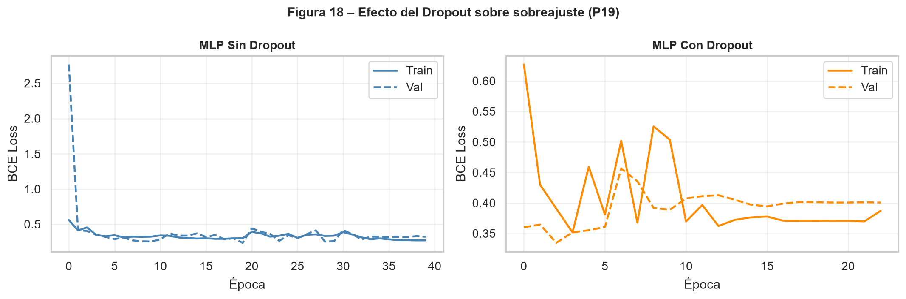
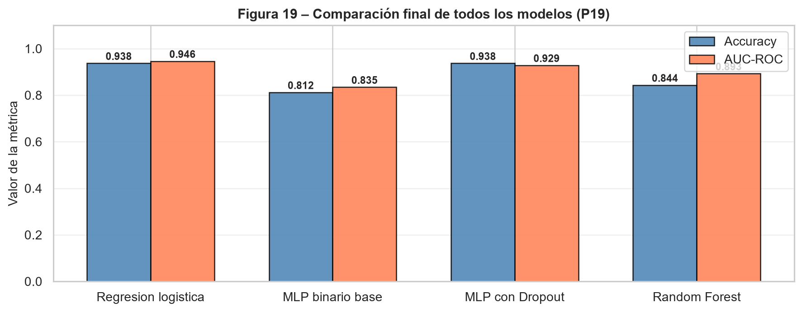
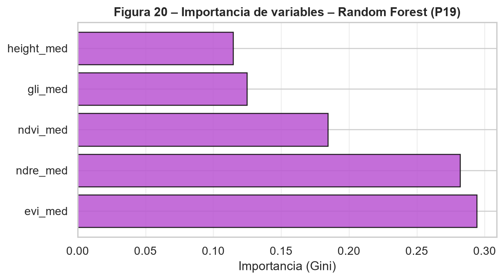

# Pregunta 19: Propuesta metodológica propia

Como propuesta metodológica propia se implementaron dos extensiones complementarias. La primera consistió en evaluar el efecto de la regularización por `dropout` en el perceptrón multicapa binario, manteniendo además el uso de `early stopping`. La segunda consistió en comparar el desempeño de los modelos neuronales con un algoritmo no neuronal, Random Forest, usando las mismas particiones de entrenamiento, validación y prueba.

El objetivo de esta propuesta fue evaluar dos aspectos relevantes para un sistema de apoyo a la decisión agronómica: la robustez del MLP frente al sobreajuste y la conveniencia de contrastar la red neuronal con un modelo alternativo de aprendizaje automático, capaz de capturar relaciones no lineales y entregar una medida directa de importancia de variables.

## Metodología

Para la regularización de la red neuronal se entrenó un MLP binario con la misma arquitectura base seleccionada previamente, pero incorporando capas `Dropout` con una tasa de 0.3 después de cada capa oculta. El entrenamiento usó `early stopping` monitoreando la pérdida de validación, con paciencia de 20 épocas y restauración de los mejores pesos. Esta combinación busca reducir el sobreajuste: `dropout` fuerza a la red a no depender excesivamente de neuronas específicas, mientras que `early stopping` detiene el entrenamiento cuando el desempeño de validación deja de mejorar.

Como modelo alternativo se entrenó un Random Forest de 200 árboles, con `class_weight = "balanced"` para compensar el desequilibrio entre plantas sanas y enfermas. El modelo se ajustó sobre el mismo conjunto de entrenamiento balanceado y se evaluó sobre el mismo conjunto de prueba usado en los modelos anteriores. Se reportaron accuracy y AUC-ROC para mantener la comparación con las secciones previas.

Las extensiones implementadas se resumen en:

```{python}
#| echo: false
#| tbl-cap: "Extensiones metodológicas implementadas en la propuesta libre."
import pandas as pd
pd.read_csv("../resultados/tablas/p19_configuracion_propuesta.csv")
```

## Resultados comparativos

Para hacer la comparación operativa de forma consistente con las secciones anteriores, se usó el umbral óptimo de Youden en cada modelo. Las métricas obtenidas fueron:

```{python}
#| echo: false
#| tbl-cap: "Comparación final de modelos usando el umbral de Youden."
pd.read_csv("../resultados/tablas/p19_comparacion_modelos.csv").round(4)
```

{#fig-dropout-comparacion width="90%"}

{#fig-comparacion-final width="90%"}

La regresión logística obtiene el mayor AUC-ROC (`0.9464`) y también una exactitud de `0.9375` con el umbral de Youden. El MLP con Dropout alcanza la misma exactitud, sensibilidad y F1-score que la regresión logística, aunque con un AUC-ROC menor (`0.9286`). El MLP binario base obtiene una exactitud de `0.8125` y AUC-ROC de `0.8348`, mientras que Random Forest presenta un desempeño intermedio (`Accuracy = 0.8438`, `AUC-ROC = 0.8929`).

## Efecto de Dropout y Early Stopping

El comportamiento de entrenamiento de los dos MLP se resume en:

```{python}
#| echo: false
#| tbl-cap: "Resumen del entrenamiento del MLP base y del MLP con Dropout."
pd.read_csv("../resultados/tablas/p19_resumen_dropout.csv").round(4)
```

El Dropout cambia de forma importante la dinámica de entrenamiento: el modelo con Dropout se detiene después de 23 épocas, mientras que el MLP base entrena 40 épocas. En el conjunto de prueba, el MLP con Dropout mejora frente al MLP base al usar el umbral de Youden: la exactitud pasa de `0.8125` a `0.9375`, la sensibilidad de `0.7857` a `0.9286` y el AUC-ROC de `0.8348` a `0.9286`. Esto sugiere que la regularización puede ayudar a generalizar mejor en esta corrida.

Sin embargo, la pérdida mínima de validación del MLP base es menor que la del modelo con Dropout. Por tanto, no se debe concluir de forma absoluta que Dropout sea siempre superior; más bien, se observa una mejora empírica en las métricas de prueba bajo esta partición y este umbral. Dado el tamaño reducido del conjunto de prueba, sería recomendable repetir el experimento con varias semillas o validación cruzada antes de adoptar Dropout como decisión definitiva.

## Comparación con Random Forest

Random Forest no supera a la regresión logística ni al MLP con Dropout en AUC-ROC, pero sí supera al MLP binario base en esta corrida y ofrece una ventaja práctica: permite obtener una importancia de variables basada en la reducción de impureza de los árboles. El ranking obtenido fue:

```{python}
#| echo: false
#| tbl-cap: "Importancia de variables según Random Forest."
pd.read_csv("../resultados/tablas/p19_importancia_random_forest.csv").round(4)
```

{#fig-importancia-rf width="80%"}

El Random Forest identifica como variables más importantes a `evi_med` y `ndre_med`, coincidiendo con la regresión logística Lasso en que estos índices son predictores centrales. A diferencia del MLP por permutación, que ubica primero a la altura, Random Forest asigna mayor importancia relativa al NDVI y menor importancia a la altura. Esta diferencia puede deberse a que los árboles capturan umbrales y divisiones no lineales sobre los índices espectrales, mientras que el MLP aprovecha combinaciones más distribuidas entre variables.

## Conclusión de la propuesta

La propuesta libre cumple dos objetivos complementarios. Primero, muestra que incorporar Dropout y early stopping puede mejorar las métricas de prueba del MLP binario en esta partición, aunque el resultado debe confirmarse con repeticiones por la variabilidad propia de las redes neuronales y el tamaño reducido del conjunto de prueba. Segundo, la comparación con Random Forest aporta un contraste no neuronal útil: aunque no mejora el desempeño global, confirma la relevancia de los índices EVI y NDRE.

En conjunto, la regresión logística sigue siendo el modelo más sólido por su mayor AUC-ROC e interpretabilidad, mientras que el MLP con Dropout aparece como una alternativa competitiva cuando se priorizan métricas operativas como sensibilidad y F1-score. Para trabajos futuros se recomienda probar varias tasas de Dropout, por ejemplo 0.1, 0.2 y 0.3, y repetir las particiones para evaluar si la mejora observada es estable.
