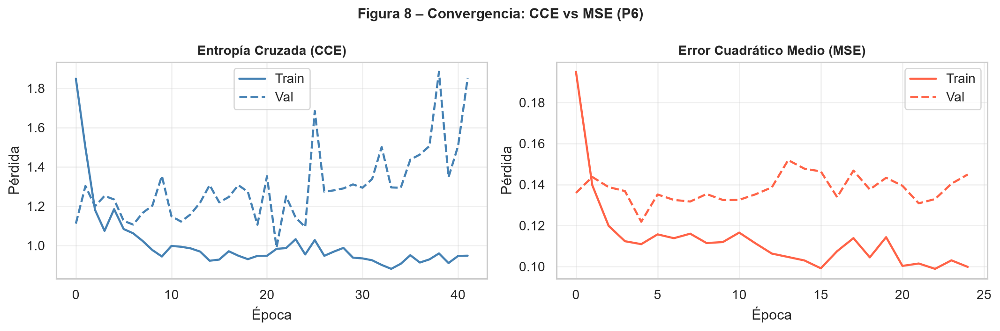

# Pregunta 6: Implemente y compare dos criterios para cuantificar el error durante el entrenamiento: entropía cruzada categórica (CCE) y error cuadrático medio (MSE). ¿Cuál es más apropiado para un problema de clasificación múltiple? Fundamente su respuesta tanto teórica como empíricamente.

Se entrenó la arquitectura seleccionada en la Pregunta 5 (*2L-64N-lr0.1*) dos veces, idéntica en todo salvo la función de pérdida. Para la entropía cruzada se usó `sparse_categorical_crossentropy`, que es equivalente a la entropía cruzada categórica cuando las etiquetas se almacenan como enteros; para MSE se usaron etiquetas en formato *one-hot*.

## Resultados obtenidos

```{python}
#| echo: false
#| tbl-cap: "Comparación empírica entre entropía cruzada categórica y MSE."
import pandas as pd

tabla_p6 = pd.read_csv("../resultados/tablas/p6_comparacion_funciones_perdida.csv")
tabla_p6 = tabla_p6[
    [
        "Funcion perdida",
        "Implementacion",
        "Arquitectura",
        "Accuracy prueba",
        "Aciertos prueba",
        "Total prueba",
        "Decision metodologica",
    ]
].rename(
    columns={
        "Funcion perdida": "Función de pérdida",
        "Implementacion": "Implementación",
        "Aciertos prueba": "Aciertos",
        "Total prueba": "Total",
        "Decision metodologica": "Decisión metodológica",
    }
)
tabla_p6
```

Con la arquitectura seleccionada en la Pregunta 5, CCE obtuvo una exactitud de prueba de *0.4375* (14/32), mientras que MSE obtuvo *0.2188* (7/32). La diferencia empírica favorece claramente a CCE en esta ejecución: el modelo entrenado con entropía cruzada clasificó correctamente el doble de observaciones que el modelo entrenado con MSE.

{#fig-cce-vs-mse width="85%"}

Las curvas de entrenamiento muestran que ambas funciones reducen la pérdida durante el ajuste, pero no optimizan el mismo objetivo probabilístico. Por esta razón, la comparación directa de los valores de pérdida entre CCE y MSE debe hacerse con cautela: lo más informativo es observar la estabilidad de la validación y el desempeño final sobre prueba.

## Fundamento teórico

La entropía cruzada categórica es la función de pérdida coherente con la capa de salida *softmax*: maximiza la verosimilitud de una distribución categórica y constituye una regla de puntuación propia (*proper scoring rule*), que penaliza de forma creciente la confianza mal ubicada en la clase incorrecta, con gradientes bien escalados incluso cuando la predicción está muy alejada del valor real. El error cuadrático medio, en cambio, fue diseñado para variables continuas; aplicado sobre probabilidades *softmax* con codificación *one-hot*, produce gradientes que pueden ser menos informativos cuando la salida se acerca a 0 o a 1, ralentizando el aprendizaje justo en casos de error claro. Además, MSE trata las probabilidades de clase como coordenadas continuas y no como una distribución categórica que debe asignar alta probabilidad a una única clase verdadera.

## Conclusión

Se recomienda la entropía cruzada categórica como función de pérdida para este problema de clasificación múltiple. La recomendación se sostiene teóricamente por su coherencia con la salida *softmax* y empíricamente porque, con la arquitectura seleccionada, obtuvo mayor exactitud de prueba que MSE. Aunque el conjunto de prueba es pequeño y las métricas deben interpretarse con cautela, en esta comparación la evidencia práctica y el fundamento estadístico apuntan en la misma dirección: CCE es más apropiada que MSE para entrenar el perceptrón multicapa multiclase.
