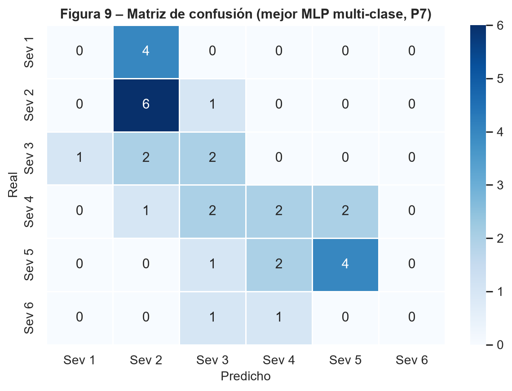
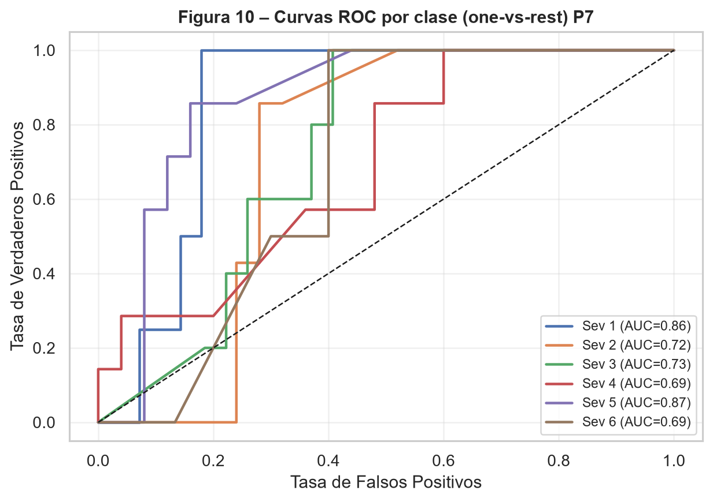

# Pregunta 7: Para el modelo seleccionado en la Pregunta 5, reporte exactitud global, precisión, sensibilidad y F1 por clase, macro-promedio y promedio ponderado, matriz de confusión con interpretación, y curva ROC/AUC uno-contra-todos. ¿Qué categorías de severidad son más difíciles de clasificar? ¿A qué lo atribuye?

Se evaluó el modelo seleccionado en la Pregunta 5, *2L-64N-lr0.1*, entrenado con entropía cruzada categórica, sobre el conjunto de prueba reservado (n = 32). La exactitud global obtenida fue de *0.4375*; es decir, el modelo clasificó correctamente 14 de las 32 observaciones de prueba.

## Resumen global

```{python}
#| echo: false
#| tbl-cap: "Resumen de métricas globales del modelo multiclase en prueba."
import pandas as pd

tabla_p7_resumen = pd.read_csv("../resultados/tablas/p7_resumen_metricas_multiclase.csv")
tabla_p7_resumen
```

## Métricas por clase

```{python}
#| echo: false
#| tbl-cap: "Precisión, sensibilidad y F1-score por clase, macro-promedio y promedio ponderado."
import pandas as pd

tabla_p7_metricas = pd.read_csv("../resultados/tablas/p7_metricas_clasificacion_multiclase.csv")
tabla_p7_metricas
```

El macro F1-score fue de *0.3137*, inferior al F1 ponderado (*0.3909*). Esta diferencia indica que el desempeño global está favorecido por las clases con mayor soporte en prueba, mientras que las clases minoritarias o difíciles, especialmente Sev 1 y Sev 6, reducen de forma marcada el promedio no ponderado.

## Matriz de confusión

```{python}
#| echo: false
#| tbl-cap: "Matriz de confusión del modelo multiclase."
import pandas as pd

pd.read_csv("../resultados/tablas/p7_matriz_confusion_multiclase.csv")
```

{#fig-confusion-multiclase width="80%"}

La matriz evidencia una tendencia a concentrar predicciones en severidades intermedias y altas: todos los casos reales de Sev 1 fueron clasificados como Sev 2, y ninguno de los dos casos reales de Sev 6 fue clasificado correctamente. En cambio, Sev 2 y Sev 5 concentran la mayor cantidad de aciertos absolutos, con 6/7 y 4/7 casos correctos, respectivamente.

## Curvas ROC y AUC

```{python}
#| echo: false
#| tbl-cap: "AUC-ROC por clase bajo esquema uno-contra-todos."
import pandas as pd

pd.read_csv("../resultados/tablas/p7_auc_roc_ovr_multiclase.csv")
```

{#fig-roc-multiclase width="85%"}

El AUC-ROC macro fue de *0.7588*, lo que sugiere que el modelo conserva cierta capacidad de ordenamiento probabilístico entre clases, incluso cuando la decisión final por *argmax* produce errores importantes. Esta diferencia entre AUC y F1 es especialmente visible en Sev 1: su AUC es relativamente alto (*0.8571*), pero su F1 es 0 porque, bajo la regla de clase final, ningún caso real de Sev 1 fue asignado correctamente.

## Interpretación por categoría

Las categorías más difíciles de clasificar correctamente fueron Sev 1 y Sev 6, ambas con precisión, sensibilidad y F1-score iguales a 0. En Sev 1, los cuatro casos reales fueron desplazados hacia Sev 2, lo que indica que el modelo no logra separar de forma robusta plantas sanas de plantas con severidad leve bajo la regla de decisión final. En Sev 6, los dos casos disponibles en prueba fueron clasificados como Sev 3 y Sev 4; este resultado debe interpretarse con cautela por el soporte extremadamente pequeño, pero confirma que la clase más severa no está bien representada.

Entre las clases intermedias, Sev 4 también presenta dificultad: su AUC-ROC es el más bajo (*0.6914*) y solo 2 de 7 casos reales fueron clasificados correctamente. Esto es consistente con el carácter ordinal del problema: las severidades intermedias comparten señales espectrales con categorías vecinas y se solapan en variables como EVI, GLI y altura. Por contraste, Sev 5 fue la categoría con mejor F1-score (*0.6154*) y mayor AUC (*0.8657*), lo que sugiere una señal espectral más distinguible para niveles altos pero no extremos de daño.

## Conclusión

El desempeño multiclase del MLP es moderado y desigual entre categorías. La exactitud global de *0.4375* supera la clasificación aleatoria esperada para seis clases, pero el macro F1-score de *0.3137* revela que el modelo no trata todas las severidades con la misma eficacia. Las clases más problemáticas son Sev 1 y Sev 6 por ausencia de aciertos directos, y Sev 4 por su bajo AUC y confusión con clases vecinas. Esto sugiere que seis niveles ordinales pueden ser demasiado finos para el tamaño muestral disponible y anticipa la pertinencia de explorar la clasificación binaria en la Parte II.
